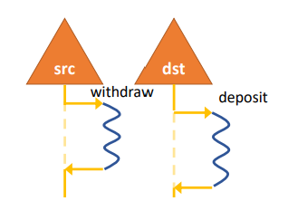
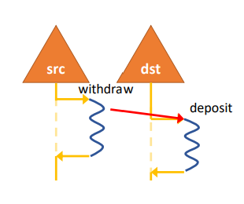
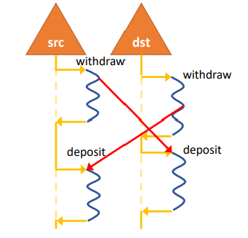
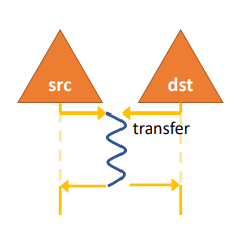
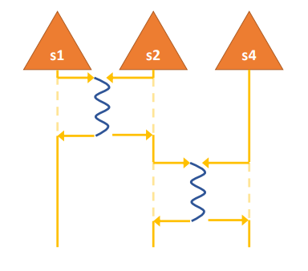
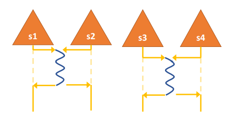
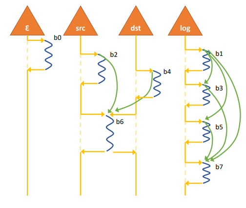
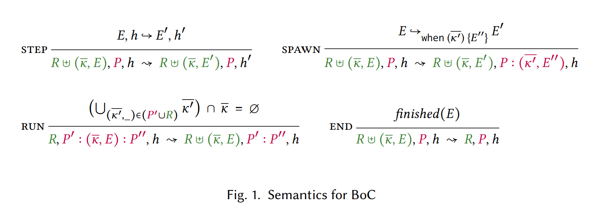
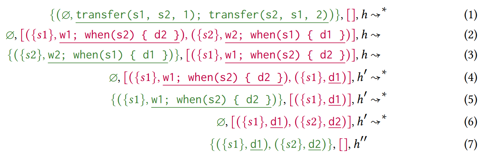
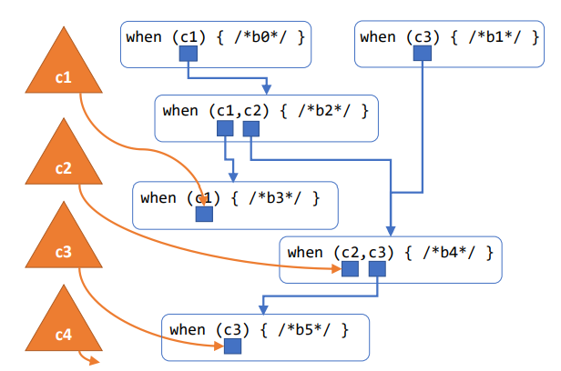

<h1 align="center">When Concurrency Matters:</h1>
<h2 align="center">Behaviour-Oriented Concurrency</h2>

Expressing parallelism and coordination is central for modern concurrent programming. Many mechanisms exist for expressing both parallelism and coordination. However, the design decisions for these two mechanisms are tightly intertwined. We believe that the interdependence of these two mechanisms should be recognised and achieved through a single, powerful primitive. We are not the first to realise this: the prime example is actor model programming, where parallelism arises through fine-grained decomposition of a program's state into actors that are able to execute independently in parallel. However, actor model programming has a serious pain point: updating multiple actors as a single atomic operation is a challenging task.

表达并行和协调是现代并发编程的核心。有许多机制可以表达并行和协调。然而，这两种机制的设计决策紧密相关。我们认为，应该认识到这两种机制的相互依赖性，并通过一个统一的强大原语来实现。我们不是第一个意识到这一点的：典型的例子是 actor 模型编程，其中并行性通过将程序状态细粒度分解为能够独立并行执行的 actor 来实现。然而，actor 模型编程有一个严重的痛点：将更新多个 actor 作为一个原子操作来执行是非常困难的。

> *原语：由系统/语言提供的最小、不可再分的基本操作或构造单元，所有上层功能都构建于其上。不可再分指其不可通过系统内更简单的构造组合而成。*

We address this pain point by introducing a new concurrency paradigm: Behaviour-Oriented Concurrency (BoC). In BoC, we are revisiting the fundamental concept of a behaviour to provide a more transactional concurrency model. BoC enables asynchronously creating atomic and ordered units of work with exclusive access to a collection of independent resources.

我们通过引入一种新的并发范式——行为导向并发（Behaviour-Oriented Concurrency，简称 BoC）——来解决这个痛点。在 BoC 中，我们重新审视行为这一基本概念，以提供一种更具事务性的并发模型。BoC 支持异步创建原子的、有序的工作单元，这些单元对一组独立资源拥有独占访问权。

In this paper, we describe BoC informally in terms of examples, which demonstrate the advantages of exclusive access to several independent resources, as well as the need for ordering. We define it through a formal model. We demonstrate its practicality by implementing a C++ runtime. We argue its applicability through the Savina benchmark suite: benchmarks in this suite can be more compactly represented using BoC in place of Actors, and we observe comparable, if not better, performance.

在本文中，我们通过示例非正式地介绍 BoC。这些示例既展示了独占访问多个独立资源的优势，也说明了排序的必要性。我们通过形式化模型来定义它。我们通过实现 C++ 运行时来证明其实用性。我们通过 Savina 基准测试套件来论证其适用性：该套件中的基准测试使用 BoC 替代 Actor 可以更紧凑地表达，而且我们观察到性能相当甚至更好。

## 1. INTRODUCTION

In a world that demands faster and more efficient computing, the need for concurrent programming has become paramount. Concurrent programming expresses the asynchronous behaviour that arises naturally in systems (e.g., process an incoming request) and harnesses the parallel compute power of modern hardware, where hardware thread counts can soar into the hundreds and beyond [Bergman et al. 2008].

在一个追求更快、更高效计算的世界中，并发编程的需求变得至关重要。并发编程表达系统中自然出现的异步行为（例如处理传入请求），并利用现代硬件的并行计算能力——硬件线程数可以轻松达到数百甚至更多 [Bergman et al. 2008]。

Expressing parallelism and coordination is central for modern concurrent programming. Parallelism empowers us to perform multiple tasks simultaneously, while coordination provides us with the control necessary to exclude the concurrent schedules that do not meet our desired outcomes. Several mechanisms exist for expressing both parallelism and coordination.

表达并行和协调是现代并发编程的核心。并行使我们能够同时执行多个任务，而协调提供了必要的控制，以排除不符合期望结果的并发调度。有多种机制可以表达并行和协调。

The main abstraction for the level of parallelism is a thread and its different instantiations, e.g., kernel threads, user-level threads, coroutines, tasks, fork/join, etc. These parallelism mechanisms typically provide a minimal coordination in the form of waiting for termination (e.g., join, promises). This is sufficient for problems that are easy to parallelise which are typically structured (e.g., McCool et al. [2012]) with up-front knowledge of the data needed to perform a task; the key to efficient parallelism is partitioning data into isolated (ideally equi-sized) chunks to be processed individually.

并行层次的主要抽象是线程及其不同实例，例如内核线程、用户级线程、协程、任务、fork/join 等。这些并行机制通常以等待终止的形式（如 join、promises）提供最少的协调。这对于容易并行化的问题已经足够——这类问题通常是结构化的（例如 McCool et al. [2012]），并且事先知道执行任务所需的数据。高效并行化的关键在于将数据分割成隔离的（最好是大小相等的）块来独立处理。

Other classes of problems such as concurrent event handling or serving requests typically needs scheduling a mix of short and long-running events and coordinating accesses to data according to an unforseeable schedule [Kegel 2014; WhatsApp 2012]. Here the coordination mechanism are required to be more elaborate (e.g., locks, transactions, condition variables).

其他类型的问题，如并发事件处理或服务请求，通常需要同时调度短时间和长时间运行的事件，并以事件的执行顺序不可预知为基础协调对数据的访问 [Kegel 2014; WhatsApp 2012]。此时需要更复杂的协调机制（例如锁、事务、条件变量）。

Whilst decoupling parallelism and coordination provides flexibility, their design decisions are tightly intertwined. For an async runtime, it is wise to provide bespoke synchronisation primitives, rather than relying on standard locking which will block one of the underlying implementation threads and harm performance (e.g., Tokio in Rust provides a Lock primitive). In the pursuit of performance, increasing the thread count may improve parallelism, but for codebases with coarse-grained locking, more threads may harm scalability by racing for the same resources.

虽然解耦并行和协调提供了灵活性，但它们的设计决策紧密相关。例如对于异步运行时，提供定制的同步原语是明智的，而不是依赖标准的锁——后者会阻塞底层线程并损害性能（例如 Rust 的 Tokio 提供了 Lock 原语）。在追求性能时，增加线程数可能提高并行度，但对于粗粒度锁定的代码库，更多线程可能会因竞争相同资源而损害可扩展性。

Rather than decoupling parallelism and coordination, we should recognise their interdependence and achieve both through a single, powerful primitive. We are not the first to realise this, the prime example is actor model programming. In the actor model [Agha 1985], parallelism arises through fine-grained decomposition of a program's state into actors that are able to execute independently in parallel, regardless of whether they serve different requests, process different sub-problems to be joined together, or a mix. A key feature of the actor model is that each actor isolates its own state. This enables sequential reasoning inside an actor, but this is arguably also its Achilles' heel: poor support for operations that involve accessing the states of multiple actors. For this reason actor systems mix the actor model with other concurrency paradigms (giving potential for programmers to break the actor model) [Tasharofi et al. 2013], or invent complicated bespoke coordination mechanisms on-top of the underlying model.

与其解耦并行和协调，不如认识到它们的相互依赖关系，并通过一个统一的强大原语来实现两者。我们不是第一个意识到这一点的，典型的例子是 actor 模型编程。在 actor 模型 [Agha 1985] 中，并行通过将程序状态细粒度分解为能够独立并行执行的 actor 来实现，无论这些 actor 是处理不同的请求，处理要合并的不同子问题，还是混合情况。Actor 模型的一个关键特性是每个 actor 隔离自己的状态。这使得 actor 内部可以进行顺序推理，但这也可以说是它的致命弱点：对涉及访问多个 actor 状态的操作支持很差。因此，actor 系统将 actor 模型与其他并发范式混合使用（这为程序员破坏 actor 模型留下了可能性）[Tasharofi et al. 2013]，或者在底层模型之上发明复杂的定制协调机制。

In this paper we explore and extend the idea of coupling parallelism and coordination. We propose a programming model that we call behaviour-oriented concurrency (BoC). The BoC programming model relies on a decomposition of state that is akin to actors—a program's state is a set of isolated resources (that we call cowns). Behaviours are asynchronous units of work that explicitly state their required set of resources. Unlike messages in actor programming, behaviours are not coupled to a specific resource; crucially, BoC offers flexible coordination, operations that require synchronous access to multiple resources can be easily expressed.

在本文中，我们探索并扩展了将并行和协调耦合的思想。我们提出了一种编程模型，称为行为导向并发（BoC）。BoC 编程模型依赖于与 actor 类似的状态分解——程序的状态是一组隔离的资源（我们称之为 cown）。行为（behaviour）是异步的工作单元，它们明确声明所需的资源集合。与 actor 编程中的消息不同，行为不绑定到特定的资源。关键在于，BoC 提供了灵活的协调，需要同步访问多个资源的操作可以很容易地表达。

To construct those behaviours, we introduce a new keyword, when, which enumerates the set of necessary resources for the said behaviour and spawns this an asynchronous unit of compute. So, a BoC program is a collection of behaviours that each acquires zero or more resources, performs computation on them, which typically involves reading and updating them, and spawning new behaviours, before releasing the resources. When running, a behaviour has no other state than the resources it acquired. A behaviour can be run when it has acquired all of its resources, which is guaranteed to be deadlock free. Despite its apparent simplicity, this model has considerable expressive power to construct a wide range of concurrent schedules by simply nesting them and/or sequencing them in combination with the resources they require. This is important in itself as making it effortless to spawn new concurrent computation is key to writing programs that are able to scale with the parallel compute power of modern hardware, without being crippled by Amdahl's law 1967.

为了构造这些行为，我们引入了一个新的关键字 `when`，它列举该行为所需的一组资源，并创建这个异步计算单元。因此，BoC 程序是行为的集合，每个行为获取零个或多个资源，对其进行计算（通常涉及读取和更新），创建新行为，最后释放资源。运行时，行为除了它获取的资源外没有其他状态。一个行为只有在获取了它的所有资源后才可以运行，并且这保证是无死锁的。尽管看似简单，这个模型却具有相当强的表达能力：只需对行为进行嵌套和/或排序，再配合它们所需的资源，就能构造出各种并发调度。这本身很重要，因为轻松创建新的并发计算，是编写能够随现代硬件并行计算能力扩展的程序的关键——只有这样才不会被 Amdahl 定律 [1967] 所限制。

We introduce a formal model of the new paradigm which demonstrates how BoC can introduce concurrency to a programming language. We also lay out the expectations of a programming language, such as separation of heap, so that the language is able to fully utilise BoC.

我们引入了新范式的形式化模型，展示了 BoC 如何为编程语言引入并发。我们还阐述了编程语言的期望，例如堆的隔离，以便语言能够充分利用 BoC。

To demonstrate that BoC is a practical approach to concurrency across different languages, we have created a C++ library that functions as a runtime for BoC and an executable model implementation in C#. Both runtimes are closely aligned with the formal model. Whilst we aim to integrate our C++ runtime as a fundamental component of a programming language, this library provides insights into the runtimes performance.

为了证明 BoC 是一种可跨不同语言应用的实用并发方案，我们创建了一个作为 BoC 运行时的 C++ 库，以及一个用 C# 实现的可执行模型。两个运行时都与形式化模型紧密对齐。虽然我们的目标是将 C++ 运行时集成为编程语言的基本组成部分，但这个库能让我们了解运行时的性能表现。

We evaluate both the expressiveness of BoC as a concurrency paradigm and the efficiency of our implementation. We present BoC implementations of the Savina actor benchmark suite [Imam and Sarkar 2014], first using BoC as if it were an actor language, and then better utilising BoC to demonstrate where it can be a better fit than actors.

我们从两个维度对 BoC 进行了评估：其作为并发范式的表达能力，以及我们实现的运行时的效率。我们用 Savina actor 基准测试套件 [Imam and Sarkar 2014] 编写了 BoC 实现：首先以 actor 风格（每个 behaviour 只访问一个 cown）使用 BoC，然后充分发挥 BoC 的跨多 cown 能力，展示其相比 actor 更适合哪些场景

In this paper, we make the following contributions:

- The Behaviour-Oriented Concurrency paradigm: a concurrency paradigm that achieves flexible coordination over multiple resources, and ordered execution, and scalability
- A formal model for BoC which demonstrates how it can provide concurrency for an underlying programming language.
- An efficient proof of concept implementation of BoC in C++ that achieves almost perfect scaling for the conducted system-level experiments.

在本文中，我们做出以下贡献：

- 行为导向并发范式：一种在多个资源上实现灵活协调、有序执行和可扩展性的并发范式
- BoC 的形式化模型，展示了它如何为底层编程语言提供并发支持
- 一个高效的 BoC 概念验证 C++ 实现，在系统级实验中达到了近乎完美的可扩展性

The rest of this paper is organised as follows: In Section 2 we give introduction to behaviouroriented concurrency informally and illustrate it through examples. In Section 3 we formalise the informal definition of BoC by providing a simplified abstract execution model and show how the guarantees are met. In Section 4 we develop an implementation for BoC. In Section 5 we evaluate BoC concurrency with the Savina benchmark suite. In Sections 6 and 7 we conclude and discuss related and further work.

本文其余部分组织如下：第 2 节非正式地介绍行为导向并发，并通过示例加以说明。第 3 节通过提供简化的抽象执行模型来形式化 BoC 的非正式定义，并展示如何满足各项保证。第 4 节介绍 BoC 的实现。第 5 节使用 Savina 基准测试套件评估 BoC 并发。第 6、7 节总结并讨论相关工作与未来工作。

## 2. BEHAVIOUR-ORIENTED CONCURRENCY – OVERVIEW

Behaviour-oriented concurrency (or BoC) is intended as the sole concurrency feature of an underlying programming language. The underlying language is expected to provide a means to separate the heap into disjoint sets with unique entry points, for example through a type system as in [Clarke and Wrigstad 2003]. Provided that the type system satisfies the requirements outlined here and in the semantics section, its exact design is orthogonal to BoC. Several such type systems exist already [Clebsch et al. 2015; Gordon et al. 2012; Noble et al. 1998]. In [Arvidsson et al. 2023] we propose a new, more powerful type system which we are adopting for our language implementing the BoC paradigm.

行为导向并发（BoC）旨在作为底层编程语言的唯一并发特性。底层语言需要提供一种方法，将堆划分为具有唯一入口点的不相交集合，例如通过像 [Clarke and Wrigstad 2003] 那样的类型系统。只要类型系统满足本文及语义部分提出的要求，其具体设计与 BoC 是正交的（独立的）。已有几种这样的类型系统 [Clebsch et al. 2015; Gordon et al. 2012; Noble et al. 1998]。在 [Arvidsson et al. 2023] 中，我们提出了一种新的、更强大的类型系统，我们将其用于实现 BoC 范式的语言。

### 2.1 Boc in a Nutshell

BoC augments the underlying language with two fundamental concepts: the concurrent owner or cown, and the behaviour.

BoC 用两个基本概念扩展了底层语言：并发拥有者（concurrent owner，简称 cown）和行为（behaviour）。

Cowns a cown protects a piece of separated data, meaning it provides the only entry point to that data in the program. A cown is in one of two states: available, or acquired by a behaviour.

Cown 保护一段隔离的数据，意味着它提供了程序中该数据的唯一入口点。Cown 处于两种状态之一：可用（available），或已被行为获取（acquired）。

Behaviours are the unit of concurrent execution. They are spawned with a list of required cowns and a closure. We define happens before, as an ordering relation which strengthens the "spawned before" relation by also requiring that the sets of cowns required by the two behaviours have a non-empty intersection:

Behaviour 是并发执行单元。创建 behaviour 时需要指定一个必需的 cown 列表和一个闭包。我们定义"发生在之前"（happens before）为一个顺序关系：它通过额外要求两个 behaviour 所需的 cown 集合有非空交集，来强化"创建在前"关系：

Definition 2.1. A behaviour b will happen before another behaviour b′ iff b and b′ require overlapping sets of cowns, and b is spawned before b′.

Definition 2.1. 行为 b 发生在另一个行为 b′ 之前，当且仅当 b 和 b′ 需要的 cown 集合重叠，且 b 在 b′ 之前创建。

Once spawned, a behaviour can be run (i.e., its closure starts executing) only when all its required cowns are available, and all other behaviours which happen before it have been run. Once available, all the cowns are acquired by the behaviour atomically, and become unavailable to other behaviours. Throughout execution of the closure the behaviour retains exclusive access to its cowns, and to their data. Moreover, the behaviour cannot acquire more cowns, nor can it prematurely release any cown it is holding. Upon termination of the closure, the behaviour terminates, and all its cowns become available.

行为创建后，必须满足两个条件才能开始运行（即执行其闭包）：所有必需的 cown 均可用，且所有发生在它之前的行为都已运行完毕。一旦这些 cown 变为可用，它们会被行为原子地获取，并对其他行为不可用。在闭包执行期间，行为对其持有的 cown 以及这些 cown 所保护的数据拥有独占访问权。此外，行为不能获取更多 cown，也不能提前释放已持有的任何 cown。闭包执行完毕后，行为终止，其所有 cown 恢复可用状态。

BoC is datarace-free and deadlock-free. BoC provides the principles to ensure data-race freedom: since the state associated with each cown is isolated, and since behaviours have exclusive access to the acquired cowns' state, there is no way for two different behaviours to have concurrent mutable access to the same state. Furthermore, as behaviours acquire all their required cowns atomically, and because the happens before relation is acyclic, BoC is deadlock-free by construction.

BoC 是无数据竞争且无死锁的。无数据竞争的理由如下：每个 cown 关联的状态是隔离的，且行为对已获取的 cown 状态拥有独占访问权，因此两个不同的行为不可能并发修改同一状态。无死锁的理由如下：行为原子地获取所有必需的 cown，且"发生在之前"关系是无环的，因此 BoC 在构造上就是无死锁的。

> *假设存在存在环： A -> B -> A，那么根据 Definition 2.1 A 在 B 之前创建 & B 在 A 之前创建，这是互相矛盾的，因此 happens before 关系必然无环。*

We introduce BoC through examples expressed in an imperative, expression-oriented, stronglytyped pseudo-language with isolation. Two language features are of interest: 

- The cown[T] type: it represents a cown with contents of type T, with a create constructor.
- The when expression: it consists of a set of cown identifiers, and a closure, and is used to spawn a behaviour that requires the specified cowns.

我们通过示例来介绍 BoC，这些示例使用一种命令式、面向表达式、带隔离机制的强类型伪语言编写。有两个语言特性值得关注：

- `cown[T]` 类型：表示一个内容的类型为 T 的 cown，带有 create 构造函数。
- `when` 表达式：由一组 cown 标识符和一个闭包组成，用于创建需要特定 cown 的行为。

It is the remit of the underlying language to ensure that each object in the heap is owned by exactly one entry point, and that any object accessed within the closure of a when is owned by one of the acquired cowns.

底层语言的职责是确保堆中的每个对象恰好被一个入口点拥有，并且 when 闭包内访问的任何对象都必须归属于某个已获取的 cown。

### 2.2 Creating Cowns

For our examples we focus on concurrent modifications to bank account objects of type Account with fields balance and frozen. Listing 1 shows how a programmer can create a cown to protect an account. The programmer creates and accesses acc1 as an Account object; they can then add and remove funds from acc1 as they want (synchronously). Conversely, acc2 is created as a cown that protects an Account; in other words, a cown of type cown[Account]. The cown prevents any direct access to the account, such as that on Line 6. The only way to gain access to the contents of a cown is by spawning a behaviour that acquires it.

在我们的示例中，我们关注对 Account 类型（有 balance 和 frozen 字段）的银行账户对象的并发修改。清单 1 展示了程序员如何创建一个 cown 来保护账户。程序员创建 acc1 Account 对象并直接访问；然后可以随意（同步地）向 acc1 添加或扣除资金。相反，acc2 被创建为保护 Account 的 cown；换句话说，它是类型为 `cown[Account]` 的 cown。Cown 阻止任何对账户的直接访问，例如第 6 行那样的访问。访问 cown 内容的唯一方法是创建一个获取该 cown 的行为。

<p align="center">List. 1. Creating cowns to protect data</p>

```typescript
main() {
    var acc1 = Account.create();
    acc1.balance -= 100; // OK
    
    var acc2 = cown.create(Account.create());
    acc2.balance += 100; // Access is invalid
}
```

### 2.3 Spawning and Running Behaviours

Listing 2 contains a simple use-case of behaviours. The transfer function transfers amount from src to dst. It consists of two when expressions, which spawn behaviours that need mutable access to Account objects. Note that while a when always requires resources to be of type cown[T] the closure sees the resources as being of type T, i.e., from the inside, an acquired cown[T] looks like a T. Each when expression spawns a behaviour that will, at a later point, execute with exclusive access to the contents of its cown; thus it will execute without data races, and logically atomically. The transfer function returns immediately, without waiting for the two behaviours to execute.

清单 2 包含一个简单的行为用例。`transfer` 函数将 amount 金额从 src 转移到 dst。它由两个 `when` 表达式组成，分别创建需要可变访问 Account 对象的行为。注意，`when` 总是要求资源类型为 `cown[T]`，但闭包将资源视为类型 T——也就是说，从内部看，已获取的 `cown[T]` 就像是一个普通的 T。每个 `when` 表达式创建一个行为，该行为稍后将对其 cown 的内容进行独占访问并执行；因此它将在没有数据竞争的情况下执行，并且在逻辑上是原子的。`transfer` 函数立即返回，不等待两个行为执行完毕。

<p align="center">List. 2. Scheduling work on each account</p>

```typescript
transfer(src: cown[Account], dst: cown[Account], amount: U64) {
    when(src) { src.balance -= amount; } // withdraw
    when(dst) { dst.balance += amount; } // deposit
}
```



Note that spawning and running a behaviour are different events; moreover, spawning is synchronous, while running is asynchronous. Assuming that src and dst are not aliases, they can start running in any order: the withdraw behaviour might happen before, at the same time as, or after the deposit behaviour. In Listing 2, each behaviour is executed independently and unconditionally. The right of Listing 2 shows a possible execution timeline: each cown (triangles) transitions from available (solid lines) to acquired (dashed lines) as it is acquired by an executing behaviour (squiggly lines), and transitions back again once the behaviour terminates; as these behaviours are independent they may execute together or one at a time (and so may move up and down the timeline). That is, the withdraw behaviour might happen before, at the same time as, or after the deposit behaviour.

注意，创建和运行行为是两个不同的事件；创建是同步的，而运行是异步的。假设 src 和 dst 不是别名，它们可以按任意顺序开始执行：取款行为可能发生在存款行为之前、同时或之后。在清单 2 中，每个行为独立无条件地执行。清单 2 右侧展示了一种可能的执行时间线：每个 cown（三角形）在被执行的行为（波浪线）获取时从可用状态（实线）转换为已获取状态（虚线），并在行为终止后恢复；由于这些行为是独立的，它们可以同时执行或逐个执行（因此可以在时间线上下移动）。也就是说，取款行为可能发生在存款行为之前、同时或之后。

<p align="center">List. 3. Nesting spawning behaviours</p>

```typescript
transfer(src: cown[Account], dst: cown[Account], amount: U64) {
    when(src) { // withdraw
        if (src.balance >= amount) {
            src.balance -= amount;
            when(dst) { // deposit
                dst.balance += amount;
            }
        }
    }
}
```



But what if successful transfer is contingent on properties of the src cown? Consider the case where accounts may not be overdrawn, i.e., the balance has to be positive. This can be achieved by nesting the second when expression inside a conditional path in the first, as demonstrated in Listing 3. Here, the function transfer merely spawns one behaviour to be executed on the src cown and returns immediately. When this outer behaviour executes, it will check that the src has sufficient funds. If it does, a new behaviour will be spawned to run on the dst cown. The outer behaviour terminates immediately, without waiting for the inner one to start nor finish executing. To be clear, the deposit does not have access to src. On the right of Listing 3, the withdrawing behaviour is shown to spawn the depositing behaviour (red arrow), the spawned behaviour can be run anytime after it was spawned (incidentally, the spawned behaviour can move along the timeline as long as the arrow does not point upwards), the depositing behaviour may in fact terminate before the withdrawing behaviour terminates. So, whilst the depositing behaviour is textually nested within the withdrawing behaviour, nested whens have the same semantics as any other whens. Contrast this with transactions where nested transactions have special semantics [Ni et al. 2007].

但如果转账成功依赖于 src cown 的属性呢？考虑账户不能透支的情况，即余额必须为正。这可以通过在第一个 `when` 的条件路径内嵌套第二个 `when` 表达式来实现，如清单 3 所示。这里，`transfer` 函数仅创建一个将在 src cown 上执行的行为并立即返回。当这个外部行为执行时，它会检查 src 是否有足够的资金。如果有，它会创建一个新行为在 dst cown 上运行。外部行为立即终止，不等待内部行为开始或结束执行。需要明确的是，存款操作不能访问 src。在清单 3 下方，取款行为创建了存款行为（红色箭头），创建的行为可以在创建后的任何时间运行（被创建的行为可以沿时间线移动，只要不移动到红色箭头的上方），存款行为实际上可能在取款行为终止之前就结束了。因此，虽然存款行为在文本上嵌套在取款行为内部，但嵌套的 `when` 与其他任何 `when` 具有相同的语义。这与嵌套事务具有特殊语义的情况 [Ni et al. 2007] 不同。

<p align="center">List. 4. Deadlock-free transfers</p>

```typescript
transfer(src, dst, 1);
transfer(dst, sr2, 2);
```



We extend the example from above to two calls of transfer: one from src to dst, and one from dst to src, illustrated in Listing 4. Readers accustomed to lock-based programming or nested transactions might think that the example would deadlock, but this is not so: the two withdraw behaviours may run in parallel (since they require different cowns), and during their execution they will spawn the deposit behaviours. Each deposit behaviour will be able to run once its cown is no longer held by the withdraw behaviour. Moreover, the two withdraws can happen in either order as can the two deposits. We will revisit this example in Section 3.

我们将上面的例子扩展到两次 `transfer` 调用：一次从 src 到 dst，一次从 dst 到 src，如清单 4 所示。熟悉基于锁的编程或嵌套事务的读者可能认为这个例子会死锁，但事实并非如此：两个取款行为可以并行运行（因为它们需要不同的 cown），并且在它们执行期间会创建存款行为。每个存款行为只要其 cown 不再被取款行为持有就能运行。而且，两个取款可以按任意顺序发生，两个存款也是如此。我们将在第 3 节重新讨论这个例子。

> *死锁是指并发系统中，一组进程（或线程）中的每一个成员，均因等待一个由该组中其他成员所占有的资源，而陷入永久的阻塞状态，从而导致系统整体无法继续推进的一种异常状态。*

### 2.4 Behaviours Requiring Multiple Cowns

Listing 3 avoids transfers with insufficient funds, but what if successful transfer is contingent on properties of both cowns? For instance, a bank account may be marked as "frozen", meaning any transfer to or from the account should be forbidden.

清单 3 避免了资金不足的转账，但如果成功转账依赖于两个 cown 的属性呢？例如，一个银行账户可能被标记为"冻结"，这意味着任何向该账户转入或转出的操作都应被禁止。

We could try to solve the problem by checking each account in turn, withdraw the money from the src and finally deposit the money on the dst, requiring further nesting of behaviours. However, by doing so we would lose atomicity guarantees: between checking the account and depositing the money, the dst could be frozen by another behaviour spawned by a different part of the program.

我们可以尝试依次检查每个账户，从 src 取款，最后存入 dst，这需要进一步嵌套行为。但这样做会失去原子性保证：在检查账户和存入资金之间，dst 可能会被程序其他部分创建的行为冻结。

Instead, we will employ a key feature of our paradigm which allows behaviours to acquire multiple cowns at once, thus giving simultaneous exclusive mutable access to several cowns.

相反，我们采用范式的一个关键特性：允许行为一次获取多个 cown，从而同时获得对多个 cown 的独占可变访问。

In Listing 5, the function transfer avoids the earlier atomicity problems. It consists of a when block that requires access to src as well as dst. The when checks that the accounts are not frozen and that there are sufficient funds, and if so, proceeds with transferring the funds.

在清单 5 中，`transfer` 函数避免了之前的原子性问题。它由一个需要访问 src 和 dst 的 `when` 块组成。该 `when` 检查账户没有被冻结且资金充足，如果满足条件，就进行转账。

<p align="center">List. 5. Spawn a behaviour that requires both accounts</p>

```typescript
transfer(src: cown[Account], dst: cown[Account], amount: U64) {
    when(src, dst) { // withdraw and deposit
        if (src.balance >= acmount && !src.frozen && !dst.frozen) {
            src.balance -= amount;
            src.balance += amount;
        }
    }
}
```



This example demonstrates the power of behaviour-oriented concurrency: It allows the programmer to coordinate access to multiple shared resources. A rendezvous of cowns is now a simple task: a single when expression creates the synchronisation between multiple cowns and allows a behaviour to read/write the state of all involved cowns. This rendezvous is demonstrated in to the right of Listing 5 by a behaviour that acquires both src and dst at once.

这个例子展示了行为导向并发的强大之处：它允许程序员协调对多个共享资源的访问。Cown 的 rendezvous 现在变得简单：一个 `when` 表达式就创建了多个 cown 之间的同步，并允许一个行为读写所有相关 cown 的状态。清单 5 下方展示了一个同时获取 src 和 dst 的行为，这正是 cown rendezvous 的示例。

> *Cown rendezvous 指的是 behaviour 可以原子地获取所需的所有 Cown，从而可以同步读写多个 Cown？？？*

### 2.5 Order Matters

So far, we assumed that src and dst do not alias. For behaviours requiring non-overlapping cowns, the order of execution does not matter. Namely, the effects of behaviour execution demonstrate themselves through modification of the state under their cowns; therefore, cowns cannot observe the effects of execution of behaviours that took place on separate cowns.

到目前为止，我们假设 src 和 dst 不是别名。对于所需 cown 不重叠的行为，执行顺序无关紧要。也就是说，行为执行的效果通过修改其 cown 保护的状态来体现；因此，运行在某个 cown 上的行为无法观察到其它 cown 上执行行为的效果。

However, when behaviours execute on overlapping cowns, the order matters, and BoC has rules for such cases. For illustration, consider the following scenario: we want to transfer money from one account to another, and then use the money from the second account to pay a third party. This is done in Listing 6. The first transfer will be spawned before the second transfer, but what we have discussed so far does not preclude the second example from running first. Here the order of execution of the behaviours matters: e.g., if the second behaviour runs first, it could deplete the funds in s2, and incur overdraft fees.

然而，当行为在重叠的 cown 上执行时，顺序就很重要，BoC 对此有规则。举例说明：假设我们要将资金从一个账户转移到另一个账户，然后用第二个账户的资金支付第三方。这在清单 6 中实现。第一次转账将在第二次转账之前创建，但我们目前讨论的内容并不阻止第二次转账先执行。这里行为的执行顺序很重要：例如，如果第二个行为先运行，它可能耗尽 s2 中的资金并产生透支费用。

Thus, we would like the first transfer to be completed before the second transfer starts running. We could transform the program to achieve the required ordering, for example by using nested behaviours, but there is no need: BoC guarantees the desired order of behaviours. Namely, a behaviour will only be run once all behaviours that must happen before it have been run (Definition 2.1).

因此，我们希望第一次转账在第二次转账开始运行之前完成。我们可以通过修改程序来实现所需的顺序，例如使用嵌套行为，但没必要：BoC 保证了行为所需的顺序。也就是说，一个行为只有在所有必须发生在它之前的行为都已运行之后才会运行（定义 2.1）。

<p align="center">List. 6. Statically Ordered</p>

```typescript
transfer(s1, s2, 10);
transfer(s2, s4, 20);
```



In Listing 6, the first transfer requires cowns s1 and s2, the second transfer requires cowns s2 and s4, and {s1, s2} overlaps with {s2, s4}. As we said earlier, the first transfer is spawned before the second transfer. Therefore, the first transfer will happen before the second transfer.

在清单 6 中，第一次转账需要 cown s1 和 s2，第二次转账需要 cown s2 和 s4，{s1, s2} 与 {s2, s4} 重叠。如前所述，第一次转账在第二次转账之前创建。因此，第一次转账发生在第二次转账之前。

<p align="center">List. 7. Dynamically Ordered</p>

```typescript
transfer(s1, s2, 10);
transfer(s3, s4, 20);
```



Behaviour ordering is determined at runtime. Consider the slightly modified example from Listing 7, where we have four different cown identifiers, s1, s2, s3, s4. If s2 and s3 are aliases, then the situation is as in Listing 6, and the first transfer will complete before the second starts running. But if the four identifiers point to four different cowns, then execution of the first and second transfer may take place in any order, and may overlap. Below Listing 7 we show diagrammatically a possible execution, when s1, s2, s3, s4 differ.

行为顺序在运行时确定。考虑清单 7 中稍作修改的例子，我们有四个不同的 cown 标识符：s1、s2、s3、s4。如果 s2 和 s3 是别名，那么情况与清单 6 相同，第一次转账将在第二次开始运行之前完成。但如果四个标识符指向四个不同的 cown，那么第一次和第二次转账的执行可以按任意顺序发生，并且可以重叠。我们在清单 7 下方以图表方式展示了当 s1、s2、s3、s4 不同时的一种可能执行情况。

### 2.6 Putting It All Together

Revisiting our example from section Section 2.3, in Listing 2, if src and dst are aliases, then withdraw will complete before deposit. In Listing 8, green arrows represent happens before relations.

回到第 2.3 节的例子，在清单 2 中，如果 src 和 dst 是别名，那么取款将在存款之前完成。在清单 8 中，绿色箭头表示"发生在之前"关系。

This ordering is a deep property that can be used to order nested spawned behaviours. Consider a scenario where, in addition to account operations, we also wanted to create a log of what happened; we augment each behaviour to output strings to an OutStream as in Listing 8. Notice that b2 and b6 spawn further behaviours, b3 and b7, both of which require log. Again, we expect the start message, on Line 3, to be logged before the deposit message, on Line 5, and the deposit message before the transfer message on Line 11.

这种顺序是一个根本属性，可用于对嵌套创建的行为进行排序。考虑这样一个场景：除了账户操作之外，我们还要创建操作日志；我们在每个行为中添加向 OutStream 输出字符串的逻辑，如清单 8 所示。注意 b2 和 b6 又分别创建了 b3 和 b7，这两个新行为都需要 log。同样，我们期望 b1 的 begin 消息在 b3 的存款消息之前输出，b3 的存款消息在 b7 的转账消息之前输出。

The "begin" message will be logged before the "deposit" message: b1 and b3 require log and b1 will be spawned before b3 (we know this as b1 will be spawned before b2, and b2 spawns b3); thus, we know b1 will happen before b3 from Definition 2.1.

"begin"消息将在"deposit"消息之前记录：b1 和 b3 都需要 log，且 b1 将在 b3 之前创建（这是因为 b1 在 b2 之前创建，而 b2 创建了 b3）。因此，根据定义 2.1，我们知道 b1 发生在 b3 之前。

The "deposit" message will be logged before the "transfer" message: b3 and b7 require log; we know b2 spawns b3 and b6 spawns b7, and we know b2 happens before b6 from previous discussion; therefore, we know b3 will be spawned before b7 and so b3 will happen before b7.

"deposit"消息将在"transfer"消息之前记录：b3 和 b7 都需要 log。我们知道 b2 创建了 b3，b6 创建了 b7，并且根据之前的讨论，b2 发生在 b6 之前。因此，我们知道 b3 将在 b7 之前创建，所以 b3 发生在 b7 之前。

<p align="center">List. 8. Creating an accurate log</p>

```typescript
main(src: cown[Account], dst: cown[Account], log: cown[OutStream]) { /∗ b0 ∗/
	when(log) { /∗ b1 ∗/ log.log("begin") }
	when(src) { /∗ b2 ∗/ ...
		when(log) { /∗ b3 ∗/ log.log("deposit") }
	}
	when(dst) { /∗ b4 ∗/ ...
		when(log) { /∗ b5 ∗/ log.log("freeze") }
	}
	when(src, dst) { /∗ b6 ∗/ ...
		when(log) { /∗ b7 ∗/ log.log("transfer") }
	}
}
```



These constraints are presented in the execution timeline in the right of Listing 8: this depicts which behaviours must happen before which others (green arrows), we can see for example that b2 and b4 can happen in either order, but both must happen before b6, and thus b3 and b5 happen before b7. Yet, there is no happens before order between b3 and b5 and so these behaviours can run in either order.

这些约束在清单 8 下方的执行时间线中展示：它描述了哪些行为必须发生在其他行为之前（绿色箭头）。例如，我们可以看到 b2 和 b4 可以按任意顺序发生，但两者都必须在 b6 之前发生，因此 b3 和 b5 在 b7 之前发生。然而，b3 和 b5 之间没有"发生在之前"的顺序（*b3 和 b5 的创建顺序在运行时确定，谁先创建谁就先执行*），所以这些行为可以按任意顺序运行。

### 2.7 Cost of Order

We showed how a desired order can be obtained by construction of a program, but what about when order is not desired? Consider a very simplified version of the Dining Philosophers with 4 forks and 4 philosophers each trying to eat once. If we scheduled them in sequential order, then we would fully sequentialise the program. The overlapping cown sets in Listing 9 forces all the operations into a single linear order, whereas Listing 10 enforces that b1 and b3 must occur before b2 and b4, but no other constraints. Thus, the second program can execute two things in parallel, whereas first can only execute one. We can view the Philosophers problem as a generalisation of this pattern.

我们展示了如何通过构造程序来获得期望的顺序，但如果不希望有顺序呢？考虑哲学家就餐问题的一个极简版本：4 把叉子和 4 个哲学家，每个哲学家各吃一次。如果按顺序调度，程序将被完全串行化。清单 9 中重叠的 cown 集合将所有操作强制为单一的线性顺序，而清单 10 只要求 b1 和 b3 必须在 b2 和 b4 之前发生，没有其他约束。因此，第二个程序可以并行执行两件事，而第一个程序只能执行一件。我们可以将哲学家问题视为这种模式的泛化。

<p align="center">List. 9. Sequential scheduling</p>

```typescript
when (f1, f2) { /∗ b1 ∗/ }
when (f2, f3) { /∗ b2 ∗/ }
when (f3, f4) { /∗ b3 ∗/ }
when (f4, f1) { /∗ b4 ∗/ }
```

<p align="center">List. 10. Alternating scheduling</p>

```typescript
when (f1, f2) { /∗ b1 ∗/ }
when (f3, f4) { /∗ b3 ∗/ }
when (f2, f3) { /∗ b2 ∗/ }
when (f4, f1) { /∗ b4 ∗/ }
```

It is important to note that this degenerate case affects performance but not correctness. In contrast, the failure modes of a similar error in a lock-based implementation are either data races or deadlock. Implementations using transactional memory would have similar problems, with adjacent philosophers attempting to mutate the same state in a transaction and then rolling back and hitting a slow-path with guaranteed ordering. BoC provides an advantage in that the error causing the performance problem is both observable and fixable in the source language. The happens-before ordering is part of the source-level semantics and so can be broken with source-level constructs, such as the interleaved ordering presented above. We believe that this combination of properties—that failure modes affect performance rather than correctness and that the programmer can reason about performance problems at the source-language level—are key benefits to the BoC model.

需要注意的是，这种退化情形影响的是性能而非正确性。相比之下，类似的设计错误在基于锁的实现中会导致数据竞争或死锁。使用事务内存的实现也会遇到类似问题：相邻的哲学家试图在同一事务中修改相同状态，然后回滚，落入带有顺序保证的慢路径。BoC 的优势在于，导致性能问题的错误在源代码层面既能被观察到，也能被修复。"发生在之前"顺序是源代码语义的一部分，因此可以通过修改源代码来打破——例如把顺序调度改成交错调度。我们认为，正是这种属性组合——故障模式影响的是性能而非正确性，且程序员可以在源代码层面推理性能问题——构成了 BoC 模型的关键优势。

### 2.8 How Does BoC Measure Up?

Returning to our desired research direction from Section 1: BoC provides a single powerful abstraction for parallelism and flexible coordination through the concept of when. Like Actors, a BoC program can saturate a system with behaviours which can be run in parallel, but, unlike Actors, BoC programs can flexibly coordinate access such that behaviours access multiple cowns. Moreover, BoC guarantees an ordering on the execution of behaviours which enables a runtime to implicitly parallelise behaviours as long as the order is respected.

回到第 1 节中提出的研究方向：BoC 通过 `when` 的概念为并行和灵活协调提供了一个统一的强大抽象。与 Actor 类似，BoC 程序可以用行为构造系统，这些行为可以并行运行；但与 Actor 不同的是，BoC 程序可以灵活地协调行为对多个 cown 的访问。此外，BoC 保证了行为执行的顺序，这使得运行时可以在不违反顺序的前提下隐式地并行执行行为。

## 3. Semantics

Having introduced BoC informally, and illustrated it through examples, we move on to give a formal model to refine the understanding of how a BoC program executes. We will build on this model in Section 4 to demonstrate how BoC can be implemented.

前文通过示例非正式地介绍了 BoC，现在我们将给出一个形式化模型，以更精确地理解 BoC 程序的执行方式。第 4 节将基于此模型展示如何实现 BoC。

BoC can be built on top of any programming language with the necessary building blocks. Thus, our model is parametric in an underlying programming language. In Definition 3.1 we define the building blocks upon which BoC can be constructed. Note, few constraints are placed on Context and Heap to allow for many implementations of an underlying language (which is expected to instantiate their structure).

BoC 可以构建在任何具备必要基础构件（building blocks）的编程语言之上。因此，我们的模型以底层编程语言为参数。定义 3.1 定义了构建 BoC 所需的基础构件。注意，我们对 Context 和 Heap 施加了极少的约束，以便底层语言可以有多种实现（这些实现将自行实例化 Context 和 Heap 的具体结构）。

Definition 3.1 (Simple underlying programming language). A tuple (Context, Heap, ↪, finished) is an underlying programming language if all of the points that follow hold. We use the identifiers *h, h', ...* to range over elements of Context, and ℎ, ℎ′ . . . for Heap.

​	(1) The evaluation relation ↪ has signature ↪ ⊆ (Context × Heap) → (Context × Heap). 

​	(2) The set finished ⊆ Context describes terminal contexts.

定义 3.1（简单的底层编程语言）。一个元组 *(Context, Heap, ↪, finished)* 构成一门底层编程语言，当以下条件都成立时。我们使用标识符 *E, E', ...* 来指代 Context 中的元素，使用 *h, h', ...* 来指代 Heap 中的元素。

​	(1) 求值关系 *↪* 的签名为：↪ ⊆ (Context × Heap) → (Context × Heap)。

​	(2) 集合 *finished* ⊆ Context 描述终止态上下文（terminal contexts）。

In Definition 3.2 we show how we can extend any underlying language to obtain a BoC language. The extension enriches the underlying language so that programmers can create cowns and spawn new behaviours; also, the extension introduces concurrency to the language by enabling running multiple behaviours at a time.

在定义 3.2 中，我们展示如何扩展任意底层语言，使其成为一门 BoC 语言。该扩展增强底层语言，使程序员能够创建 cown 和生成新 behaviour；同时，通过允许多个 behaviour 并发运行，为语言引入了并发性。

This extension requires that the underlying language provides cown identifiers, Tag, and the behaviour spawn evaluation relation, ↪<sub>when (κ) {E}</sub>.

该扩展要求底层语言提供三样东西：cown 标识符、Tag（即 cown 的标识符类型），以及 behaviour 的生成求值关系 ↪<sub>when (κ) {E}</sub>。

Definition 3.2 (BoC extensions). We define the Behaviour-Oriented Concurrency (BoC) extension for an underlying language, (Context<sub>u</sub>, Heap<sub>u</sub>, ↪, finished<sub>u</sub>), and obtain a BoC tuple (Context, Heap, ↪, finished, ↝, Tag):

​	(1) We expect the underlying language to be extended to accomodate κ ∈ Tag (and κ is a sequence of κ) 

​	(2) We require the evaluation relation to be extended to accomodate ↪<sub>when (κ) {E}</sub> where ↪<sub>when (κ) {E}</sub> ⊆ Context → Context

​	(3) Configurations are tuples, Conf = PendingBehaviours × RunningBehaviours where

​					*P ∈ PendingBehaviours = (Tag\*× Context)\**

​					R ∈ RunningBehaviours = P(Tag\* × Context)*

​	(4) The evaluation relation ↝ ⊆ (Conf × Heap) → (Conf × Heap) is defined in Figure 1.

定义 3.2（BoC 扩展）。我们针对一门底层语言 *(Context<sub>u</sub>, Heap<sub>u</sub>, ↪, finished<sub>u</sub>)* 定义行为导向并发（BoC）扩展，并得到一个 BoC 元组 *(Context, Heap, ↪, finished, ↝, Tag)*：

​	(1)底层语言需扩展以支持 κ ∈ Tag（其中 κ 可以是单个 cown 标识符，也可以是 cown 标识符的序列）。

​	(2) 我们要求求值关系被扩展以支持 ↪<sub>when (κ) {E}</sub>，其中 ↪<sub>when (κ) {E}</sub> ⊆ Context → Context。

​	(3) 配置（Configurations） 是一个二元组：*Conf = PendingBehaviours × RunningBehaviours*，其中

​					*P ∈ PendingBehaviours = (Tag\*× Context)\**

​					R ∈ RunningBehaviours = P(Tag\* × Context)*

​	(4) 求值关系 *↝ ⊆ (Conf × Heap) → (Conf × Heap)* 如图 1 所定义。

Note that running behaviours form a set (thus supporting arbitrary interleaved evaluation), while the pending behaviours are a sequence (thus supporting behaviour ordering). Also, we highlight in green, behaviours that are running, and in purple, those that are pending.

注意，运行中行为构成一个集合（因此可以任意交错执行），而挂起行为构成一个序列（因此可以保证行为之间的顺序）。图中用绿色高亮表示运行中行为，紫色表示挂起行为。

Pending behaviours. The linear structure of pending behaviours creates a total order over the spawned behaviour. The reader may be concerned that this restricts the parallelism in BoC, however, we will see that we can remove this total order in Section 4 for an efficient implementation.

挂起行为。挂起行为的线性结构为所有被生成的行为建立了一个全序。读者可能会担心这会限制 BoC 的并行度，但我们在第 4 节中将看到，在具体实现中可以移除这个全序。

We will now discuss each of the rules in Figure 1.

下面我们将讨论图 1 中的每条规则。



step describes a step where a running behaviour is able to make a step in the underlying language; this updates the global heap and the local context of the behaviour.

*step* 描述了运行中行为在底层语言中能够执行一步的情况；这会更新全局堆（heap）和该行为的局部上下文（context）。

spawn describes spawning of a new behaviour. The underlying relation updates the spawning behaviour’s context to accommodate the local effects of spawning a behaviour (such as updating stacks to reflect captured values and reducing expressions). The cowns required by the new behaviour (κ′ ) and its context (E′′) are added to the end of the pending behaviours list.

spawn 描述创建新行为的过程。底层语言的关系会更新创建者（即执行 when 的行为）的上下文，以反映创建行为带来的局部影响——例如将捕获的变量保存到栈上，以及将 when 表达式规约（求值）完成。同时，新行为所需的 cown（κ′）及其代码（E′′）被追加到挂起行为列表的末尾。

run describes running a behaviour. A behaviour can be run once two criteria are met: (1) no behaviour that appears earlier in list of pending behaviours has overlapping cowns with this behaviours cowns; (2) the cowns required by the behaviour are not in use by any running behaviour. Note, it is not required the first pending behaviour is selected.

*run* 描述运行一个行为的过程。一个行为可以运行需满足两个条件：(1) 挂起队列中不存在更早的行为与其 cown 集合重叠；(2) 该行为所需的 cown 没有被任何运行中行为占用。注意，不要求选择队列中第一个挂起行为。

end describes terminating a behaviour. This step requires that some running behaviour has reached some terminal state, it can then be removed from the running behaviours.

*end* 描述终止一个行为的过程。当某个运行中行为达到终止态时，即可将其从运行中行为集合中移除。

Ensuring happens-before. spawn demonstrates the linear structure of P, spawned behaviours are always appended to the end of the list of pending behaviours. In run a behaviour can only be made running and removed from P if there is no prior behaviour in P that requires the same cowns. This means that whenever two behaviours overlap, the earlier spawned behaviour will always be run first. Consider what this means for the example in Listing 8: b1 will be spawned before b2 and, as b2 spawns b3, also before b3 and so b1 will precede b3 in P, thus b1 will be run first.

确保 happens-before 关系。spawn 体现了 P 的线性结构：被生成的行为总是追加到挂起列表末尾。run 规则要求，只有当 P 中没有更早的行为需要相同的 cown 时，该行为才能转为运行态并从 P 中移除。这意味着，每当两个行为有 cown 重叠时，更早生成的行为总是先运行。以清单 8 为例：b1 在 b2 之前生成，而 b2 又生成了 b3，因此 b1 也在 b3 之前生成。于是 b1 在 P 中排在 b3 前面，b1 将先运行。

> *挂起队列（`Pending`）中的任意一个行为，当且仅当它所需的 cown，与当前运行中行为（`Running`）以及队列中排在它之前的行为所需的 cown 没有交集时，才允许被调度执行。这保证了：*
>
> 1. *协调性（Coordination）：若多个行为访问相同的 cown，它们将严格遵循队列的线性顺序依次执行，从而天然保证了共享资源的互斥访问，完全避免了数据竞争和死锁。*
> 2. *并行性（Parallelism）：若行为所需的 cown 互不重叠，则调度器允许其“插队”提前运行。这种机制在遵守资源隔离约束的前提下，最大程度地保证了系统的并行性。*

Ensuring isolation of behaviours. These semantics provide a means to schedule behaviours such that no running behaviours are granted access to the same cowns at once. This is not in itself enough to isolate behaviours: we also need the contents of these cowns and the states of the behaviours to not overlap. Thus, we require the underlying language to provide a mechanism for memory isolation. These semantics permit, and in fact we strongly recommend, such a mechanism to ensure behaviour isolation.

确保行为隔离（isolation）。这些语义确保不会有两个运行中行为同时访问同一个 cown。但这本身不足以实现行为隔离：我们还需要这些 cown 所保护的数据以及行为的内部状态互不重叠。因此，我们要求底层语言提供内存隔离机制。这些语义并不排斥这样的机制——实际上我们强烈建议采用——以确保行为隔离。

> *语义（Semantics）是一套数学工具（函数、关系、逻辑公式等），用于严格且无歧义地刻画编程语言或计算系统的运行规则（即程序的执行效果）。*
>
> *操作语义（Operational Semantics） 是一种通过抽象机（Abstract Machine）的状态转换来描述编程语言执行过程的形式化方法。它精确规定了程序执行的每一步是如何改变系统状态的。*
>
> *BoC 使用的就是操作语义。*

Assume the underlying language has a mechanism for isolation, such as a type system. Consider what it means for a step to be allowed in the underlying language in step. One definition of this requires that a step must preserve the state of all memory from which this behaviour is isolated [Dinsdale-Young et al. 2013]. Thus a behaviour can mutate its cowns and local state, as long as it does not affect other isolated memory.

假设底层语言有某种隔离机制（如类型系统）。考虑 step 规则中"底层语言允许执行一步"的含义。一种定义方式是：一步执行必须保持该行为所隔离的所有内存不变 [Dinsdale-Young et al. 2013]。因此，只要不影响其他被隔离的内存，一个行为可以自由修改自己的 cown 和局部状态。

In more detail, for spawn we expect the type system to ensure any shared data accessed within the new context (E′′) is protected (uniquely owned) by the required cowns (κ). For end, we expect that the type system ensures that the data protected by the cowns being released (κ) are disjoint.

更具体地说，对于 spawn，类型系统需确保新上下文（E''）中访问的所有共享数据都被相应的 cown（κ）保护（即唯一拥有）。对于 end，类型系统需确保被释放的 cown（κ）所保护的数据互不相交。

Assuming this provisioned isolation, we can claim that behaviours are atomic. A behaviour will acquire its cowns, execute with isolated access to its cowns until completion and then release the cowns. There is no way one behaviour can observe another partially executed behaviour.

有了这种隔离保障，我们可以断言行为是原子的。一个行为先获取需要的 cown，然后以隔离方式访问这些 cown 直到执行完毕，最后释放 cown。任何行为都不可能观察到另一个行为的中间执行状态。

> *原子性：行为的中间状态对外不可见。从其他行为看来，行为要么还没开始，要么已经结束，没有“正在进行中”这个状态。*

Ensuring deadlock freedom. BoC is deadlock-free by construction as the semantics in Figure 1 can always reduce unless all the behaviours have finished. To show this, we assume the underlying semantics cannot get stuck, that is:

> ∀E. [ (∀h. ∃E', h'. E, h ↪ E', h') ∨ (∃E', κ, E''. E ↪<sub>when (κ) {E''}</sub> E') ∨ finished(E) ] ………… (1)

确保无死锁。BoC 在构造上就是无死锁的，因为图 1 的语义总能继续执行（除非所有行为都已结束）。为证明这一点，我们先假设底层语义不会卡住（cannot get stuck），即：

> ∀E. [ (∀h. ∃E', h'. E, h ↪ E', h') ∨ (∃E', κ, E''. E ↪<sub>when (κ) {E''}</sub> E') ∨ finished(E) ] ………… (1)

This may seem like too strong an assumption, as we expect that given a context and heap pair progress can always be made, yet this can be satisfied fairly simply by permitting error contexts that satisfy the finished predicate. In the presence of a heap in which a context cannot reduce, say some dangling pointer, this will step to an error which will then be finished. We can also satisfy this by defining well-formed configurations and proving preservation of such over the evaluation relation, but this is more involved than we require here.

这看起来可能是个过强的假设——我们期望任何 (Context, Heap) 对都能继续推进。但只需将错误上下文也视为满足 finished 谓词，这个假设就能简单地成立。当存在一个堆使得某个上下文无法规约时（例如某个悬垂指针），它将步进到一个错误状态，然后该错误状态将被视为 *finished*。我们也可以通过定义良构配置（well-formed configurations） 并证明其在求值关系上的保持性来满足这一点，但这比我们这里需要的要复杂得多。

We proceed by case analysis on R being empty. If it is not empty, then we can apply the assumption (1) to an element of R, which gives three cases, one for each disjunct. The three cases can reduce by step, spawn or end respectively. If R is empty and P is non-empty, then the first element of P can be moved to the running set using run. If R and P are both empty, then no rules apply and the program has terminated. Hence, the BoC semantics cannot get stuck before termination. In the next section, we show how the implementations preserves deadlock freedom.

证明思路是对 R 是否为空进行分类讨论：

- 若 R 非空：对 R 中的某个行为应用假设 (1)，得到三个分支，分别可通过 step、spawn 或 end 规约。
- 若 R 为空而 P 非空：P 的第一个行为可通过 run 移入 R。
- 若 R 和 P 均为空：无规则可应用，程序终止。

In the next section, we show how the implementations preserves deadlock freedom.

因此，BoC 语义在终止前不会卡住。下一节将展示实现如何保持这一无死锁性。

### 3.1 Demonstrating Parallelism and Deadlock Freedom

We now demonstrate that Listing 4 is deadlock free through the following potential execution. We use w1, w2, d1 and d2, as behaviour identifiers for withdrawing from and depositing to s1 and s2 respectively. In the transition from Config 2 to Config 3, we use the run rule to start the second behaviour in the queue. This is allowed as it does not require any cowns required by an earlier behaviour. If s1 and s2 were the same cown, then the second behaviour could not run as it would require the same cown as the first behaviour. We then let the running behaviour complete. At this point (Config 4), there are two behaviours in the pending queue, but only the first can run, because they both require the same cown. This behaviour must now complete, before the remaining behaviour in the queue can run. Once both withdrawals are complete (Config 6), then both deposits can start in either order, and then they can run in parallel (Config 7).

下面通过一个可能的执行序列来演示清单 4 是无死锁的。我们用 w1、w2、d1、d2 分别表示从 s1 取款、从 s2 取款、向 s1 存款、向 s2 存款的行为。从 Config 2 到 Config 3 的转换中，run 规则启动了队列中的第二个行为。这是允许的，因为它不请求任何被更早行为所请求的 cown。如果 s1 和 s2 是同一个 cown，第二个行为将无法运行——因为它会请求第一个行为正在使用的 cown。然后我们让运行中的行为完成。此时（Config 4），挂起队列中有两个行为，但只有第一个可以运行（它们需要同一个 cown）。这个行为必须先完成，队列中剩下的行为才能运行。两个取款都完成后（Config 6），两个存款可以按任意顺序启动，甚至并行运行（Config 7）。



## 4. Implementation

We have created a C++ library that functions as a runtime for BoC. While an interim solution, this library enables the execution of C++ programs that utilize the BoC approach to concurrency, providing valuable insight into the runtime's performance. Ultimately, we aim to integrate this runtime as a fundamental component of a programming language implementation that natively supports BoC as the exclusive method for concurrency, integrated with the language's type system.

我们创建了一个作为 BoC 运行时的 C++ 库。虽然这是一个临时方案，但这个库能够执行使用 BoC 并发的 C++ 程序，让我们得以了解该运行时的性能表现。最终，我们的目标是将这个运行时集成到编程语言实现中，作为其基本组成部分，使该语言原生支持 BoC 作为唯一的并发方法，并与语言的类型系统集成。

<p align="center">List. 11. Example of ordering</p>

```typescript
when (c1) { /∗ b0 ∗/ }

when (c3) { /∗ b1 ∗/ }

when (c1, c2) { /∗ b2 ∗/ }

when (c1) { /∗ b3 ∗/ }

when (c2, c3) { /∗ b4 ∗/ }

when (c3) { /∗ b5 ∗/ }
```

<p align="center">Fig. 2. Dependency graph for Listing 11</p>



The development of the BoC runtime had to address the following challenges: correspondence between implementation and semantics, atomicity and deadlock-freedom of the operations of the runtime, and efficiency.

BoC 运行时的开发必须解决以下挑战：实现与语义的一致性、运行时操作的原子性和无死锁性，以及运行效率。

The BoC runtime is closely aligned with the operational semantics outlined in Section 3. In the runtime, behaviours operate within scheduler threads, and when a behaviour is ready to run (i.e., it can be added to R), it is dispatched to an underlying scheduler (such as a thread pool) for execution. The pending behaviour queue (P) is represented as a dependency graph, which is updated when a behaviour terminates or a new behaviour is spawned, and used to determine if a behaviour is ready to run. Unlike more complex systems, there is no need for additional operations, such as logs, commit, or roll-back. This tight correspondence between the runtime and operational semantics is often absent in more complex systems, such as those described be Harris et al. [2005] and Moore and Grossman [2008].

BoC 运行时与第 3 节概述的操作语义紧密对齐。在运行时中，行为在调度器线程内运行，当一个行为准备好执行（即它可以被添加到 R 中）时，它被分派到底层调度器（如线程池）执行。待处理行为队列（P）被表示为一个依赖图，在行为终止或新行为创建时更新，并用于判断行为是否准备好执行。与更复杂的系统不同，这里不需要额外的操作，如日志、提交或回滚。运行时与操作语义之间的这种紧密对应关系，在复杂系统中通常是缺失的，例如 Harris et al. [2005] 和 Moore and Grossman [2008] 所描述的那些系统。

### 4.1 High-Level Design

The dependency graph is at the heart of the BoC runtime. It is an directed acyclic graph (DAG) of behaviours, whose edges express the holding of a cown needed by a successor.

依赖图是 BoC 运行时的核心。它是一个行为的有向无环图（DAG），其边表示持有一个后继行为所需的 cown。

To provide further detail, let's consider a behaviour b that requires n cowns. In the behaviour dependency graph, b will have k predecessors, where k ≤ n. These k predecessors will be behaviours that require one of the cowns required by b, and are either running or directly preceding b in the graph. And n − k is the cowns that are not currently being used by any running behaviour and are also not required by any preceding behaviour.

更具体地说，假设行为 b 需要 n 个 cown。在行为依赖图中，b 有 k 个前驱，其中 k ≤ n。这 k 个前驱是那些也需要 b 的某个 cown 的行为，它们要么正在运行，要么在图中直接排在 b 之前。而 n - k 是那些既没有被任何运行中行为使用、也不被任何前驱行为需要的 cown。

In the rest of this subsection, we will expand on:

* When to start running a behaviour?
* What happens when a behaviour completes?
* How to spawn a new behaviour?

在本小节的剩余部分，我们将详细讨论：

* 何时开始运行一个行为？
* 行为完成时会发生什么？
* 如何创建新行为？

For now, we will assume that manipulations of the dependency graph are atomic with respect to themselves and each other; we will explain their detailed implementation in the next subsection.

目前，我们先假设所有对依赖图的操作都是原子的——即每个操作自身不可分割，且不同操作之间不会相互交错；下一小节再解释其具体实现。

We will use the program given in Listing 11 to illustrate how the runtime can execute a BoC program. Assuming that all the behaviours have been spawned, and none have started running yet, the dependency graph would look as shown in Figure 2.

我们将使用清单 11 中的程序来说明运行时如何执行 BoC 程序。假设所有行为都已创建，但还没有开始运行，依赖图将如图 2 所示。

A behaviour which has no predecessors in the dependency graph can be executed. Once it completes executing, it removes itself from the predecessor set of all it successors in the dependency graph. For instance, in the dependency graph in Figure 2, b0 may execute, and once it completes it can remove itself from b2's predecessors. In parallel with this, b1 may execute, and similarly when it completes it can also remove itself from b4's predecessors. Hence, when both b0 and b1 have completed, b2 will have no predecessors, and thus can execute. When b2 completes, it will update its two successors, b3 and b4, which enables them both to be executed. Finally, b5 can be executed on completion of b4.

依赖图中没有前驱的行为即可执行。执行完毕后，它从所有后继的前驱集合中移除自己。例如图 2 中，b0 可执行，执行完毕后从 b2 的前驱集合中移除自己；同理，b1 也可执行，执行完毕后从 b4 的前驱集合中移除自己。因此当 b0 和 b1 都执行完时，b2 没有前驱，即可执行。b2 执行完毕后，更新自己的两个后继 b3 和 b4，使两者都能执行。最后，b4 执行完毕后 b5 即可执行。

The runtime also handles adding new behaviours. The last behaviour scheduled on each cown is pointed to by that cown. For instance, in Figure 2, the cown c1 refers to b3. This specifies where the dependency graph must be extended for the next behaviour that uses c1. Similarly, a new behaviour using c2, or c3, would have to be added as a successor to b4, or b5 respectively.

运行时还要处理新增行为。每个 cown 都指向它上面最后一个调度的行为。例如图 2 中，cown c1 指向 b3，这指明了下次有行为使用 c1 时，应在依赖图的何处扩展。类似地，使用 c2 或 c3 的新行为，需分别作为 b4 或 b5 的后继添加。

> *新的行为会被添加到 Cown 指向的在它上面最后一个调度的行为的后继中，同时更新 Cown 指向新行为。因此从 Cown 的视角来看，所有需要它的行为都形成了线性序列，相当于串行化了 Cown 对应的所有行为。因此 DAG 也可以表示成所有 Cown 的行为序列的组合。*

A cown which has no behaviours using it, such as c4, points to a special unused value, rather than a pointer to a behaviour. When scheduling a behaviour on a cown in this state, BoC replaces the special value by that behaviour. When the last behaviour finishes on a particular cown, it reestablishes the unused value.

没有行为使用过的 cown（如 c4）指向一个特殊的空值标记，而非指向某个行为。当在此类 cown 上调度行为时，BoC 将该空值标记更新为新行为的引用。当最后一个使用该 cown 的行为执行完毕后，该 cown 重置为空值标记。

Thus, if we were to schedule when(c1,c4){/∗b6 ∗/} on the dependency graph in Figure 2, we would update the cowns c1 and c4 to point to b6, and add b6 as a successor to b3 as that was the last value for c1. As c4 had no behaviours using it, we would not need to add a successor for c4.

因此，如果我们在图 2 的依赖图上调度行为 `when(c1,c4){/∗b6 ∗/}`，我们会将 cown c1 和 c4 更新为指向 b6，并将 b6 添加为 b3 的后继（因为它是 c1 指向的最后一个行为）。由于 c4 没有行为使用它，我们不需要为 c4 添加后继。

To summarize, the behaviour dependency graph evolves dynamically as new behaviours are introduced and terminated. The addition of new behaviours is represented by the addition of new leaves in the graph, which are pointed to by cowns. When a behaviour terminates, the corresponding edges in the graph are removed. The root nodes of the dependency graph are the behaviours that are either currently running or can potentially start running. It is important to note that the dependency graph may have multiple roots; also, when viewed from the perspective of any single cown, the graph appears as a linear order (or queue).

总结来说，行为依赖图随着新行为的引入和终止而动态演化。新行为的添加通过在图中添加新的叶子节点来表示，这些叶子节点由 cown 指向。当行为终止时，图中相应的边被移除。依赖图的根节点是当前正在运行或可以开始运行的行为。需要注意的是，依赖图可能有多个根节点；同时，从任何一个 cown 的视角来看，图呈现为线性顺序（或队列）。

### 4.2 Formal Semantics Correspondence

We now connect this implementation with the formal semantics from Section 3.

我们现在将这个实现与第 3 节的形式化语义联系起来。

In the semantics, a configuration consists of a set of running behaviours, a queue of pending behaviours and a heap. In the implementation, the running set are those behaviours executing on scheduler threads, whilst the centralised pending queue has been transformed into a decentralised DAG. The edges between two behaviours in the DAG are the happens before relation between two behaviours in the queue. As behaviours are executed from the root of the DAG, this correlates to taking a behaviour that must happen before other behaviours from the queue.

在语义中，配置由一组运行中的行为、一个待处理行为队列和一个堆组成。在实现中，运行中的集合是在调度器线程上执行的那些行为，而集中的待处理队列已被转换为分散的 DAG。DAG 中两个行为之间的边对应队列中两个行为之间的"发生在之前"关系。由于行为从 DAG 的根开始执行，这相当于从队列中取出一个必须发生在其他行为之前的行为。

In the semantics, spawn appends a behaviour to the end of the pending queue. In the implementation, spawning a behaviour sets the last behaviour of each of the required cowns to the new behaviour, updating the cown's previously last behaviour to know about their new successor.

在语义中，spawn 将新行为追加到待处理队列末尾。在实现中，创建行为时，新的行为会被添加到 Cown 指向的在它上面最后一个调度的行为的后继中，同时更新 Cown 指向新行为。

In the semantics, run starts any behaviour whose cowns are all currently available, and who does not require any cowns required by a behaviour that appears earlier in the queue. step continues the evaluation of this behaviour. In the implementation, any behaviour that has no predecessors, indicating all required cowns are available, can begin executing; in the DAG representation, the first behaviour that requires a cown must be a root of the DAG, so there is no search necessary as in the formal semantics. Once a behaviour starts running it can continue to execute until termination.

在语义中，run 启动一个行为需满足两个条件：该行为所需的所有 cown 当前均可用，且它与任何排在前面挂起行为所需的 cown 集合均无重叠。step 规则继续执行该行为。在实现中，无前驱的行为即可开始执行——无前驱即表明其所有 cown 均可用。在 DAG 中，每个 cown 链的第一个行为天然是 DAG 的根节点，因此实现无需像形式语义那样遍历队列来查找可运行的行为。行为一旦启动，将持续执行至终止。

In the semantics, end terminates a behaviour, removing it from the running set. In the implementation, a behaviour terminates and decrements its successors number of pending predecessors.

在语义中，end 终止一个行为，将其从运行集合中移除。在实现中，行为终止并减少其后继的待处理前驱计数。

> *总结：所有行为被组织成一张有向无环图（DAG）。若两个行为的所需 cown 集合存在交集，则按照创建顺序，后创建的行为作为先创建行为的后继。根节点无前驱，其所需的所有 cown 均立即可用，因此可被调度执行。根节点可以有多个，它们之间无依赖关系，可以并行执行。 行为执行完毕后从图中删除，此时其后继中所有前驱均已消失的行为成为新的根节点，继续被调度。重复此过程即可按序调度所有行为。*

### 4.3 Model Implementation

<p align="center">Fig. 3. C# implementation of the BoC runtime.</p>

```c#
class CownBase : StableOrder {
    volatile Request? last = null;
}

class Request {
    volatile Behaviour? next = null;
    volatile bool scheduled = false;
    CownBase target;
    
    Request(CownBase t) { target = t; }
    
    void StartAppendReg(Behaviour behaviour) {
        var prev = Exchange(ref target.last, this);
        if (prev == null) {
            behaviour.ResolveOne();
            return;
        }
        while (!prev.scheduled) { /* spin */ }
        prev.next = behaviour;
    }
    
    void FinishAppendReq() { scheduled = true; }
    
    void Release() {
        if (next == null) {
            if (CompareExchange(ref target.last, null, this) == this) return;
            while (next == null) { /∗spin∗/ }
        }
        next.ResolveOne();
    }
}

class Behaviour {
    Action thunk;
    int count;
    Request [] requests;
    
    Behaviour(Action t, CownBase[] cowns) {
        thunk = t;
        requests = new Request[cowns.Length];
        for (int i = 0; i < cowns.Length; i++)
            requests[i] = new Request(cowns[i];)
    }
    
    static void Schedule(Action t, params CownBase[] cowns) {
        Array.Sort(cowns);
        var behaviour = new Behaviour(t, cowns);
        behaviour.count = cowns.Length + 1;
        foreach (var r in behaviour.requests)
            r.StartAppendReq(behaviour);
        foreach (var r in behaviour.requests)
            r.FinishAppendReq();
        behaviour.ResolveOne();
    }
    
    void ResolveOne() {
        if (Decrement(ref count) != 0)
            return;
        Task.Run(() => {
            thunk();
            foreach (var r in requests)
                r.Release();
        });
    }
}
```

We give a model C# implementation of the BoC runtime in Figure 3, to illustrate the core details required to schedule behaviours. In the next section, we will discuss the differences with the more performant C++ implementation.

我们在图 3 中给出了 BoC 运行时的 C# 模型实现，以说明调度行为所需的核心细节。在下一节中，我们将讨论与性能更优的 C++ 实现的差异。

The implementation is composed of three classes: CownBase – the common superclass representation of a cown (the triangles in Figure 2); Behaviour – the representation of the when block (the rounded squares in Figure 2); Request – the edges of the dependency graph (the blue squares and the blue arrows in Figure 2). The class CownBase has a single field last that either references the Request of the last behaviour to be scheduled on this cown, or null to signify there are no behaviours using nor waiting for this cown. CownBase also extends StableOrder, a class which enables sorting of its instances. A Request has three fields: next – a pointer to the next behaviour in the graph; scheduled – used to atomically append a request on multiple cowns; and target – the cown that this request is requesting. A Behaviour has three fields: thunk – the body of the when; requests – the array of requests for this behaviour; and count – an atomic counter for how many predecessor behaviours must complete before the behaviour can execute.

该实现由三个类组成：CownBase——cown 的公共超类表示（图 2 中的三角形）；Behaviour——`when` 块的表示（图 2 中的圆角矩形）；Request——依赖图的边（图 2 中的蓝色方块和蓝色箭头）。CownBase 有一个字段 last，它要么引用最后一个在该 cown 上调度的行为的 Request，要么为 null 表示没有行为使用或等待这个 cown。CownBase 还扩展了 StableOrder，这是一个支持其实例排序的类。Request 有三个字段：next——指向图中下一个行为的指针；scheduled——用于在多个 cown 上原子地追加请求；target——该 Request 请求的 cown。Behaviour 有三个字段：thunk——`when` 的主体；requests——该行为的 Request 数组；count——一个原子计数器，记录在该行为可以执行之前必须完成的先驱行为数量。

Graph design. Our implementation is based on the MCS-queue lock [Mellor-Crummey and Scott 1991], which provides a guaranteed ordered spin lock. Recall, from the point of view of a cown, the behaviours form a queue. Our runtime adapts the MCS-queue lock data structure in two important ways: (1) the graph entries contain a reference to behaviours, rather than a flag for spinning on; and (2) it extends the enqueuing mechanism with a two phase enqueuing that allows an atomic enqueue on multiple cowns. The first change is how we move from blocking to asynchrony. The second enables when to be over multiple cowns, and correctly provide the order.

图设计。我们的实现基于 MCS 队列锁 [Mellor-Crummey and Scott 1991]，它提供了有保证的有序自旋锁。回想一下，从 cown 的角度来看，行为形成一个队列。我们的运行时在两个重要方面改编了 MCS 队列锁的数据结构：(1) 图条目（Request）包含对行为的引用，而不是用于自旋的标志；(2) 它将入队机制扩展为两阶段入队，允许在多个 cown 上原子地入队。第一个改变使得我们从阻塞转向异步。第二个改变使得 `when` 可以在多个 cown 上进行操作，并正确提供顺序。

> *MCS 锁的每个节点里有一个自旋标志 locked，线程在节点入队后就卡在那里自旋。BoC 的行为入图后函数立即返回，不再自旋阻塞；前驱行为执行完成后通过 count 异步通知后继。*

Resolving a Request. The instance method ResolveOne from class Request is called when one predecessor can be removed from the dependency graph. It decrements the count of predecessors, and if count is decremented to zero (meaning that the behaviour has no dependencies), it passes the behaviour to Task.Run for execution. The scheduled task runs the behaviour body and once the body completes, it Releases each of its associated requests (Lines 63 and 64).

完成一个 Request。当依赖图中某个前驱可以移除时，调用 Request 的实例方法 ResolveOne。该方法递减前驱计数，若减到零（表示 behaviour 没有未完成的依赖），则将 behaviour 提交给 Task.Run 执行。执行任务运行 behaviour 主体，主体完成后，对每个关联的 Request 调用 Release（代码第 63、64 行）。

Spawning a behaviour. This is the responsibility of the static method Schedule from class Behaviour. Unlike our abstract semantics with a single queue to update atomically, the implementation must atomically update multiple cowns to extend the dependency graph.

生成行为。这是 Behaviour 类的静态方法 Schedule 的职责。与我们的抽象语义中只需要原子地更新单个队列不同，实现必须原子地更新多个 cown 以扩展依赖图。

To achieve atomicity of appending a request across a set of cowns (as required in Section 4.1), we separate the operation into two phases [Eswaran et al. 1976]. To achieve deadlock freedom (also required in Section 4.1), we sort the cowns into a globally agreed order (Line 48). This ensures that the append cannot deadlock [Havender 1968] due to a cycle in waiting on the scheduled flag.

为了实现在一组 cown 上原子地追加 Request（如第 4.1 节所述），我们将操作分为两个阶段 Eswaran et al. 1976。为了实现无死锁（也是第 4.1 节所需），我们将 cown 按全局一致顺序排序（第 48 行）。这保证追加过程不会因等待 scheduled 标志形成循环而死锁 [Havender 1968]。

The first phase calls StartAppendReq on every request (Lines 51 and 52). StartAppendReq uses an exchange to atomically set the current request as the last request for a required cown, and get the previous value (Line 13). If there is no previous value, then this dependency can be immediately resolved (Line 15). Otherwise, it waits for the scheduled flag on the predecessor's request to be set (Line 18), before linking the request in the graph (Line 19). The wait prevents this behaviour from appending on further cowns, until the prior behaviour has completed its append.

第一阶段在每个请求上调用 StartAppendReq（第 51 和 52 行）。StartAppendReq 使用 exchange 原子地将当前请求设置为所需 cown 的最后一个请求，并获取先前的值（第 13 行）。如果没有先前的值，那么这个依赖可以立即解决（第 15 行）。否则，它等待前驱请求的 scheduled 标志被设置（第 18 行），然后再将请求链接到图中（第 19 行）。这个等待阻止该行为在更多 cown 上追加请求，直到前一个行为完成它的追加。

The second phase calls FinishAppendReq on every request (Lines 53 and 54). We want to ensure that the second phase does indeed run, before the behaviour is run (executed by Task.Run). This is why we set count to one higher than the number of requested cowns – Line 50. After the end of the second phase, the call of ResolveOne restores count its correct value, and runs the behaviour if indeed all its cowns were available – Line 54.

第二阶段在每个请求上调用 FinishAppendReq（第 53 和 54 行）。我们希望确保第二阶段在行为运行（由 Task.Run 执行）之前执行。这就是为什么我们将 count 设置为比请求的 cowns 数量多一（第 50 行）。第二阶段结束后，ResolveOne 的调用将 count 恢复为正确的值，并在所有 cown 都可用时运行行为（第 54 行）。

Completing a behaviour. The function Release from class Request notifies the next element in the graph (if a next element exists) that this predecessor has been resolved. There are three cases that the code must deal with, (1) the next pointer has been set, (2) this is the last request for the cown, and (3) this is not the last request for the cown, and the next pointer has not been set. This is identical to the cases for releasing a lock in the MCS lock. If the next pointer has been set, simply notify the successor by calling ResolveOne. If it has not been set, then attempt using a CompareExchange to set the cown to point back to null. If this succeeds, then there are no more behaviours on the cown and nothing more is required. If CompareExchange fails, then this is not the last behaviour on the cown and another behaviour is in the process of being scheduled. In this case, the thread spins until the next pointer is set (line 29), and then notifies it.

完成行为。Request 类的 Release 函数通知图中的下一个 behaviour（如果存在）这个前驱已被解决。代码必须处理三种情况：(1) next 指针已被设置，(2) 这是 cown 的最后一个请求，(3) 这不是 cown 的最后一个请求，且 next 指针尚未被设置。这与 MCS 锁中释放锁的情况相同。如果 next 指针已被设置，直接调用 ResolveOne 通知后继。如果尚未设置，则尝试使用 CompareExchange 将 cown 设置回 null。如果成功，则 cown 上没有更多行为，不需要进一步操作。如果 CompareExchange 失败，则这不是 cown 上的最后一个行为，另一个行为正在被调度。在这种情况下，线程自旋直到 next 指针被设置（第 29 行），然后通知后继行为。

---

以下是对上述 C# 实现的分层讲解，帮助理解三个类的角色和 behaviour 的完整生命周期。

**三个类的角色**

| 类          | 对应图 2 中的       | 职责                                       |
| ----------- | ------------------- | ------------------------------------------ |
| `CownBase`  | 三角形（cown）      | 记录该 cown 链上的**最后一个 Request**     |
| `Request`   | 蓝色方块 + 蓝色箭头 | 一条边，代表"某个 behaviour 需要某个 cown" |
| `Behaviour` | 圆角矩形            | `when` 块，包含要执行的代码 + 计数         |

关键关系：

- 一个 behaviour 需要 n 个 cown → 有 n 个 Request（每个 cown 一个）
- 每个 cown 有一条 Request 链 → `last` 指向链尾，`next` 指向链中下一个 Request 对应的 behaviour

**一条完整生命周期：创建 → 执行 → 释放**

**1. 创建行为：`Behaviour.Schedule()`**

```
Schedule(thunk, [c1, c2]) {
    1. 排序 c1, c2（全局固定顺序，防死锁）
    2. 创建 Behaviour，count = 2 + 1 = 3（多出来的 +1 后面解释）
    3. [阶段一] 对每个 cown 调用 StartAppendReq
    4. [阶段二] 对每个 cown 调用 FinishAppendReq（设 scheduled = true）
    5. 调用 ResolveOne() 减一次 count，这里没有实际地完成某个 Request
}
```

**2. 阶段一：`StartAppendReq`（原子入链）**

```csharp
void StartAppendReq(Behaviour behaviour) {
    var prev = Exchange(ref target.last, this); // 更新 cown 指向新的 Request
    if (prev == null) {
        behaviour.ResolveOne();  				// 这个 cown 上没有前驱，立即减一次 count（完成对这个 Cown 的请求）
        return;
    }
    while (!prev.scheduled) { /* spin */ }      // 等待前一个 behaviour 调度完成（在所有的 Cown 上入链或者说所有 Request 都添加到图中）
    prev.next = behaviour;                      // behaviour 追加到 Cown 链中或者说当前 Request 添加到图中
}
```

**3. 阶段二：`FinishAppendReq`**

```csharp
void FinishAppendReq() { scheduled = true; }
```

告诉在阶段一中等待的**后继**："我已经调度好了，你可以继续了"。

两阶段保证了多 cown 入链的原子性。如果 behaviour 需要 c1 和 c2，必须先在所有 cown 上完成阶段一，再在所有 cown 上完成阶段二。

**4. 计数和 gate：`count = #cowns + 1`**

| 来源 | 触发时机                                                     |
| ---- | ------------------------------------------------------------ |
| 减 1 | 每个 cown 的 StartAppendReq 中，如果 prev == null（无前驱）  |
| 减 1 | 每个 cown 的 StartAppendReq 中，前驱的 Release 调用 ResolveOne |
| 减 1 | Schedule 末尾主动调用一次 ResolveOne（gate）                 |

`+1` 确保：**在所有 FinishAppendReq 执行完毕之前，behaviour 不会启动。** 

**5. 执行：`ResolveOne`**

```csharp
void ResolveOne() {
    if (Decrement(ref count) != 0)
        return;                     // 还存在前驱，还有 Request 没有完成，不能执行
    Task.Run(() => {                // 前驱都结束了，所有的 Request 都完成了（所有 Cown 都已获取），开始执行
        thunk();                    // 执行 When 闭包
        foreach (var r in requests)
            r.Release();            // 释放 Cown，告诉 Cown 链上的下一个 Request 可以完成了
    });
}
```

**6. 释放：`Release`**

```csharp
void Release() {
    if (next == null) {
        // 尝试将 Cown 指向的最后一个 Request 置为空，表示 Cown 链上没有后继 behaviour 了
        if (CompareExchange(ref target.last, null, this) == this)
            // CAS 成功，不存在后继 behaviour 了，返回
            return;  
        // 说明有其他的 behaviour 被追加到 Cown 链中，等待 next 指针被后继 behaviour 设置
        while (next == null) { /* spin */ }  
    }
    next.ResolveOne();  // 后继 behaviour 完成 Request，获取到一个需要的 Cown
}
```

**7. Cown 排序 & 两阶段原子入链**

**Cown 排序**

假设 A 需要 c1、c2，B 也需要 c2、c1。如果没有全局排序，可能出现：

```bash
C1 -> A -X- B
C2 -> B -X- A
```

A 准备在 C2 上入链，B 准备在 C1 上入链，A 和 B 分别等待对方设置 scheduled 标志，形成死锁。

Cown 排序将所有 cown 按全局固定顺序排列，不同的 behaviour 就会以相同顺序在不同 cown 上入链，保证了两阶段原子入链的过程中不会因等 scheduled 标志而形成循环等待造成死锁。

**两阶段原子入链**

假设 A 需要 C1、C2，B 也需要 C1、C2。如果没有两阶段保护，可能会出现：
```bash
C1 -> A -> B
C2 -> B -> A
```

此时两个链上的依赖方向冲突：A 认为 B 是前驱、B 认为 A 是前驱，形成循环依赖，死锁。

两阶段原子入链通过"先在所有 cown 上完成入链（阶段一），再在所有 cown 上确认完成（阶段二）"的方式，保证一个 behaviour 在所有 cown 上的相对顺序完全一致：要么 A 在所有 cown 上都先于 B，要么 B 在所有 cown 上都先于 A。

```bash
C1 -> A -> B
C2 -> A -> B
```

两阶段原子入链解决了 behaviour 在多个 cown 上入链时的一致性问题，保证依赖图中不存在矛盾顺序，从而为 happens-before 关系和执行时的原子 cown 获取提供了正确的图结构基础。

---

> *总结：当根 behaviour 被添加到图中后随即执行，执行完毕后释放其持有的所有 cown（通知后继 behaviour 其所需 cown 已可用），此时后继 behaviour 成为新的根行为可被运行。重复此过程直到图为空，所有 behaviour 执行完毕。*

### 4.4 Optimised Implementation

We have developed a high-performance C++ implementation of the BoC runtime. There are a few key implementation differences with the C# implementation we have just described.

我们开发了一个高性能的 BoC 运行时 C++ 实现。与刚才描述的 C# 实现有几个关键区别。

The main differences is that the C++ implementation packs all the objects associated with a when into a single allocation. The C# implementation for a when with n cowns, results in n + 2 allocations: one for each request, one for the array, and one for the behaviour. The C++ implementation lays out all the objects inside a single allocation. All the objects have a shared lifetime, so this is a simple optimisation. This is not possible in the C# implementation as the .NET GC does not support interior pointers on the heap. Similarly, the C++ implementation encodes the next and scheduled field into a single pointer using standard bit borrowing tricks.

主要区别在于，C++ 实现将与一个 when 关联的所有对象打包到一次分配中。对于需要 n 个 cown 的 when，C# 实现会产生 n + 2 次分配：每个 Request 一次、Request 数组一次、Behaviour 一次。C++ 实现将所有对象布局在单次分配中。所有对象共享相同的生命周期，因此这是一个简单的优化。C# 实现无法做到这一点，因为 .NET GC 不支持堆上的内部指针。类似地，C++ 实现利用指针对齐低位将 next 和 scheduled 字段编码到单个指针中。

The C++ implementation must handle the manual deallocation of the heap allocations. It is safe to deallocate the behaviour once it has completed releasing its successors. This is safe because there are three ways a behaviour can be reached by its predecessors, its successors and the cowns it is scheduled on. For the behaviour to have executed, the count must be zero, so there are no predecessors left. If a request has a next that has been set, then it is not reachable from the cown, and will not be accessed again by that successor. Note that it is important that the wait on scheduled occurs before setting next, if they were in the other ordered then there would be a use after free. The Release call also removes any direct reference from a cown if it still exists. Hence, once Release has been called on each request the object is unreachable and may be deallocated.

C++ 实现必须手动处理堆分配的释放。behaviour 一旦完成释放其后继，就可以安全回收。这是因为 behaviour 可以通过三种途径到达：其前驱、其后继以及它被调度到的 cown。behaviour 要执行完毕，count 必须为零，因此不会有前驱遗留。如果某个 Request 的 next 已被设置，则该 Request 不再从 cown 可达，且不会被该后继再次访问。注意，必须等待 scheduled 标志后再设置 next；如果顺序颠倒，会导致 use-after-free。Release 调用还会移除 cown 上仍存在的直接引用。因此，一旦在每个 Request 上调用了 Release，该对象就不可达了，可以被释放。

> *假设 Cown 链：C1 -> A -> B，A 入链后还没设置 scheduled，B 就入链，此时 A 执行完成后 Release，B 访问 A.scheduled，但是 A 已经被回收，造成 use-after-free。*

The C++ runtime has a work stealing scheduler. To improve performance, we keep the most recently runnable behaviour in thread local state, so that we do not have to pay scheduling costs. This has the effect of running several related behaviours in a batch. After n thread-local running behaviours, we always use the shared scheduler to ensure we do not starve the rest of the system.

C++ 运行时有一个工作窃取调度器。为了提升性能，我们将最近可运行的行为保存在线程本地状态中，以避免调度开销。这会产生批量运行多个相关行为的效果。在运行了 n 个线程本地行为后，我们总是使用共享调度器，以确保不会饿死系统的其余部分。

### 4.5 Correctness: Deadlock Freedom, Atomicity, and Progress

In Section 3 we demonstrated that the BoC semantics guarantees both deadlock freedom and atomicity of behaviours with respect to one another. However, the question arises as to whether these guarantees still hold when the behaviours are executed within the BoC runtime.

在第 3 节中，我们证明了 BoC 语义保证了行为的无死锁性和相对原子性。然而，问题在于当行为在 BoC 运行时中执行时，这些保证是否仍然成立。

In Section 4.3 we established that operations for manipulating the behaviour dependency graph shown in Figure 3 are atomic with respect to each other. When running the thunk (Line 62), the BoC runtime may affect the contents of the cowns, but not the behaviour dependency graph. All other functions may affect the behaviour dependency graph, but not the contents of the cowns. And while running the thunk, they only affect the contents of the cowns. As a result, the footprint of the behaviour dependency graph manipulating operations and that of the thunk are disjoint. Therefore, the behaviours as executed by our BoC runtime are atomic with respect to one another.

在第 4.3 节中，我们已证明图 3 中对行为依赖图的操作是彼此原子的。运行 thunk（第 62 行）时，BoC 运行时可能修改 cown 的内容，但不会修改行为依赖图；反之，修改依赖图的操作不会修改 cown 的内容。因此，操作依赖图的代码与执行 thunk 的代码访问的内存范围是不相交的。所以，由 BoC 运行时执行的行为之间是相互原子的。

Similarly, the dependency graph manipulation operations are deadlock-free. By the same argument of footprint disjointness, behaviours as executed by our BoC runtime are also deadlock-free.

类似地，依赖图操作是无死锁的。基于相同的访问内存范围不相交的论证，BoC 运行时执行的行为也是无死锁的。

Finally, due to the acyclic nature of the dependency graph and the fact that the roots of the graph are either executing or can be started, we also have progress.

最后，由于依赖图的无环性质，以及图的根要么正在执行要么可以启动，我们还保证了进展。

> ***上述推理实际上是三层递进结构***
>
> ***第一层：图操作本身安全正确（第 4.3 节证明）***
>
> *图操作之间是相互原子的（两阶段入链、Release 的 CAS 等不会冲突），且图操作本身无死锁（cown 排序 + 两阶段原子入链保证）。调度和释放阶段本身没有问题。*
>
> ***第二层：图操作和 thunk 的访问范围不相交***
>
> *thunk 只碰 cown 中的用户数据（如 `src.balance`），图操作只碰图中的 `next`、`count`、`last` 等字段。两者操作的是完全不同的内存。这意味着 thunk 对图操作是完全透明的——两者永远不会因共享数据而出问题。*
>
> ***第三层：前两层如何推出行为之间原子且无死锁***
>
> *两个 behaviour 的执行过程分别由"图操作 → thunk → 图操作"三个阶段组成：*
>
> *原子性方面：*
>
> - *B1 的图操作与 B2 的图操作 → 由图操作之间的原子性保证*
> - *B1 的 thunk 与 B2 的 thunk → 由 cown 互斥保证（cown 重叠则串行，不重叠则操作独立数据）*
> - *B1 的 thunk 与 B2 的图操作 → 访问范围不相交，不可能互相干扰*
>
> *这两个 behaviour 执行过程的三个阶段是互相原子的，因此不同的 behaviour 执行是相互原子的。*
>
> *无死锁方面：*
>
> * *图操作本身就无死锁*
> * *thunk 在执行前已持有所有 cown，不需要等任何其他资源，thunk 内部不存在死锁*
> * *thunk 与图操作不共享任何数据，thunk 和图不会造成对方死锁*
>
> *因此，可以保证 behaviour 的执行是无死锁的。*

## 5. Evaluation

Omit.

## 6. RELATED WORK AND REFLECTIONS

Omit.

## 7. CONCLUSION

In this paper, we introduced BoC, arguing that it provides parallelism and flexible coordination though a single powerful abstraction. Furthermore, we argued that it provides a causal ordering for concurrent units, provides implicit parallelism, and is both deadlock and data-race free. Also, we have shown the applicability of BoC through examples and challenges. We discussed how to implement BoC, provided insights into doing so efficiently, and shown that BoC compares well with actors: it simplifies the design of many problems, while remaining comparable, if not better, in performance than actors.

在本文中，我们介绍了 BoC，论证了它通过一个统一的强大抽象提供了并行和灵活协调。此外，我们论证了它为并发单元提供了因果顺序、隐式并行性，并且既无数据竞争也无死锁。我们还通过示例和具有挑战性的场景展示了 BoC 的实用性。我们讨论了如何实现 BoC，深入分析了如何高效实现，并表明 BoC 与 actor 相比毫不逊色：它简化了许多问题的设计，同时在性能上与 actor 相当甚至更优。

We initially developed BoC as part of the programming language Verona, a statically typed, object-oriented, programming language currently being designed and implemented at Microsoft, Imperial, Uppsala and Wellington. Crucial aspects of the Verona type system are described in the OOPSLA companion paper. The Verona runtime is available in the open github repo. The repository contains a C++ DSL-like template library that can be used to evaluate examples. We are also currently working on an introduction of BoC to Python, where the type guarantees will be checked dynamically.

我们最初将 BoC 作为编程语言 Verona 的一部分进行开发。Verona 是一种静态类型、面向对象的编程语言，目前由 Microsoft、Imperial、Uppsala 和 Wellington 共同设计和实现。Verona 类型系统的核心设计已在 OOPSLA 配套论文中阐述。Verona 运行时已开源于 GitHub。该仓库包含一个类似 DSL 的 C++ 模板库，可用于评估示例。我们目前也正在将 BoC 引入 Python，其中的类型保证将在运行期动态检查。

In future work, we want to further develop the formal model of BoC (e.g. explore the isolation guarantees an underlying language must provide), reasoning about the correctness of BoC programs, study of further aspects of the implementation, e.g., backpressure. In this paper we have shown the paradigm's utility on small examples, in the future we aim to push this demonstration to use in large real-world applications.

在未来的工作中，我们希望进一步发展 BoC 的形式化模型（例如探索底层语言必须提供的隔离保证）、对 BoC 程序进行正确性推理，以及实现层面的其他问题（如 backpressure）。本文通过小示例展示了该范式的实用性，未来我们致力于将其推广到大型真实应用。

> *在 BoC 的语境中，backpressure 指的是创建 behaviour 的速度超过了调度器处理的速度。
> function spam() {
>     loop {
>         when(c1) { /* 耗时操作 */ }
>         when(c2) { /* 耗时操作 */ }
>     }
> }
> 每次 when 都立即返回，新 behaviour 被追加到依赖图中。如果创建速度远大于执行速度，待处理的 behaviour 越积越多，内存无限增长。
> 背压机制会在待处理队列达到阈值时让 when 阻塞或降速，让"生产者（创建 behaviour 的代码）"等一等"消费者（执行 behaviour 的调度器）"。*

In our opinion, the when construct is simple, intuitive, and expressive. We hope future languages will adopt behaviour-oriented concurrency, and that when will become as ubiquitous as if.

我们认为，`when` 构造简单、直观且富有表现力。我们希望未来的语言能够采用行为导向并发，并期望 `when` 能像 `if` 一样普及。

## 8. ACKNOWLEDGEMENTS

Omit.

## REFERENCES

Omit.
