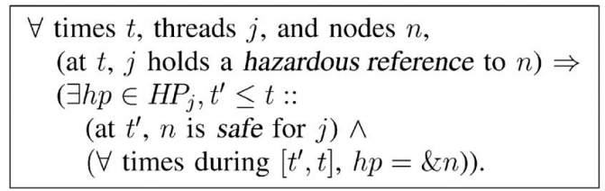

<h1 align="center">Hazard Pointers</h1>
<h2 align="center">Safe Memory Reclamation for Lock-Free Objects</h2>
<p align="center">Maged M. Michael</p>

## Abstract

Lock-free objects offer significant performance and reliability advantages over conventional lock-based objects. However, the lack of an efficient portable lock-free method for the reclamation of the memory occupied by dynamic nodes removed from such objects is a major obstacle to their wide use in practice. This paper presents hazard pointers, a memory management methodology that allows memory reclamation for arbitrary reuse. It is very efficient, as demonstrated by our experimental results. It is suitable for user-level applications—as well as system programs—without dependence on special kernel or scheduler support. It is wait-free. It requires only single-word reads and writes for memory access in its core operations. It allows reclaimed memory to be returned to the operating system. In addition, it offers a lock-free solution for the ABA problem using only practical single-word instructions. Our experimental results on a multiprocessor system show that the new methodology offers equal and, more often, significantly better performance than other memory management methods, in addition to its qualitative advantages regarding memory reclamation and independence of special hardware support. We also show that lock-free implementations of important object types, using hazard pointers, offer comparable performance to that of efficient lock-based implementations under no contention and no multiprogramming, and outperform them by significant margins under moderate multiprogramming and/or contention, in addition to guaranteeing continuous progress and availability, even in the presence of thread failures and arbitrary delays.

无锁（lock-free）对象在性能和可靠性上比传统的基于锁的对象有显著优势。然而，缺乏一种高效、可移植的无锁方法来回收从这类对象中删除的动态节点所占用的内存，是它们在实践中广泛使用的主要障碍。本文提出的风险指针（hazard pointers）是一种内存管理方法，能回收内存并允许任意重用。实验表明它的效率很高。它适用于用户级应用和系统程序，不依赖内核或调度器的特殊支持。它是无等待的（wait-free），核心操作只需要单字的内存读写，并且允许回收的内存返还给操作系统。此外，仅使用实际可用的单字指令，它还为 ABA 问题提供了无锁的解决方案。我们在多处理器系统上的实验结果表明，除了在内存回收和无需特殊硬件支持上的定性优势外，该新方法的性能和其它内存管理方法相当，而且在更多情况下明显更好。我们还表明，使用风险指针（Hazard Pointers）的重要对象类型的无锁实现，在无争用、无多道程序的环境下与高效基于锁的实现性能相当，在中等多道程序和/或争用下则显著优于它们，同时还支持在存在线程失败和任意延迟时确保持续进展和可用性。

## 1. Introduction

A shared object is lock-free (also called nonblocking) if it guarantees that whenever a thread executes some finite number of steps toward an operation on the object, some thread (possibly a different one) must have made progress toward completing an operation on the object, during the execution of these steps. Thus, unlike conventional lock-based objects, lock-free objects are immune to deadlock when faced with thread failures, and offer robust performance, even when faced with arbitrary thread delays.

共享对象是无锁的（lock-free）（也称为非阻塞的，nonblocking），如果它能保证：当一个线程在对象上执行有限步数的操作时，在这期间**某个**线程（可能是不同的线程）一定朝完成操作的方向取得了进展。因此，与传统的基于锁的对象不同，无锁对象在线程失败时不会死锁，即使面对任意的线程延迟，也能提供稳定的性能。

Many algorithms for lock-free dynamic objects have been developed, e.g., [^11], [^9], [^23], [^21], [^4], [^5], [^16], [^7], [^25], [^18]. However, a major concern regarding these objects is the reclamation of the memory occupied by removed nodes. In the case of a lock-based object, when a thread removes a node from the object, it is easy to guarantee that no other thread will subsequently access the memory of that node, before it is reused or reallocated. Consequently, it is usually safe for the removing thread to reclaim the memory occupied by the removed node (e.g., using free) for arbitrary future reuse by the same or other threads (e.g., using malloc)

已经有许多无锁动态对象的算法被提出，例如[^11], [^9], [^23], [^21], [^4], [^5], [^16], [^7], [^25], [^18]。但这些对象的一个主要问题是如何回收被删除节点所占用的内存。对于基于锁的对象，当线程删除一个节点后，很容易保证其他线程在它被重用或重新分配之前不会再访问该节点的内存。因此，删除线程通常可以安全地回收被删除节点的内存（例如用 `free`），以供相同或其它线程将来任意重用（例如用 `malloc`）。

This is not the case for a typical lock-free dynamic object, when running in programming environments without support for automatic garbage collection. In order to guarantee lock-free progress, each thread must have unrestricted opportunity to operate on the object, at any time. When a thread removes a node, it is possible that some other contending thread—in the course of its lock-free operation—has earlier read a reference to that node, and is about to access its contents. If the removing thread were to reclaim the removed node for arbitrary reuse, the contending thread might corrupt the object or some other object that happens to occupy the space of the freed node, return the wrong result, or suffer an access error by dereferencing an invalid pointer value. Furthermore, if reclaimed memory is returned to the operating system (e.g., using munmap), access to such memory locations can result in fatal access violation errors. Simply put, the memory reclamation problem is how to allow the memory of removed nodes to be freed (i.e., reused arbitrarily or returned to the OS), while guaranteeing that no thread accesses free memory, and how to do so in a lock-free manner.

对于典型的无锁动态对象，在没有自动垃圾回收支持的编程环境中运行时，情况就不同了。为了保证无锁进展，每个线程必须能随时不受限制地操作该对象。当线程删除一个节点时，其它争用线程可能——在其无锁操作的执行过程中——之前已经读取了该节点的引用，正要访问其内容。如果删除线程真的回收了该节点以供任意重用，争用线程就可能破坏对象或者恰好占用被释放节点空间的其他对象，返回错误结果，或者因解引用无效指针而出现访问错误。此外，如果被回收的内存返还给了操作系统（例如通过 `munmap`），访问这样的内存位置会导致致命的访问违例错误。简单来说，内存回收问题就是：如何在保证没有线程访问已删除节点的前提下，释放被删除节点的内存被（即任意重用或返还给 OS），并且要以无锁的方式做到这一点。

Prior methods for allowing node reuse in dynamic lockfree objects fall into three main categories. 1) The IBM tag (update counter) method [^11], which hinders memory reclamation for arbitrary reuse and requires double-width instructions that are not available on 64-bit processors. 2) Lock-free reference counting methods [^29], [^3], which are inefficient and use unavailable strong multiaddress atomic primitives in order to allow memory reclamation. 3) Methods that depend on aggregate reference counters or per-thread timestamps [^13], [^4], [^5]. Without special scheduler support, these methods are blocking. That is, the failure or delay of even one thread can prevent an aggregate reference counter from reaching zero or a timestamp from advancing and, hence, preventing the reuse of unbounded memory.

之前用于允许动态无锁对象回收节点的方法主要分为三类。1）IBM 标记（更新计数器）法[^11]，它阻碍了内存回收以供任意重用，并且需要在 64 位处理器上不可用的双字宽度指令。2）无锁引用计数法 [^29], [^3]，效率不高，并且为了允许内存回收而使用了不可用的强多地址原子原语。3）依赖于总体引用计数或每线程时间戳的方法 [^13], [^4], [^5]，这些方法在没有特殊调度器支持时是阻塞的——即使一个线程的失败或延迟也会阻止总体引用计数归零或时间戳推进，从而阻止无界内存的重用。

This paper presents hazard pointers, a methodology for memory reclamation for lock-free dynamic objects. It is efficient; it takes constant expected amortized time per retired node (i.e., a removed node that is no longer needed by the removing thread). It offers an upper bound on the total number of retired nodes that are not yet eligible for reuse, regardless of thread failures or delays. That is, the failure or delay of any number of threads can prevent only a bounded number of retired nodes from being reused. The methodology does not require the use of double-width or strong multiaddress atomic primitives. It uses only singleword reads and writes for memory access in its core operations. It is wait-free [^8], i.e., progress is guaranteed for active threads individually, not just collectively; thus, it is also applicable to wait-free algorithms without weakening their progress guarantee. It allows reclaimed memory to be returned to the operating system. It does not require any special support from the kernel or the scheduler.

本文介绍风险指针（hazard pointers），一种用于无锁动态对象的内存回收方法。它的效率很高：对每个 retired 节点（即被删除线程不再需要的已删除节点）的预期分摊时间是常数。无论线程失败还是延迟，它都能还不能回收的 retired 节点总数保持一个上界——也就是说，任意数量的线程失败或延迟也只能阻止有界数量的 retired 节点被回收。该方法不需要双字或强多地址原子原语，其核心操作只使用单字的读写。它是无等待的 [^8]，即每个活跃线程都能独立保证进展（而不仅仅是整体进展），因此它也适用于无等待算法而不会削弱其进展保证。回收的内存可以返还给操作系统，且该方法不要求内核或调度器的任何特殊支持。

The core idea is to associate a number (typically one or two) of single-writer multireader shared pointers, called hazard pointers, with each thread that intends to access lockfree dynamic objects. A hazard pointer either has a null value or points to a node that may be accessed later by that thread without further validation that the reference to the node is still valid. Each hazard pointer can be written only by its owner thread, but can be read by other threads.

核心思想是，将一些（通常是一个或两个）单写者多读者（single-writer multi-reader）的共享指针——称为风险指针（hazard pointers）——与每个要访问无锁动态对象的线程关联。风险指针要么为 NULL，要么指向一个节点，该节点之后可能会被该线程访问，而无需进一步验证对该节点的引用是否仍然有效。每个风险指针只能由其拥有者线程写入，但可以被其他线程读取。

The methodology requires lock-free algorithms to guarantee that no thread can access a dynamic node at a time when it is possibly removed from the object, unless at least one of the thread’s associated hazard pointers has been pointing to that node continuously, from a time when the node was guaranteed to be reachable from the object’s roots. The methodology prevents the freeing of any retired node continuously pointed to by one or more hazard pointers of one or more threads from a point prior to its removal.

该方法要求无锁算法保证：当一个动态节点可能已从对象中删除时，任何线程都不能再访问该节点，除非该线程至少有一个风险指针在该节点从对象入口还能访问到时，就一直指向该节点。如果一个 retired 节点在被删除前已经有一个或多个线程用风险指针指向它，该方法就不会让这个节点被释放。

Whenever a thread retires a node, it keeps the node in a private list. After accumulating some number R of retired nodes, the thread scans the hazard pointers of other threads for matches for the addresses of the accumulated nodes. If a retired node is not matched by any of the hazard pointers, then it is safe for this node to be reclaimed. Otherwise, the thread keeps the node until its next scan of the hazard pointers.

每当一个线程 retire 一个节点时，它先将该节点保存在一个私有列表中。当累积到 R 个 retired 节点后，线程就扫描其他线程的风险指针，看这些指针中是否有与私有列表中的节点地址匹配的。如果某个 retired 节点没有被任何风险指针匹配，那么释放该节点就是安全的。否则，线程保留该节点，直到下次扫描风险指针。

By organizing a private list of snapshots of nonnull hazard pointers in a hash table that can be searched in constant expected time, and if the value of R is set such that R = H + Ω(H), where H is the total number of hazard pointers, then the methodology is guaranteed in every scan of the hazard pointers to identify Θ(R) nodes as eligible for arbitrary reuse, in O(R) expected time. Thus, the expected amortized time complexity of processing each retired node until it is eligible for reuse is constant.

通过将非空风险指针的快照组织成一个可在常数预期时间搜索的哈希表，并且将 R 设置为满足 R = H + Ω(H)（其中 H 是风险指针总数），该方法可以保证每次扫描风险指针时都能在 O(R) 的预期时间内识别出 Θ(R) 个可回收的节点。因此，每个 retired 节点直到可以回收为止的预期分摊时间是一个常数。

Note that a small number of hazard pointers per thread can be used to support an arbitrary number of objects as long as that number is sufficient for supporting each object individually. For example, in a program where each thread may operate arbitrarily on hundreds of shared objects that each requires up to two hazard pointers per thread (e.g., hash tables, FIFO queues, LIFO stacks, linked lists, work queues, and priority queues), only a total of two hazard pointers are needed per thread.

注意，每个线程只要少量风险指针就能支持任意数量的对象——只要该风险指针的数量足以单独支持每个对象。例如，如果一个程序中每个线程可以在数百个共享对象上进行操作，每个线程对任意对象最多需要两个风险指针（例如哈希表[^25]、FIFO 队列[^21]、LIFO 栈[^11]、链表[^16]、工作队列[^7]和优先级队列[^9]），那么每个线程就总共只需要两个风险指针。

> *每个线程所需的风险指针数量取决于同一时刻最多有多少个有风险的引用需要保护，而不是取决于线程会操作多少个不同的对象。风险指针是操作期间临时登记、用完即清的——在线程同时只操作一个对象的情况下，只需要满足单个对象需求的那个数量就够了。因此，一个线程可以操作数百个不同的共享对象，每个对象最多需要两个风险指针，而不需要几百个风险指针——因为它同一时刻只做一个操作，那两个指针反复在用。*

Experimental results on an IBM RS/6000 multiprocessor system show that the new methodology, applied to lock-free implementations of important object types, offers equal and, more often, significantly better performance than other memory management methods, in addition to its qualitative advantages regarding memory reclamation and independence of special hardware support. We also show that lockfree implementations of important object types, using hazard pointers, offer comparable performance to that of efficient lock-based implementations under no contention and no multiprogramming, and outperform them by significant margins under moderate multiprogramming and/or contention, in addition to guaranteeing continuous progress and availability even in the presence of thread failures and arbitrary delays.

在 IBM RS/6000 多处理器系统上的实验结果表明，该新方法应用于重要对象类型的无锁实现时，除了在内存回收和无需特殊硬件支持方面的定性优势外，其性能与其他内存管理方法相当，而且在更多情况下显著更好。我们还表明，使用风险指针（Hazard Pointers）的重要类型对象的无锁实现，在无争用、无多道程序时与高效基于锁的实现性能相当，在中等多道程序和/或争用下显著优于它们，同时还支持在有线程失败和任意延迟时确保持续进展和可用性。

The rest of this paper is organized as follows: In Section 2, we discuss the computational model for our methodology and memory management issues for lock-free objects. In Section 3, we present the hazard pointer methodology. In Section 4, we discuss applying hazard pointers to lock-free algorithms. In Section 5, we present our experimental performance results. In Section 6, we discuss related work and summarize our results.

本文其余部分组织如下：第 2 节讨论方法的计算模型和无锁对象的内存管理问题。第 3 节介绍风险指针方法。第 4 节讨论将风险指针应用于无锁算法。第 5 节给出实验性能结果。第 6 节讨论相关工作并总结结果。

## 2.  Preliminaries

### 2.1 The Model

The basic computational model for our methodology is the asynchronous shared memory model. Formal descriptions of this model appeared in the literature, e.g., [^8]. Informally, in this model, a set of threads communicate through primitive memory access operations on a set of shared memory locations. Threads run at arbitrary speeds and are subject to arbitrary delays. A thread makes no assumptions about the speed or status of any other thread. That is, it makes no assumptions about whether another thread is active, delayed, or crashed, and the time or duration of its suspension, resumption, or failure. If a thread crashes, it halts execution instantaneously.

我们方法的基本计算模型是异步共享内存模型。该模型的形式化描述出现在文献中，例如[^8]。通俗地说，在该模型中，一组线程通过共享变量上的原始内存操作来进行通信。线程以任意速度运行，并可能遭受任意延迟。线程不对任何其他线程的速度或状态做任何假设——即它不假设其他线程是活动的、延迟的还是崩溃的，也不假设其暂停、恢复或失败的时间或持续时间。如果线程崩溃，它会立即停止执行。

A shared object occupies a set of shared memory locations. An object is an instance of an implementation of an abstract object type, that defines the semantics of allowable operations on the object.

共享对象由一组共享变量组成。对象是抽象对象类型的一个实现实例，抽象类型定义了该对象上允许的操作的语义。

### 2.2 Atomic Primitives

In addition to atomic reads and writes, primitive operations on shared memory locations may include stronger atomic primitives such as compare-and-swap (CAS) and the pair load-linked/store-conditional (LL/SC). CAS takes three arguments: the address of a memory location, an expected value, and a new value. If and only if the memory location holds the expected value, the new value is written to it, atomically. A Boolean return value indicates whether the write occurred. That is,  CAS(addr, exp, new) performs the following atomically:

```
{ if (*addr != exp) return false; &addr <- new; return true; }
```

除了原子读取和写入外，共享内存变量上的基本操作可能包括更强的原子原语，例如 compare-and-swap（CAS）以及 load-linked/store-conditional（LL/SC）。CAS 有三个参数：内存变量的地址、预期值和新值。当且仅当内存变量与预期值相等时，新值会被原子地写入。布尔返回值指示写入是否发生。即 CAS(addr, exp, new) 原子地执行以下操作：

```
{ if (*addr != exp) return false; &addr <- new; return true; }
```

LL takes one argument: the address of a memory location, and returns its contents. SC takes two arguments: the address of a memory location and a new value. Only if no other thread has written the memory location since the current thread last read it using LL, the new value is written to the memory location, atomically. A Boolean return value indicates whether the write occurred. An associated instruction, Validate (VL), takes one argument: the address of a memory location, and returns a Boolean value that indicates whether any other thread has written the memory location since the current thread last read it using LL.

LL 接受一个参数：内存变量的地址，并返回其内容。SC 接受两个参数：内存变量的地址和一个新值。仅当自当前线程上次使用 LL 读取该内存变量以来没有其他线程写入过它时，新值才会被原子地写入。布尔返回值指示写入是否发生。还有一个相关的指令 Validate（VL），它接受一个参数：内存变量的地址，并返回一个布尔值，指示自当前线程上次使用 LL 读取以来是否有其他线程写入了该内存变量。

For practical architectural reasons, none of the architectures that support LL/SC (Alpha, MIPS, PowerPC) support VL or the ideal semantics of LL/SC as defined above. None allow nesting or interleaving of LL/SC pairs, and most prohibit any memory access between LL and SC. Also, all such architectures, occasionally—but not infinitely often—allow SC to fail spuriously; i.e., return false even when the memory location was not written by other threads since it was last read by the current thread using LL. For all the algorithms presented in this paper, CASðaddr; exp; newÞ can be implemented using restricted LL/SC as follows:

```c
{
    do
    { 
        if (LL(addr) != exp) 
            return false; 
    } 
    until SC(addr, new); 
    return true; 
}
```

出于实际的架构原因，支持 LL/SC 的架构（Alpha、MIPS、PowerPC）都不支持 VL 或上述 LL/SC 的理想语义。它们都不允许 LL/SC 对的嵌套或交织，且大多数禁止在 LL 和 SC 之间的任何内存访问。此外，所有这些架构偶尔（但不是无限频繁地）允许 SC 意外失败——即即使内存变量自当前线程上次使用 LL 读取后未被其他线程写入，也返回 false。对于本文提出的所有算法，CAS(addr, exp, new) 可以使用受限制的 LL/SC 实现如下：

```c
{
    do
    {
        if (LL(addr) != exp) 
            return false; 
    } 
    until SC(addr, new); 
    return true; 
}
```

Most current mainstream processor architectures support either CAS or restricted LL/SC on aligned single words. Support for CAS and LL/SC on aligned doublewords is available on most 32-bit architectures (i.e., support for 64-bit instructions), but not on 64-bit architecture (i.e., no support for 128-bit instructions).

当前大多数主流处理器架构都支持对齐单字上的 CAS 或受限制的 LL/SC。大多数 32 位架构（即支持 64 位指令）支持对齐双字上的 CAS 和 LL/SC，但 64 位架构（即不支持 128 位指令）上不提供该支持。

### 2.3 The ABA problem

A different but related problem to memory reclamation is the ABA problem. It affects almost all lock-free algorithms. It was first reported in the documentation of CAS on the IBM System 370. It occurs when a thread reads a value A from a shared location, and then other threads change the location to a different value, say B, and then back to A again. Later, when the original thread checks the location, e.g., using read or CAS, the comparison succeeds, and the thread erroneously proceeds under the assumption that the location has not changed since the thread read it earlier. As a result, the thread may corrupt the object or return a wrong result.

一个与内存回收不同但相关的问题是 ABA 问题。它几乎影响所有无锁算法，最早在 IBM System 370 的 CAS 文档中提出。当线程从共享变量读取值 A，然后其他线程将该变量改为不同的值 B，再改回 A 时，就会发生 ABA 问题。之后，当原线程检查该变量时（例如用 read 或 CAS），比较成功，线程就会错误地假设该变量自上次读取以来没有变化，从而可能破坏对象或返回错误结果。

> *只要一个地址经历 A → B → A 的循环，而另一个线程在 CAS 中用地址值做比较，就一定有 ABA 问题。*

The ABA problem is a fundamental problem that must be prevented regardless of memory reclamation. Its relation to memory reclamation is that solutions of the latter problem, such as automatic garbage collection (GC) and the new methodology, often prevent the ABA problem as a side-effect with little or no additional overhead.

ABA 问题是一个无论是否考虑内存回收都必须要防止的基本问题。它与内存回收的关系是：内存回收的解决方案（例如自动垃圾收集 GC 和这里提出的新方法）通常能作为附带效果防止 ABA 问题，而几乎没有或没有额外开销。

This is true for most lock-free dynamic objects. But, it should be noted that a common misconception is that GC inherently prevents the ABA problem in all cases. However, consider a program that moves dynamic nodes back and forth between two lists (e.g., LIFO stacks[^11]). The ABA problem is possible in such a case, even with perfect GC.

大多数无锁动态对象都是如此。但需要注意的是，一个常见的误解是 GC 在所有情况下都能从本质上防止 ABA 问题。以在两个列表（例如 LIFO 栈[^11]）之间来回移动动态节点的程序为例——即使有完美的 GC，ABA 问题仍然可能发生。

The new methodology is as powerful as GC with respect to ABA prevention in lock-free algorithms. That is, if a lockfree algorithm is ABA-safe under GC, then applying hazard pointers to it makes it ABA-safe without GC. As we discuss in a recent report(M.M. Michael, “ABA Prevention Using Single-Word Instructions”), lock-free algorithms can always be made ABA-safe under GC, as well as using hazard pointers in the absence of GC. In the rest of this paper, when discussing the use of hazard pointers for ABA prevention in the absence of support for GC, we assume that lock-free algorithms are already ABA-safe under GC.

在无锁算法的 ABA 防止方面，新方法与 GC 同样强大。也就是说，如果一个无锁算法在 GC 下是 ABA 安全的，那么应用风险指针后，它在没有 GC 的情况下也是 ABA 安全的。正如我们在最近的一篇报告[^19]中讨论的，如果无锁算法在 GC 下可以做到 ABA 安全，那么在没有 GC 的情况下使用风险指针也能做到。我们假设无锁算法在 GC 下已经是 ABA 安全的——本文后续关于在没有 GC 支持时使用风险指针防止 ABA 的讨论都基于此前提。

## 3. The Methodology

The new methodology is primarily based on the observation that, in the vast majority of algorithms for lock-free dynamic objects, a thread holds only a small number of references that may later be used without further validation for accessing the contents of dynamic nodes, or as targets or expected values of ABA-prone atomic comparison operations.

该方法主要基于一个观察：在绝大多数无锁动态对象算法中，线程只持有少量引用，这些引用稍后可能会在无需进一步验证的情况下被用来访问动态节点的内容，或作为容易发生 ABA 问题的原子比较操作的目标或期望值。

The core idea of the new methodology is associating a number of single-writer multireader shared pointers, called hazard pointers, with each thread that may operate on the associated objects. The number of hazard pointers per thread depends on the algorithms for associated objects and may vary among threads depending on the types of objects they intend to access. Typically, this number is one or two. For simplicity of presentation, we assume that each thread has the same number K of hazard pointers.

该方法的核心思想是，将一些单写者多读者（single-writer multi-reader）的共享指针——称为风险指针（hazard pointers）——与每个可能操作共享对象的线程关联起来。每个线程所需的风险指针数量取决于无锁共享对象的算法，且可能因线程打算访问的对象类型而不同。通常这个数量是一或两个。为简单起见，我们假设每个线程持有相同数量的 K 个风险指针。

The methodology communicates with the associated algorithms only through hazard pointers and a procedure RetireNode that is called by threads to pass the addresses of retired nodes. The methodology consists of two main parts: the algorithm for processing retired nodes, and the condition that lock-free algorithms must satisfy in order to guarantee the safety of memory reclamation and ABA prevention.

该方法只通过风险指针（hazard pointers）和一个由线程调用的 RetireNode 过程（用于传递 retired 节点的地址）来与相关算法通信。该方法包括两个主要部分：处理 retired 节点的算法，以及无锁算法为保证内存回收安全性和防止 ABA 所必须满足的条件。

### 3.1 The Algorithm


Fig. 1 shows the shared and private structures used by the algorithm. The main shared structure is the list of hazard pointer (HP) records. The list is initialized to contain one HP record for each of the N participating threads. The total number of hazard pointers is H = NK[^R]. Each thread uses two static private variables, rlist (retired list) and rcount (retired count), to maintain a private list of retired nodes.

图 1 显示了算法使用的共享结构和私有结构。主要的共享结构是 HP 记录列表。该列表初始化为 N 个 HP 列表，每个参与线程各一个。风险指针总数为 H = NK [^R]。每个线程使用两个静态私有变量 rlist（retired list）和 rcount（retired count）来维护一个私有的 retired 节点列表。


Fig. 2 shows the RetireNode routine, where the retired node is inserted into the thread’s list of retired nodes and the length of the list is updated. Whenever the size of a thread’s list of retired nodes reaches a threshold R, the thread scans the list of hazard pointers using the Scan routine. R can be chosen arbitrarily. However, in order to achieve a constant expected amortized processing time per retired node, R must satisfy R = H + Ω(H).

图 2 显示了 RetireNode 例程：retired 节点被插入到线程的 retired 节点列表中，并更新列表长度。当线程的 retired 节点列表大小达到阈值 R 时，线程就使用 Scan 例程扫描 HP 记录列表。R 可以任意选择。但为了使每个 retired 节点的预期分摊处理时间为常数，R 必须满足 R = H + Ω(H)。


Fig. 3 shows the Scan routine. A scan consists of two stages. The first stage involves scanning the HP list for nonnull values. Whenever a nonnull value is encountered, it is inserted in a local list plist, which can be implemented as a hash table. The second stage of Scan involves checking each node in rlist against the pointers in plist. If the lookup yields no match, the node is identified to be ready for arbitrary reuse. Otherwise, it is retained in rlist until the next scan by the current thread. Insertion and lookup in plist take constant expected time.

图 3 展示了 Scan 例程。扫描分为两个阶段。第一阶段扫描 HP 记录列表以找出所有非空值。每当遇到一个非空值，就将其插入到本地列表 plist 中（可实现为哈希表）。第二阶段检查 rlist 中的每个节点是否在 plist 中存在匹配的指针。如果查找不匹配，则该节点被判定为可以回收；否则它被保留在 rlist 中，直到当前线程下一次扫描。plist 中的插入和查找耗时都是常量预期时间。

Alternatively, if a lower worst-case—instead of average— time complexity is desired, plist can be implemented as a balanced search tree with O(log p) insertion and lookup time complexities, where p is the number of nonnull hazard pointers encountered in Stage 1 of Scan. In such a case, the amortized time complexity per retired node is O(log p).

或者，如果追求更低的最坏情况时间复杂度（而非平均），plist 可以作为一个平衡搜索树实现，插入和查找的时间复杂度为 O(log p)，其中 p 是 Scan 第一阶段中遇到的非空风险指针数目。此时，每个 retired 节点的分摊时间复杂度为 O(log p)。

In practice, for simplicity and speed, we recommend implementing plist as an array and sorting it at the end of Stage 1 of Scan, and then using binary search in Stage 2. We use the latter implementation for our experiments in Section 5. We omit the algorithms for hash tables, balanced search trees, sorting, and binary search, as they are wellknown sequential algorithms [^2].

在实践中，为了简单和速度，我们建议将 plist 实现为数组，在 Scan 第一阶段结束时对其排序，然后在第二阶段使用二分查找。我们在第 5 节的实验中使用的后一种实现。我们省略了哈希表、平衡搜索树、排序和二分查找的算法，因为它们是众所周知的顺序算法[^2]。

The task of the memory reclamation method in the context of this paper is to determine when a retired node is eligible for reuse safely while allowing memory reclamation. Thus, the definition of the PrepareF orReuse routine is open for several implementation options and is not an integral part of this methodology. An obvious implementation of that routine is to reclaim the node immediately for arbitrary reuse using the standard library call for memory deallocation, e.g., free. Another possibility—in order to reduce the overhead of calling malloc and free for every node allocation and deallocation—is that each thread can maintain a limited size private list of free nodes. When a thread runs out of private free nodes, it allocates new nodes, and when it accumulates too many private free nodes, it deallocates the excess nodes.

在本文的上下文中，内存回收方法的任务是确定一个 retired 节点何时可以安全地被回收。因此 PrepareForReuse 例程的定义是开放的，可以有多种实现选项，并不是该方法不可分割的一部分。该例程的一个直接实现是通过标准库调用（如 free）立即回收节点以供任意重用。另一种方案——为了减少每个节点分配和释放都调用 malloc 和 free 的开销——是让每个线程维护一个大小有限的私有 free 节点列表。当线程用完私有 free 节点时分配新节点；当积累了太多私有 free 节点时释放多余的节点。

The algorithm is wait-free; it takes O(R) expected time—or O(R log p) worst-case time if a logarithmic search structure is used—to identify Θ(R) retired nodes as eligible for arbitrary reuse. It only uses single-word reads and writes. It offers an upper bound NR on the number of retired nodes that are not yet eligible for reuse, even if some or all threads are delayed or have crashed.

该算法是无等待的（wait-free）：它需要 O(R) 的预期时间（如果使用对数搜索结构则是 O(R log p) 最坏情况时间）来识别 Θ(R) 个可回收的 retired 节点。它只使用单字读写操作。它提供了一个还不可回收的 retired 节点的上界 NR，即使部分或全部线程被延迟或崩溃。

### 3.2 Algorithm Extensions

The following are optional extensions to the core algorithm that enhance the methodology’s flexibility.

以下是核心算法的可选扩展，增强了方法的灵活性。

If the maximum number N of participating threads is not known before hand, we can add new HP records to the HP list using a simple push routine [^11]. Note that such a routine is wait-free, as the maximum number of threads is finite. This can be useful also, if it is desirable for threads to be able to allocate additional hazard pointers dynamically.

如果事先不知道参与线程的最大数量 N，我们可以使用简单的 push 例程向 HP 记录列表添加新的 HP 记录[^11]。注意这样的例程是无等待的，因为最大线程数是有限的（Scan 需要扫描 HP 记录列表，如果线程数无上限，那么就无法在有限的步骤内完成操作，这样就不是无等待的了）。如果线程希望能够动态分配额外的风险指针，这种方法也很有用。

In some applications, threads are created and retired dynamically. In such cases, it is desirable to allow HP records to be reused. Adding a Boolean flag to each HP record can serve as an indicator if the HP record is in use or available for reuse. Before retiring, a thread can clear the flag, and when a new thread is created, it can search the HP list for an available HP record and acquire it using test-andset (TAS). If no HP records are available, a new one can be added as described above.

在某些应用中，线程是动态创建和 retired 的。这种情况下，允许重用 HP 记录是可取的。可以为每个 HP 记录添加一个布尔标志，指示该 HP 记录正在使用还是可以重用。线程 retiring 前可以清除该标志；创建新线程时，可以在 HP 记录列表中搜索可用的 HP 记录并通过 test-and-set（TAS）获取。如果没有可用的 HP 记录，可以使用 push 添加新的 HP 记录。

Since a thread may have leftover retired nodes not yet identified as eligible for reuse, two fields can be added to the HP record structure so that a retiring thread can pass the values of its rlist and rcount variables to the next thread that inherits the HP record.

线程 retiring 时可能还有没处理完的 retired 节点。可以在 HP 记录里加两个字段 rlist 和 rcount，让这个线程把它的 rlist 和 rcount 传给下一个接手这个 HP 记录的线程。

Furthermore, it may be desirable to guarantee that every node that is eligible for reuse is eventually freed, barring thread failures. To do so, after executing Scan, a thread executes a HelpScan, where it checks every HP record. If an HP record is inactive, the thread locks it using TAS and pops nodes from its rlist. Whenever, the thread accumulates R nodes, it performs a Scan. Therefore, even if a thread retires leaving behind an HP record with a nonempty rlist and its HP record happens not to be reused, the nodes in the rlist will still be processed by other threads performing HelpScan.

此外，可能还需要保证每个符合回收条件的节点最终都能被释放（除非线程失败）。为此，线程在执行 Scan 后再执行一个 HelpScan，检查每个 HP 记录。如果某个 HP 记录是不活动的（inactive），线程用 TAS 锁定它，并从其 rlist 中弹出（pop）节点。每当线程积累了 R 个节点，就执行一次 Scan。因此，即使一个线程 retired 时留下了一个带有非空 rlist 的 HP 记录，且该 HP 记录恰巧没有被重用，rlist 中的节点仍然可以由其他执行 HelpScan 的线程处理。


Fig. 4 shows a version of the algorithm that incorporates the above mentioned extensions. The algorithm is still waitfree, and only single-word instructions are used.

图 4 显示了包含上述扩展的算法版本。该算法仍然是无等待的，且只使用单字指令。

### 3.3 The Condition

For a correct algorithm for a dynamic lock-free object to use the new methodology for memory reclamation and ABA prevention, it must satisfy a certain condition. When a thread assigns a reference (i.e., a node’s address) to one of its hazard pointers, it basically announces to other threads that it may use that reference in a hazardous manner (e.g., access the contents of the node without further validation of the reference), so that other threads will refrain from reclaiming or reusing the node until the reference is no longer hazardous. This announcement (i.e., setting the hazard pointer) must take place before the node is retired and the hazard pointer must continue to hold that reference until the reference is no longer hazardous.

对于一个正确的动态无锁对象算法，要使用新方法进行内存回收和防止 ABA，必须满足一定的条件。当线程将一个引用（即一个节点的地址）赋值给它的某个风险指针时，这相当于告诉其他线程：它可能会以有风险的方式使用该引用（例如访问节点的内容而不验证该引用是否有效），因此其他线程在引用不再有风险之前应避免回收或重用该节点。这一宣告（即设置风险指针）必须在节点 retired 之前完成，且风险指针必须一直持有该引用，直到该引用不再有风险。

> *这是无锁数据结构算法自身应该提供的保证，Hazard Pointers 将此保证作为前提条件。*

For a formal description of the condition, we first define some terms:

为正式描述该条件，我们先定义一些术语：

Node: We use the term node to describe a range of memory locations that at some time may be viewed as a logical entity either through its actual use in an object that uses hazard pointers, or from the point of view of a participating thread. Thus, it is possible for multiple nodes to overlap physically, but still be viewed as distinct logical entities.

节点（Node）是指一段内存范围。在某个时刻，这段内存要么被使用风险指针的对象实际当作一个节点使用，要么被某个参与线程当作一个逻辑实体看待。因此，多个节点可能在物理地址上重叠，但在逻辑上仍然是不同的实体。

At any time t, each node n is in one of the following states:

1. Allocated: n is allocated by a participating thread, but not yet inserted in an associated object.
2. Reachable: n is reachable by following valid pointers starting from the roots of an associated object.
3. Removed: n is no longer reachable, but may still be in use by the removing thread.
4. Retired: n is already removed and consumed by the removing thread, but not yet free.
5. Free: n’s memory is available for allocation.
6. Unavailable: all or part of n’s memory is used by an unrelated object.
7. Undefined: n’s range of memory locations is not currently viewed as a node.

在任何时刻 t，每个节点 n 处于以下状态之一：

1. 已分配（Allocated）：n 已被某个参与线程分配，但尚未插入到关联对象中。
2. 可到达（Reachable）：从关联对象的根开始，通过有效的指针可以到达 n。
3. 已删除（Removed）：n 不再可达，但仍可能被删除线程使用。
4. Retired（Retired）：n 已被删除线程处理完毕，但还未释放。
5. 空闲（Free）：n 的内存可供分配（free）。
6. 不可用（Unavailable）：n 的部分或全部内存被不相关的对象使用（例如 free 之后 malloc）。
7. 未定义（Undefined）：n 的内存范围当前不被视为一个节点（可能还没分配，可能已经归还给 OS）。

**Own**: A thread j owns a node n at time t, iff at t, n is allocated, removed, or retired by j. Each node can have at most one owner. The owner of an allocated node is the thread that allocated it (e.g., by calling malloc). The owner of a removed node is the thread that executed the step that removed it from the object (i.e., changed its state from reachable to removed). The owner of a retired node is the same one that removed it.

**Own**：线程 j 在时刻 t 拥有节点 n，当且仅当在 t 时，n 是由 j 分配的、由 j 删除的、或者由 j retired 的。每个节点最多只能有一个拥有者。已分配（allocated）节点的拥有者是分配它的线程（例如通过 malloc）。已删除（removed）节点的拥有者是执行删除操作（将其状态从可到达变为已删除）的线程。retired（retired）节点的拥有者与删除它的线程是同一个。

**Safe**: A node n is safe for a thread j at time t, iff at time t, either n is reachable, or j owns n.

**Safe**：节点 n 在时刻 t 对线程 j 是安全的，当且仅当在 t 时，要么 n 可达，要么 j 拥有 n。

**Possibly unsafe**: A node is possibly unsafe at time t from the point of view of thread j, if it is impossible solely by examining j’s private variables and the semantics of the algorithm to determine definitely in the affirmative that at time t the node is safe for j.

**Possibly unsafe**：仅凭线程 j 的本地信息和算法语义，不能肯定某个节点在时刻 t 对 j 是安全的——此时这个节点对 j 就是可能不安全的。

**Access hazard**： A step s in thread j’s algorithm is an access hazard iff it may result in access to a node that is possibly unsafe for j at the time of its execution.

**Access hazard**：如果线程 j 算法中的步骤 s 在执行时可能会访问一个节点，并且该节点此时对 j 可能不安全，那么 s 就是一个访问风险。

**ABA hazard**: A step s in thread j’s algorithm is an ABA hazard iff it includes an ABA-prone comparison that involves a dynamic node that is possibly unsafe for j at the time of the execution of s, such that either 1) the node’s address—or an arithmetic variation of it—is an expected value of the ABA-prone comparison, or 2) a memory location contained in the dynamic node is the target of the ABA-prone comparison.

**ABA hazard**：ABA 风险（ABA hazard）：如果线程 j 的算法执行到某一步 s，这一步包含一个ABA 风险比较（指 CAS 这类"读→比较→写"的原子操作），这个比较操作涉及一个在执行 s 时对 j 可能不安全的节点，并且满足以下条件之一，那么 s 就是一个 ABA 风险：

* 该节点的地址（或地址的算术衍生值）被作为这个比较操作的预期值（例如 CAS(&head, &NodeX, ...) 中的 &NodeX）
* 该节点内部的某个内存位置是这个比较操作的目标地址（例如 CAS(&node.next, ...) 中的 &node.next）

**Access-hazardous reference**: A thread j holds an accesshazardous reference to a node n at time t, iff at time t one or more of j’s private variables holds n’s address or an arithmetic variation of it, and j is guaranteed—unless it crashes—to reach an access hazard s that uses n’s address hazardously, i.e., accesses n when n is possibly unsafe for j.

**Access-hazardous reference**：在时刻 t，如果线程 j 的某个私有变量中存着 n 的地址，并且 j 接下来（除非崩溃）必然会执行一个访问风险的步骤，在该步骤中 j 会在 n 可能不安全的情况下访问 n，那么 j 在 t 时就持有对 n 的有访问风险的引用。

**ABA-hazardous reference**: A thread j holds an ABAhazardous reference to a node n at time t, iff at time t, one or more of j’s private variables holds n’s address or a mathematical variation of it, and j is guaranteed—unless it crashes—to reach an ABA hazard s that uses n’s address hazardously.

**ABA-hazardous reference**：在时刻 t，如果线程 j 的某个私有变量中存着 n 的地址，并且 j 接下来（除非崩溃）必然会执行一个 ABA 风险的步骤，在该步骤中 j 会在 n 可能不安全的情况下访问 n，那么 j 在 t 时就持有对 n 的一个有 ABA 风险的引用。

**Hazardous reference**: A reference is hazardous if it is accesshazardous and/or ABA-hazardous.

**Hazardous reference**：如果一个引用是有访问风险的（access-hazardous）和/或有 ABA 风险的（ABA-hazardous），则该引用是有风险的。

Informally, a hazardous reference is an address that without further validation of safety will be used later in a hazardous manner, i.e., to access possibly unsafe memory and/or as a target address or an expected value of an ABA-prone comparison.

非正式地说，有风险的引用就是一个地址，如果没有进一步的安全性验证，之后将以有风险的方式使用它——即访问可能不安全的内存，和/或作为 ABA-prone 比较操作的目标地址或预期值。

A thread that holds a reference to a node uses hazard pointers to announce to other threads that it may use the reference later without further validation in a hazardous step. However, this announcement is useless if it happens after the reference is already hazardous, or in other words, after the node is possibly unsafe, since another thread might have already removed the node, and then scanned the HP list and found no match for that node. Therefore, the condition that an associated algorithm must satisfy is that whenever a thread is holding a hazardous reference to a node, it must be the case that at least one of the thread’s hazard pointers has been continuously holding that reference from a time when the node was definitely safe for the thread. Note that this condition implies that no thread can create a new hazardous reference to a node while it is retired.

持有节点引用的线程，通过风险指针（hazard pointer）向其他线程宣告：它稍后可能会在一个有风险的步骤中使用该引用，不再做进一步验证。但是，如果宣告发生在该引用已经变得有风险之后——即在节点已经可能不安全之后——那么这个宣告是无用的，因为另一个线程可能已经删除了该节点，并且在此前扫描 HP 列表时没有找到匹配节点（被回收了）。因此，算法必须满足的条件是：每当线程持有对某个节点的有风险引用时，从该节点对该线程尚处于安全的时刻开始，线程的至少一个风险指针必须持续地持有该引用。注意，这个条件意味着，当节点 retired 之后，没有线程能再创建对该节点的新的有风险引用。

Formally, the condition is as follows, where HPj is the set of thread j’s hazard pointers:



正式地，条件如下，其中 HPj 是线程 j 的风险指针集合：


### 3.4 Correctness

Omit

## 4. Applying Hazard Pointers

This section discusses the methodology for adapting existing lock-free algorithms to the condition in Section 3.3. The following is an outline:

本节讨论将现有无锁算法适配到第 3.3 节条件的方法。以下是大纲：

1. Examine the target algorithm as follows:
   * Identify hazards and the hazardous references they use.
   * For each distinct hazardous reference, determine the point where it is created and the last hazard that uses it. The period between these two points is when a hazard pointer needs to be dedicated to that reference.
   * Compare the periods determined in the previous step for all hazardous references, and determine the maximum number of distinct references that can be hazardous—for the same thread—at the same time. This is the maximum number of hazard pointers needed per thread.
2. For each hazardous reference, insert the following steps in the target algorithm after the creation of the reference and before any of the hazards that use it:
   * Write the address of the node that is the target of the reference to an available hazard pointer.
   * Validate that the node is safe. If the validation succeeds, follow the normal flow of control of the target algorithm. Otherwise, skip over the hazards and follow the path of the target algorithm when conflict is detected, i.e., try again, backoff, exit loop, etc. This step is needed, as the node might have been already removed before the previous step was executed.

1. 按如下方式检查目标算法：

   * 识别它们涉及的风险（hazards）以及它们使用的有风险的引用（hazardous references）。

   * 对于每个不同的有风险的引用，确定它被创建的点，以及使用它的最后一个风险点。这两点之间的时间段就是需要为该引用专用一个风险指针的时间。

   * 对所有有风险的引用，比较上一步确定的时间段，确定同一线程在同一时间可能有风险的不同引用的最大数量。这就是每线程所需的最大风险指针数。

2. 对每个有风险的引用，在它被创建之后、被用于任何有风险的步骤之前，在目标算法中插入以下步骤：

   * 将目标节点引用的地址写入一个可用的风险指针。

   * 验证该节点是否安全。如果验证通过，按目标算法的正常控制流继续执行。否则，跳过有风险的访问，按目标算法检测到冲突时的路径执行——即重试（retry）、退避（back-off）、退出循环等。这一步是必要的，因为从创建引用到写入风险指针之间，节点可能已被其他线程删除，因此写入 HP 后必须重新验证安全性。

We applied hazard pointers to many algorithms, e.g., [^11], [^9], [^23], [^28], [^21], [^26], [^4], [^16], [^7], [^6], [^18], for the purposes of allowing memory reclamation and ABA prevention. We use several algorithms for important object types to demonstrate the application of the steps described above.

我们将风险指针应用到了许多算法中，例如 [^11], [^9], [^23], [^28], [^21], [^26], [^4], [^16], [^7], [^6], [^18]，用于允许内存回收和防止 ABA。我们使用几种重要对象类型的算法来演示上述步骤的应用。

Note that, while applying these steps is easy for algorithm designers, these steps are not readily applicable automatically (e.g., by a compiler). For example, it is not clear if a compiler can determine if a node is no longer reachable. Identifying ABA hazards is even more challenging for a compiler, as the ABA problem is a subtle problem that involves the implicit intentions of the algorithm designer.

需要注意的是，虽然套用这些步骤对算法设计者来说很容易，但这个过程并不容易被自动化（例如由编译器来完成）。例如，目前尚不清楚编译器能否判断一个节点是否不再可达。编译器识别 ABA 风险更具挑战性，因为 ABA 问题是一个涉及算法设计者隐含意图的微妙问题。

### 4.1 FIFO Queues

Omit

### 4.2 LIFO Stacks


Fig. 8 shows a lock-free stack based on the IBM freelist algorithm [^11] augmented with hazard pointers. In the push routine, the node accesses in lines 2 and 4 are not hazardous (as *node is owned by the thread at the time), and the CAS in line 5 is not ABA-prone (as the change of Top between lines 3 and 5 can never lead to corrupting the stack or any other object). Thus, no hazard pointers are needed for the push routine.

图 8 显示了一个基于 IBM freelist 算法 [^11] 的无锁栈，并增加了风险指针。在 push 例程中，第 2 行和第 4 行的节点访问没有风险（因为 *node 当时归该线程所有），第 5 行的 CAS 也不是 ABA-prone 的（因为第 3 行到第 5 行之间 Top 的变化永远不会导致破坏栈结构或其他对象）。因此 push 例程不需要风险指针。

In the pop routine, the node access in line 10 is hazardous and the CAS in line 11 is ABA-prone. All hazards use the reference t. The technique employed in transforming the pop routine is the same as that used in the enqueue routine of Fig. 6.

在 pop 例程中，第 10 行的节点访问是有风险的，第 11 行的 CAS 是 ABA-prone 的。所有这些有风险的操作都涉及引用 t。转换 pop 例程的方法与图 6 的 enqueue 例程相同。

### 4.3 List-Based Sets and Hash Tables

Omit

### 4.4 Single-Writer Multireader Dynamic Structures

Omit

## 5. Experimental Performance Results

omit

## 6. Discussion

### 6.1 Related Work

#### 6.1.1 IBM ABA-Prevention Tags

Omit

#### 6.1.2 Lock-Free Reference Counting

Omit

#### 6.1.3 Scheduler-Dependent and Blocking Methods

Omit

#### 6.1.4 Recent Work

Omit

### 6.2 Conclusions

Omit

## Acknowledgements

Omit


## References

[^R]: As discussed in Section 3.2, the algorithm can be extended such that the values of N and H do not need to be known in advance, and threads can join and leave the system dynamically and allocate and deallocate hazard pointers dynamically.
[^2]: T.H. Cormen, C.E. Leiserson, and R.L. Rivest, Introduction to Algorithms. MIT Press, 1990.
[^3]: D.L. Detlefs, P.A. Martin, M. Moir, and G.L. Steele Jr., “Lock-Free Reference Counting,” Proc. 20th Ann. ACM Symp. Principles of Distributed Computing, pp. 190-199, Aug. 2001.
[^4]: M.B. Greenwald, “Non-Blocking Synchronization and System Design,” PhD thesis, Stanford Univ., Aug. 1999.
[^5]: T.L. Harris, “A Pragmatic Implementation of Non-Blocking Linked Lists,” Proc. 15th Int’l Symp. Distributed Computing, pp.*nbsp;300-314, Oct. 2001.
[^6]: T.L. Harris, K. Fraser, and I.A. Pratt, “A Practical Multi-Word Compare-and-Swap Operation,” Proc. 16th Int’l Symp. Distributed Computing, pp. 265-279, Oct. 2002.
[^7]: D. Hendler and N. Shavit, “Work Dealing,” Proc. 14th Ann. ACM Symp. Parallel Algorithms and Architectures, pp. 164-172, Aug. 2002.
[^8]: M.P. Herlihy, “Wait-Free Synchronization,” ACM Trans. Programming Languages and Systems, vol. 13, no. 1, pp. 124-149, Jan. 1991.
[^9]: M.P. Herlihy, “A Methodology for Implementing Highly Concurrent Objects,” ACM Trans. Programming Languages and Systems, vol. 15, no. 5, pp. 745-770, Nov. 1993.
[^10]: M.P. Herlihy, V. Luchangco, and M. Moir, “The Repeat Offender Problem: A Mechanism for Supporting Dynamic-Sized Lock-Free Data Structures,” Proc. 16th Int’l Symp. Distributed Computing, pp. 339-353, Oct. 2002.
[^11]: IBM, IBM System/370 Extended Architecture, Principles of Operation, publication no. SA22-7085, 1983.
[^13]: P.E. McKenney and J.D. Slingwine, “Read-Copy Update: Using Execution History to Solve Concurrency Problems,” Proc. 10th IASTED Int’l Conf. Parallel and Distributed Computing and Systems, Oct. 1998.
[^16]: M.M. Michael, “High Performance Dynamic Lock-Free Hash Tables and List-Based Sets,” Proc. 14th Ann. ACM Symp. Parallel Algorithms and Architectures, pp. 73-82, Aug. 2002.
[^18]: M.M. Michael, “CAS-Based Lock-Free Algorithm for Shared Deques,” Proc. Ninth Euro-Par Conf. Parallel Processing, pp. 651- 660, Aug. 2003.
[^19]: M.M. Michael, “ABA Prevention Using Single-Word Instructions,” Technical Report RC 23089, IBM T.J. Watson Research Center, Jan. 2004.
[^21]: M.M. Michael and M.L. Scott, “Simple, Fast, and Practical NonBlocking and Blocking Concurrent Queue Algorithms,” Proc. 15th Ann. ACM Symp. Principles of Distributed Computing, pp. 267-275, May 1996.
[^23]: S. Prakash, Y.-H. Lee, and T. Johnson, “A Nonblocking Algorithm for Shared Queues Using Compare-and-Swap,” IEEE Trans. Computers, vol. 43, no. 5, pp. 548-559, May 1994.
[^25]: O. Shalev and N. Shavit, “Split-Ordered Lists: Lock-Free Extensible Hash Tables,” Proc. 22nd Ann. ACM Symp. Principles of Distributed Computing, pp. 102-111, July 2003.
[^26]: N. Shavit and D. Touitou, “Software Transactional Memory,” Distributed Computing, vol. 10, no. 2, pp. 99-116, 1997.
[^28]: J. Turek, D. Shasha, and S. Prakash, “Locking Without Blocking: Making Lock Based Concurrent Data Structure Algorithms Nonblocking,” Proc. 11th ACM Symp. Principles of Database Systems, pp. 212-222, June 1992.
[^29]: J.D. Valois, “Lock-Free Linked Lists Using Compare-and-Swap,” Proc. 14th Ann. ACM Symp. Principles of Distributed Computing, pp. 214-222, Aug. 1995.
