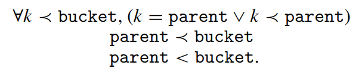

<h1 align="center">Split-Ordered Lists</h1>
<h2 align="center">Lock-Free Extensible Hash Tables</h2>
<p align="center">Ori Shalev and Nir Shavit</p>

## Abstract

We present the first lock-free implementation of an extensible hash table running on current architectures. Our algorithm provides concurrent insert, delete, and find operations with an expected O(1) cost. It consists of very simple code, easily implementable using only load, store, and compare-and-swap operations. The new mathematical structure at the core of our algorithm is recursive split ordering, a way of ordering elements in a linked list so that they can be repeatedly "split" using a single compare-and-swap operation. Metaphorically speaking, our algorithm differs from prior known algorithms in that extensibility is derived by "moving the buckets among the items" rather than "the items among the buckets." Though lock-free algorithms are expected to work best in multiprogrammed environments, empirical tests we conducted on a large shared memory multiprocessor show that even in non-multiprogrammed environments, the new algorithm performs as well as the most efficient known lock-based resizable hash-table algorithm, and in high load cases it significantly outperforms it.

我们提出了首个可在当前架构上运行的无锁可扩展哈希表实现。该算法支持并发的插入、删除和查找操作，且期望时间复杂度均为 O(1)。它由非常简洁的代码组成，仅通过 load、store 和 compare-and-swap 操作即可轻松实现。该算法的核心是一种新的数学结构——recursive split ordering（递归分裂序），这是一种对链表元素进行排序的方式，使得仅用单个 compare-and-swap 操作就能重复地 "split"（分裂）它们。打个比方，我们的算法与以往已知算法的不同之处在于，可扩展性是通过"在元素之间移动 bucket"、而非"在 bucket 之间移动元素"来实现的。尽管无锁算法在多道程序环境下表现最佳，但我们在大型共享内存多处理器上进行的实测表明，即使在非多道程序环境中，新算法的性能也不逊于已知最高效的基于锁的可调整大小哈希表算法，而在高负载情况下更是显著优于后者。

## 1. Introduction

Hash tables, and specifically extensible hash tables, serve as a key building block of many high performance systems. A typical extensible hash table is a continuously resized array of buckets, each holding an expected constant number of elements, and thus requiring an expected constant time for insert, delete and find operations [Cormen et al. 2001]. The cost of resizing, the redistribution of items between old and new buckets, is amortized over all table operations, thus keeping the average complexity of any one operation constant. As this is an extensible hash table, "resizing" means extending the table. It is interesting to note, as argued elsewhere [Hsu and Yang 1986; Lea (e-mail communication 2005)], that many of the standard concurrent applications using hash tables require tables to only increase in size."

哈希表，尤其是可扩展哈希表，是许多高性能系统的关键基础组件。典型的可扩展哈希表是一个可动态调整大小的 bucket 数组，每个 bucket 容纳期望的常数个元素，因此插入、删除和查找操作都能在期望的常数时间内完成 [Cormen et al. 2001]。调整大小的开销（即在旧 bucket 与新 bucket 之间重新分配元素）被均摊到所有表操作上，从而保证每个操作的平均复杂度为常数。由于这是可扩展哈希表，"resizing" 意味着对表进行扩展。值得注意的是，正如其他地方所阐述的 [Hsu and Yang 1986; Lea (e-mail communication 2005)]，许多使用哈希表的标准并发应用只需要表的大小单向增长。

> *传统可扩展哈希表的 resize（翻倍后 rehash 所有元素）时间复杂度是 O(n)，其中 n 是当前元素总数。但因为 resize 每 O(n) 次插入才触发一次，均摊到每次插入后就是 O(1) 摊销复杂度。*

We are concerned in implementing the hash table data structure on multiprocessor machines, where efficient synchronization of concurrent access to data structures is essential. Lock-free algorithms have been proposed in the past as an appealing alternative to lock-based schemes, as they utilize strong primitives such as CAS (compare-and-swap) to achieve fine grained synchronization. However, lockfree algorithms typically require greater design efforts, being conceptually more complex.

我们的目标是在多处理器机器上实现哈希表数据结构，而这种场景下对数据结构的并发访问进行高效同步至关重要。过去，无锁算法被提出作为基于锁的方案的一种有吸引力的替代方案，因为它们利用 CAS（compare-and-swap，比较并交换）等强原语来实现细粒度同步。然而，无锁算法通常在概念上更为复杂，需要更多的设计投入。

This article presents the first lock-free extensible hash table that works on current architectures, that is, uses only loads, stores and CAS (or LL/SC [Moir 1997]) operations. In a manner similar to sequential linear hashing [Litwin 1980] and fitting real-time applications, resizing costs are split incrementally to achieve expected O(1) operations per insert, delete and find. The proposed algorithm is simple to implement, leading us to hope it will be of interest to practitioners as well as researchers. As we explain shortly, it is based on a novel recursively split-ordered list structure. Our empirical testing shows that in a concurrent environment, even without multiprogramming, our lock-free algorithm performs as well as the most efficient known lock-based extensible hash-table algorithm due to Lea [2003], and in high-load cases, it significantly outperforms it.

本文介绍了首个适用于当前架构的无锁可扩展哈希表，它仅使用 load、store 和 CAS（或 LL/SC [Moir 1997]）操作。与顺序线性哈希 [Litwin 1980] 类似，并且适用于实时应用场景，调整大小的开销被逐步分摊，从而使得每个插入、删除和查找操作都能达到期望的 O(1) 时间复杂度。所提出的算法实现简单，我们希望它既能引起实践者的兴趣，也能引起研究者的关注。我们稍后将解释，该算法基于一种新颖的 recursively split-ordered list（递归分裂有序链表）结构。我们的实证测试表明，在并发环境中，即使没有多道程序的支持，我们的无锁算法性能也与 Lea [2003] 所提出的已知最高效的基于锁的可扩展哈希表算法相当，而在高负载情况下则显著优于后者。

> *顺序线性哈希（sequential linear hashing）是 Litwin 在 1980 年提出的顺序可扩展哈希方案。其核心思想是，不像传统可扩展哈希那样一次性翻倍 + 全部 rehash，而是在每次插入时做增量式的分裂：*
>
> * *维护一个指针 next，指向当前要分裂的 bucket*
> * *每次插入时，除了把元素放入对应 bucket，还把 next 指向的 bucket 分裂成两个 bucket*
> * *表容量从 N 逐步增长到 2N，而不是瞬间翻倍*
>
> *特点：*
>
> - *哈希函数是模 2^i（与论文相同）*
> - *bucket 数组增长也是翻倍*
> - *分裂过程分摊到每次插入，避免了单次 O(n) 的大延迟*

### 1.1 Background

There are several lock-based concurrent hash table implementations in the literature. In the early eighties, Ellis [1983, 1987] proposed an extensible concurrent hash table for distributed data based on a two level locking scheme, first locking a table directory and then the individual buckets. Michael [2002a] has recently shown that on shared memory multiprocessors, simple algorithms using a reader-writer lock [Mellor-Crummey and Scott 1991] per bucket have reasonable performance for non-extensible tables. However, to resize one would have to hold the locks on all buckets simultaneously, leading to significant overheads. A recent algorithm by Lea [2003], proposed for java.util.concurrent, the JavaTM Concurrency Package, is probably the most efficient known concurrent extensible hash algorithm. It is based on a more sophisticated locking scheme that involves a small number of high level locks rather than a lock per bucket, and allows concurrent searches while resizing the table, but not concurrent inserts or deletes. In general, lock-based hash-table algorithms are expected to suffer from the typical drawbacks of blocking synchronization: deadlocks, long delays, and priority inversions [Greenwald 1999]. These drawbacks become more acute when performing a resize operation, an elaborate "global" process of redistributing the elements in all the hash table's buckets among newly added buckets. Designing a lock-free extensible hash table is thus a matter of both practical and theoretical interest.

文献中有几种基于锁的并发哈希表实现。早在 80 年代初期，Ellis [1983, 1987] 就提出了一种基于两级锁定方案的分布式数据可扩展并发哈希表：首先锁定表的目录，然后锁定各个 bucket。Michael [2002a] 最近指出，在共享内存多处理器上，使用每个 bucket 读写锁 [Mellor-Crummey and Scott 1991] 的简单算法在不可扩展的哈希表上具有合理的性能。然而要调整大小，就必须同时持有所有 bucket 的锁，这会导致巨大的开销。Lea [2003] 最近为 JavaTM 并发包 java.util.concurrent 提出的算法可能是已知最高效的并发可扩展哈希算法。它基于一种更精细的锁定方案，涉及少量高级锁而非每 bucket 一个锁，并允许在调整表大小时进行并发查找，但不支持并发插入或删除。一般来说，基于锁的哈希表算法会遇到阻塞同步的典型缺陷：死锁、长时间延迟和优先级反转 [Greenwald 1999]。这些缺陷在执行 resize 操作（即在新增的 bucket 之间重新分配所有哈希表 bucket 中元素的复杂"全局"过程）时变得更为严重。因此，设计无锁可扩展哈希表既有实践意义，也有理论价值。

Michael [2002a], builds on the work of Harris [2001] to provide an effective compare-and-swap (CAS) based lock-free linked-list algorithm (which we will elaborate upon in the following section). He then uses this algorithm to design a lock-free hash structure: a fixed size array of hash buckets with lock-free insertion and deletion into each. He presents empirical evidence that shows a significant advantage of this hash structure over lock-based implementations in multiprogrammed environments. However, this structure is not extensible: if the number of elements grows beyond the predetermined size, the time complexity of operations will no longer be constant.

Michael [2002a] 在 Harris [2001] 的基础上，提出了一种基于 compare-and-swap (CAS) 的高效无锁链表算法（我们将在下一节详细阐述）。然后他用该算法设计了一个无锁哈希结构：一个固定大小的哈希 bucket 数组，每个 bucket 支持无锁的插入和删除操作。他提供的实证证据表明，在多道程序环境中，这种哈希结构相比基于锁的实现具有显著优势。然而该结构是不可扩展的：如果元素数量增长超过预定的大小，操作的时间复杂度将不再保持为常数。

As part of his "two-handed emulation" approach, Greenwald [2002] provides a lock-free hash table that can be resized based on a double-compare-and-swap (DCAS) operation. However, DCAS, an operation that performs a CAS atomically on two non-adjacent memory locations, is not available on current architectures. Moreover, although Greenwald's hash table is extensible, it is not a true extensible hash table. The average number of steps per operation is not constant: it involves a helping scheme where that under certain scheduling scenario would lead to a time complexity linearly dependant on the number of processes.

Greenwald [2002] 在其 "two-handed emulation" 方法中，提供了一种基于 double-compare-and-swap (DCAS) 操作的可调整大小无锁哈希表。然而 DCAS 是一种在两个不相邻内存位置上以原子方式执行 CAS 的操作，在当前架构上并不可用。此外，Greenwald 的哈希表虽然可扩展，但并非真正的可扩展哈希表。其每个操作的平均步数不是常数：它包含一个 helping（辅助）机制，在某些调度场景下会导致时间复杂度与进程数呈线性关系。

Independently of our work, Gao et al. [2004] have developed a extensible and "almost wait-free" hashing algorithm based on an open addressing hashing scheme and using only CAS operations. Their algorithm maintains the dynamic size by periodically switching to a global resize state in which multiple processes collectively perform the migration of items to new buckets. They suggest performing migration using a write-all algorithm [Hesselink et al. 2001]. Theoretically, each operation in their algorithm requires more than constant time on average because of the complexity of performing the write-all [Hesselink et al. 2001], and so it is not a true extensible hash-table. However, the nonconstant factor is small, and the performance of their algorithm in practice will depend on the yet-untested realworld performance of algorithms for the write-all problem [Hesselink et al. 2001; Kanellakis and Shvartsman 1997].

独立于我们的工作，Gao 等人 [2004] 开发了一种基于开放寻址哈希方案、仅使用 CAS 操作的可扩展且"几乎无等待"的哈希算法。该算法通过扩容切换到一个全局 resize 状态来维持动态大小，在该状态下所有线程共同执行元素到新 bucket 的迁移。他们建议使用 write-all 算法 [Hesselink et al. 2001] 来执行迁移。理论上，由于执行 write-all 的复杂度，该算法中每个操作的平均时间超过常数 [Hesselink et al. 2001]，因此它不是一个真正的可扩展哈希表。不过这个非常数因子很小，其算法在实践中的性能将取决于 write-all 问题相关算法 [Hesselink et al. 2001; Kanellakis and Shvartsman 1997] 尚未经过检验的实际表现。

### 1.2 The lock-free resizing problem

What is it that makes lock-free extensible hashing hard to achieve? The core problem is that even if individual buckets are lock-free, when resizing the table, several items from each of the "old" buckets must be relocated to a bucket among "new" ones. However, in a single CAS operation, it seems impossible to atomically move even a single item, as this requires one to remove the item from one linked list and insert it in another. If this move is not done atomically, elements might be lost, or to prevent loss, will have to be replicated, introducing the overhead of "replication management". The lock-free techniques for providing the broader atomicity required to overcome these difficulties imply that processes will have to "help" others complete their operations. Unfortunately, "helping" requires processes to store state and repeatedly monitor other processes' progress, leading to redundancies and overheads that are unacceptable if one wants to maintain the constant time performance of hashing algorithms.

是什么让无锁可扩展哈希表难以实现？核心问题在于，即使单个 bucket 是无锁的，在调整表大小时，每个"旧"bucket 中的若干元素也必须迁移到"新"bucket 中。然而，仅通过一个 CAS 操作，似乎连移动单个元素都无法以原子方式完成，因为这需要从一个链表中删除该元素并将它插入到另一个链表中。如果这个移动操作不是原子性的，元素可能会丢失；为了防止丢失，又不得不复制元素，从而引入了"复制管理"的开销。为克服这些困难而提供更广泛原子性的无锁技术（保证 lock-free），意味着线程必须"帮助"其他线程完成它们的操作。不幸的是，这种"帮助"机制要求线程存储状态并反复监视其他线程的进度，这会导致冗余和开销，对于希望保持哈希算法常数时间性能来说是不可接受的。

### 1.3 Split-ordered lists


To implement our algorithm, we thus had to overcome the difficulty of atomically moving items from old to new buckets when resizing. To do so, we decided to, metaphorically speaking, flip the linear hashing algorithm on its head: our algorithm will not move the items among the buckets, rather, it will move the buckets among the items. More specifically, as shown in Figure 1, the algorithm keeps all the items in one lock-free linked list, and gradually assigns the bucket pointers to the places in the list where a sublist of "correct" items can be found. A bucket is initialized upon first access by assigning it to a new "dummy" node (dashed contour) in the list, preceding all items that should be in that bucket. A newly created bucket splits an older bucket's chain, reducing the access cost to its items. Our table uses a modulo 2^i hash (there are known techniques for "pre-hashing" before a modulo 2^i hash to overcome possible binary correlations among values Lea [2003]). The table starts at size 2 and repeatedly doubles in size.

因此，为了实现我们的算法，我们必须克服在调整大小时将元素从旧 bucket 原子地迁移到新 bucket 的困难。为此，我们决定——打个比方说——把线性哈希算法颠倒过来：我们的算法不会在 bucket 之间移动元素，而是在元素之间移动 bucket。具体来说，如图 1 所示，该算法将所有元素保存在一个无锁链表中，然后逐步将 bucket 指针指向链表中可以找到"正确"元素子链表的位置。bucket 在第一次被访问时通过指向链表中的一个新 dummy 节点（虚线轮廓）来初始化，该节点位于该 bucket 内所有元素之前。新创建的 bucket 会分割旧 bucket 的链，从而降低对其元素的访问成本。我们的表使用模 2^i 哈希（在模 2^i 哈希之前有已知的"预哈希"技术，可以克服值之间可能存在的二进制相关性 [Lea 2003]）。哈希表从大小 2 开始，然后反复翻倍。

>*预哈希（pre-hashing）是指在取模之前对原始哈希值做一次位扩散（bit-spreading），解决纯 mod 2^i 只取低 i 位导致的分布不均问题。问题来源：*
>*mod 2^i 只看 key 的最低 i 位。如果 key 的低位存在二进制相关性（比如地址都是 4 字节对齐，低 2 位总是 00），大量 key 会扎堆到少数 bucket，负载严重倾斜。*
>
>*解决：预哈希通过把高位"搅入"低位，让 mod 2^i 这只看低位的眼睛也能看到高位的随机性。*

Unlike moving an item, the operation of directing a bucket pointer can be done in a single CAS operation, and since items are not moved, they are never "lost". However, to make this approach work, one must be able to keep the items in the list sorted in such a way that any bucket's sublist can be "split" by directing a new bucket pointer within it. This operation must be recursively repeatable, as every split bucket may be split again and again as the hash table grows. To achieve this goal we introduced recursive split-ordering, a new ordering on keys that keeps items in a given bucket adjacent in the list throughout the repeated splitting process.

与移动元素不同，将 bucket 指针指向某个位置的操作只需一个 CAS 就能完成，而且由于元素本身没有被移动，它们永远不会"丢失"。然而要使这种方法行之有效，必须能让链表中的元素以这样一种方式保持有序：任意 bucket 的子链表都可以通过在内部设置一个新的 bucket 指针来"分裂"。这种操作必须是可以递归重复的，因为随着哈希表的增长，每个已被分裂的 bucket 可能会被继续分裂。为了实现这一目标，我们引入了 recursive split-ordering（递归分裂序），这是一种新的键排序方式，它能够在整个重复分裂过程中，使给定 bucket 中的元素在链表中始终彼此相邻。

Magically, yet perhaps not surprisingly, recursive split-ordering is achieved by simple binary reversal: reversing the bits of the hash key so that the new key's most significant bits (MSB) are those that were originally its least significant. As detailed below and in the next section, some additional bit-wise modifications must be made to make things work properly. In Figure 1, the split-order key values are written above the nodes (the reader should disregard the rightmost binary digit at this point). For instance, the split-order value of 3 is the bit-reverse of its binary representation, which is 11000000. The dashed-line nodes are the special dummy nodes corresponding to buckets with original keys that are 0,1,2, and 3 modulo 4. The split-order keys of regular (nondashed) nodes are exactly the bit-reverse image of the original keys after turning on their MSB (in the example we used 8-bit words). For example, items 9 and 13 are in the "1 mod 4" bucket, which can be recursively split in two by inserting a new node between them.

奇妙的是——但也许并不令人意外——recursive split-ordering 是通过简单的二进制位反转实现的：将哈希键的二进制位反转，使得新键的最高有效位（MSB）对应原来最低有效位。如下文和下一节所述，还需进行一些额外的按位修改才能使一切正常工作。在图 1 中，split-order key 的值写在节点上方（此时读者应忽略最右边的二进制位）。例如，3 的 split-order 值是 11000000，即其二进制表示的位反转。虚线节点是特殊 dummy 节点，对应原始键为 0、1、2、3（模 4）的 bucket。常规（非虚线）节点的 split-order key 是原始键在开启 MSB 之后进行位反转的结果（示例中使用了 8 位字）。例如，元素 9 和 13 都位于"1 mod 4"bucket 中，可以通过在它们之间插入一个新节点来递归地一分为二。

>*不考虑位反转时，链表按原始 key 排序。决定 bucket 归属的是 key 的低位（因为哈希是 mod 2^i），而链表排序看的是整个 key（高位优先）。归属位是低位，排序时优先级最低，所以两个分裂去向的元素在链表中交错排列，无法一刀分开。
>位反转把 key 的位顺序颠倒，原来决定归属的低位变成了高位。此时链表按反转后的值排序，归属位变成了排序时最先比较的位：归属为 0 的全部在前段，为 1 的全部在后段，两段连续无交错。只需在分界点插入一个 dummy 节点，一个 CAS 操作就能完成分裂，无需移动任何元素。*

To insert (respectively delete or find) an item in the hash table, hash its key to the appropriate bucket using recursive split-ordering, follow the pointer to the appropriate location in the sorted items list, and traverse the list until the key's proper location in the split-ordering (respectively, until the key or a key indicating the item is not in the list) is found. The solution depends on the property that the items' position is "encoded" in their binary representation, and therefore cannot be generalized to bases other than 2.

要在哈希表中插入（或删除、查找）一个元素，先使用 recursive split-ordering 将其键哈希到对应的 bucket，然后跟随指针到达已排序链表中的相应位置，再遍历链表，直到找到该键在 split-ordering 中的正确位置（对于查找和删除操作，则是直到找到该键或遇到表明该键不存在的键为止）。该解决方案依赖于元素的二进制表示中"编码"暗含其位置这一特性，因此无法推广到 2 以外的进制。

As we show, because of the combinatorial structure induced by the split-ordering, this will require traversal of no more than an expected constant number of items. A detailed proof appears in Section 3.

正如我们所展示的，由于 split-ordering 所引出的组合结构，这一过程所需遍历的元素数量不会超过期望的常数。详细的证明见第 3 节。

We note that our design is modular: to implement the ordered items list, one can use one of several non-blocking list-based set algorithms in the literature. Potential candidates are the lock-free algorithms of Harris [2001] or Michael [2002a], or the obstruction-free algorithms of Valois[1995] or Luchangco et al. [2003]. We chose to base our presentation on the algorithm of Michael [2002a], an extension of the Harris algorithm [Harris 2001] that fits well with memory management schemes [Herlihy et al. 2002; Michael 2002b] and performs well in practice.

我们的设计是模块化的：要实现有序元素链表，可以使用文献中提到的几种基于链表的非阻塞集合算法。候选方案包括 Harris [2001] 或 Michael [2002a] 的无锁算法，以及 Valois [1995] 或 Luchangco 等人 [2003] 的 obstruction-free（无障碍）算法。我们选择基于 Michael [2002a] 的算法进行阐述，该算法是 Harris 算法 [Harris 2001] 的扩展，与内存管理方案 [Herlihy et al. 2002; Michael 2002b] 配合良好，并在实践中表现优异。

### 1.4 Complexity

Omit

### 1.5 Performance

Omit

## 2. The algorithm in detail

Our hash table data structure consists of two interconnected substructures (see Figure 1): A linked list of nodes containing the stored items and keys, and an expanding array of pointers into the list. The array entries are the logical "buckets" typical of most hash tables. Any item in the hash table can be reached by traversing down the list from its head, while the bucket pointers provide shortcuts into the list in order to minimize the search cost per item.

我们的哈希表数据结构由两个相互关联的子结构组成（见图 1）：一个包含所存储元素和键的节点链表，以及一个指向该链表的可扩展指针数组。数组中的条目就是大多数哈希表中典型的逻辑"bucket"。哈希表中的任何元素都可以从链表头部开始遍历访问，而 bucket 指针则提供了进入链表中的快捷方式，以最小化每个元素的搜索成本。

The main difficulty in maintaining this structure is in managing the continuous coverage of the full length of the list by bucket pointers as the number of items in the list grows. The distribution of bucket pointers among the list items must remain dense enough to allow constant time access to any item. Therefore, new buckets need to be created and assigned to sparsely covered regions in the list.

维护此结构的主要难点在于：随着链表增长，需要确保 bucket 指针在整个链表上始终保持足够密度，任意两个 bucket 入口之间的元素个数必须是常数，才能保证对任意元素的常数时间访问。因此，当链表某些区域覆盖稀疏时（即两个 bucket 之间聚集过多元素），就需要创建新的 bucket 分配到那里。

The bucket array initially has size 2, and is doubled every time the number of items in the table exceeds size · L, where L is a small integer denoting the load factor, the maximum number of items one would expect to find in each logical bucket of the hash table. The initial state of all buckets is uninitialized, except for the bucket of index 0, which points to an empty list, and is effectively the head pointer of the main list structure. Each bucket goes through an initialization procedure when first accessed, after which it points to some node in the list.

bucket 数组初始大小为 2，每当表中元素数量超过 size·L 时翻倍，其中 L 是一个表示负载因子的小整数，即期望在每个逻辑 bucket 中容纳的最大元素数。除索引 0 的 bucket 外，所有 bucket 初始均为未初始化；索引 0 的 bucket 指向一个空链表，本质上充当主链表结构的头指针。每个 bucket 在首次被访问时经历一个初始化过程，之后指向链表中的某个节点。

When an item of key k is inserted, deleted, or searched for in the table, a hash function modulo the table size is used, that is, the bucket chosen for item k is k mod size. The table size is always equal to some power 2^i , i ≥ 1, so that the bucket index is exactly the integer represented by the key's i least significant bits (LSBs). The hash function's dependency on the table size makes it necessary to take special care as this size changes: an item that was inserted to the hash table's list before the resize must be accessible, after the resize, from both the buckets it already belonged to and from the new bucket it will logically belong to given the new hash function.

当对键为 k 的元素进行插入、删除或查找操作时，会使用对当前表大小取模的哈希函数，即为元素 k 选择的 bucket 是 k mod size。表大小始终是 2^i (i≥1) 的幂，因此 bucket 索引正好等于由键的最低 i 个有效位（LSB）所表示的整数。哈希函数对表大小的依赖性使得在表大小发生变化时需要特别小心：在调整大小之前插入到哈希表链表中的元素，在调整大小之后必须既能从它原先所属的旧 bucket 访问到，也能从根据哈希函数计算出的新 bucket 访问到。

### 2.1 Recursive Split-ordering

The combination of a modulo-size hash function and a 2^i table size is not new. It was the basis of the well known sequential extensible Linear Hashing scheme proposed by Litwin [1980], was the basis of the two-level locking hash scheme of Ellis [1983], and was recently used by Lea [2003] in his concurrent extensible hashing scheme. The novelty here is that we use it as a basis for a combinatorial structure that allows us to repeatedly "split" all the items among the buckets without actually changing their position in the main list.

对表大小取模的哈希函数与 2^i 大小的表组合使用，这并非新事物。它是 Litwin [1980] 提出的顺序可扩展线性哈希方案的基础，也是 Ellis [1983] 的二级锁定哈希方案的基础，最近又被 Lea [2003] 用于其并发可扩展哈希方案。我们的新颖之处在于，将其用作组合结构的基础，这种组合结构允许我们反复"分裂"各个 bucket 中的所有元素，而无需改变它们在主链表中的实际位置。

When the table size is 2^i , a logical table bucket b contains items whose keys k maintain k mod 2^i = b. When the size becomes 2^i+1, the items of this bucket are split into two buckets: some remain in the bucket b, and others, for which k mod 2^i+1 = b + 2^i , migrate to the bucket b + 2^i . If these two groups of items were to be positioned one after the other in the list, splitting the bucket b would be achieved by simply pointing bucket b + 2^i after the first group of items and before the second. Such a manipulation would keep the items of the second group accessible from bucket b as desired.

当表大小为 2^i 时，哈希表逻辑 bucket b 中的元素满足 k mod 2^i = b。表大小增至 2^(i+1) 后，这些元素被分为两组：一组留在 bucket b，另一组（满足 k mod 2^(i+1) = b + 2^i）归入新 bucket b + 2^i。如果这两组元素在链表中前后连续排列，只需将 bucket b + 2^i 指向两组之间，即可完成对 bucket b 的分裂，且第二组元素仍然可以从 bucket b 访问到。

Looking at their keys, the items in the two groups are differentiated by the i'th binary digit (counting from right, starting at 0) of their items' key: those with 0 belong to the first group, and those with 1 to the second. The next table doubling will cause each of these groups to split again into two groups differentiated by bit i + 1, and so on. For example, the elements 9 (1001(2)) and 13 (1101(2)) share the same two least significant bits (01). When the table size is 2^2, they are both in the same bucket, but when it grows to 2^3, having a different third bit will cause to to be separated. This process induces recursive split-ordering, a complete order on keys, capturing how they will be repeatedly split among logical buckets. Given a key, its order is completely defined by its bit-reversed value.

这两组元素由键的第 i 个二进制位（从 0 开始，从右往左数）区分：该位为 0 的归第一组，为 1 的归第二组。下一次表翻倍时，每组又会按第 i+1 位再次分裂，以此类推。例如，元素 9（1001₂）和 13（1101₂）的最低两位相同（01），当表大小为 2² 时它们在同一 bucket 中；当表大小增至 2³ 时，第三位的不同将它们分到不同 bucket。这个过程引出了 recursive split-ordering（递归分裂序）——一种键的全局序，描述了键在逻辑 bucket 间如何被反复分裂。给定一个键，其 split-order 完全由位反转后的值决定。

Let us now return to the main picture: an exponentially growing array of (possibly uninitialized) buckets maps to a linked list ordered by the split-order values of inserted items' keys, values that are derived by reversing the bits of the original keys. Buckets are initialized when they are accessed for the first time. List operations such as insert, delete or find are implemented via a linearizable lock-free linked list algorithm. However, having additional references to nodes from the bucket array introduces a new difficulty: it is nontrivial to manage deletion of nodes pointed to by bucket pointers. Our solution is to add an auxiliary dummy node per bucket, preceding the first item of the bucket, and to have the bucket pointer point to this dummy node. The dummy nodes are not deleted, which helps keep things simple.

现在回到整体架构：一个指数增长的 bucket 数组（可能未初始化）映射到一个链表上，链表按插入元素键的 split-order 值排序——该值通过对原始键做位反转得到。bucket 在首次访问时初始化。插入、删除、查找等链表操作通过可线性化的无锁链表算法实现。然而，bucket 数组额外引用了链表节点，这带来了一个新问题：管理被 bucket 指针指向的节点的删除并非易事。我们的解决方案是为每个 bucket 添加一个辅助 dummy 节点，位于该 bucket 的第一个元素之前，并将 bucket 指针指向这个 dummy 节点。dummy 节点不会被删除，这简化了处理。


In more detail, when the table size is 2^i+1, the first time bucket b+2^i is accessed, a dummy node is created, holding the key b+2^i . This node is inserted to the list via bucket b, the parent bucket of b +2^i . Under split-ordering, b +2^i precedes all keys of bucket b +2^i , since those keys must end with i +1 bits forming the value b +2^i . This value also succeeds all the keys of bucket b that do not belong to b + 2^i : they have identical i LSBs, but their bit numbered i is "0". Therefore, the new dummy node is positioned in the exact location in the list that separates the items that belong to the new bucket from other items of bucket b. In the case where the parent bucket b is uninitialized, we apply the initialization procedure on it recursively before inserting the dummy node. In order to distinguish dummy keys from regular ones we set the most significant bit of regular keys to "1", and leave the dummy keys with "0" at the MSB. Figure 2 defines the complete split-ordering transformation using the functions so regularkey and so dummykey. The former, reverses the bits after turning on the MSB, and the latter simply performs the bit reversal.

具体来说，当表大小为 2^(i+1) 时，第一次访问 bucket b+2^i 就会创建一个包含键 b+2^i 的 dummy 节点。该节点通过其父 bucket b 插入到链表中。在 split-ordering 顺序下，b+2^i 排在 bucket b+2^i 中所有键之前，因为这些键必然以构成值 b+2^i 的那 i+1 个二进制位结尾。同时，该值也排在 bucket b 中不属于 b+2^i 的所有键之后：这些键的 LSB 相同，但第 i 位为"0"。因此，新 dummy 节点恰好落在链表中分隔新 bucket 元素与 bucket b 其他元素的位置上。如果父 bucket b 尚未初始化，则在插入 dummy 节点前递归地对其执行初始化。为区分 dummy key 与常规 key，我们将常规 key 的最高有效位设为"1"，dummy key 的 MSB 保留为"0"。图 2 使用函数 so_regularkey 和 so_dummykey 定义了完整的 split-ordering 变换：前者在设置 MSB 后进行位反转，后者直接做位反转。

*简单来说，split-order 链表中有两类节点，论文用 MSB（最高有效位）来区分它们：*

| *节点类型* | *key 来源*                              | *反转前处理*         |
| ---------- | --------------------------------------- | -------------------- |
| *Dummy*    | *bucket 索引 b（数值很小，MSB 必为 0）* | *不做任何处理*       |
| *Regular*  | *用户数据 key*                          | *先置 MSB=1，再反转* |

*因为 split-order 比较从高位开始，而常规节点的 MSB 恒为 1、dummy 的 MSB 恒为 0，因此所有 dummy 节点都排在所有常规节点之前，保证了每个 bucket 的 dummy 必然是该 bucket 子链表的第一个节点。*


Figure 3 describes a bucket initialization caused by an insertion of a new key to the set. The insertion of key 10 is invoked when the table size is 4 and buckets 0,1 and 3 are already initialized.

图 3 描述了由向集合中插入新键所触发的 bucket 初始化过程。当表大小为 4，且 bucket 0、1 和 3 已初始化时，插入键 10 的操作会触发对 bucket 2 的初始化。

Since the bucket array is growing, it is not guaranteed that the parent bucket of an uninitialized bucket is initialized. In this case, the parent has to be initialized (recursively) before proceeding. Though the total complexity in such a series of recursive calls is potentially logarithmic, our algorithm still works. This is because given a uniform distribution of items, the chances of a logarithmic-size series of recursive initialization calls are low, and in fact, the expected length of such a bad sequence of parent initializations is constant.

由于 bucket 数组在不断增长，无法保证一个未初始化 bucket 的父 bucket 已被初始化。在这种情况下，必须在继续操作之前（递归地）初始化父 bucket。尽管这样一系列递归调用的总复杂度可能是对数级别的（*初始化时，要找到未初始化 bucket 的父 bucket，逻辑是不断清除它的最高 set bit，因此最坏情况下递归深度 = bucket 索引中 1 的个数 ~ O(i) = O(log size)*），但我们的算法仍然可行。这是因为在元素均匀分布下，出现对数规模的递归初始化调用序列的概率很低，实际上这种糟糕的父初始化序列的期望长度是常数。

> *父 bucket 对应的哈希值范围是子 bucket 的两倍，因此任意一次插入/查找操作落到父 bucket 范围内的概率也是子 bucket 的两倍。在大量操作中，父 bucket 被访问到从而完成初始化的机会远比子 bucket 多，几乎总是已经初始化好了。只有连续多层父 bucket 都恰好在之前未被访问的极端情况下才会出现深层递归，而这种概率随深度指数衰减，因此期望深度是常数。*

### 2.2 The continuously growing table

We can now complete the presentation of our algorithm. We use the lock-free ordered linked-list algorithm of Michael [2002a] to maintain the main linked list with items ordered based on the split-ordered keys. This algorithm is an improved variant, including improved memory management, of an algorithm by Harris [2001]. Our presentation will not discuss the various memory reclamation options of such linked-list schemes, and we refer the interested reader to Harris [2001], Herlihy et al. [2002], and Michael [2002a, 2002b]. To keep our presentation self contained, we provide in Appendix A the code of Michael's linked list algorithm. This implementation is linearizable, implying that each of these operations can be viewed as happening atomically at some point within its execution interval.

现在我们可以完整地介绍我们的算法了。我们使用 Michael [2002a] 的无锁有序链表算法来维护主链表，其中元素按 split-order key 排序。该算法是 Harris [2001] 算法的改进变体，包含了改进的内存管理。我们的介绍不会讨论此类链表方案的各种内存回收选项，感兴趣的读者请参阅 Harris [2001]、Herlihy 等人 [2002] 和 Michael [2002a, 2002b]。为了保持自包含性，我们在附录 A 中提供了 Michael 链表算法的代码。该实现是可线性化的，即每个操作都可以视为在其调用和返回之间的某个时刻原子地发生。

> *可线性化（Linearizability） Herlihy & Wing, 1990：
> 一组并发操作是可线性化的，当且仅当每个操作都能分配一个线性化点（位于该操作的调用和返回之间），使得按线性化点排序得到的全序等价于某个合法的顺序执行。*
>
> 1. *存在性：每个操作可在其调用和返回之间找到一个线性化点*
> 2. *全序：所有操作的线性化点构成一个全局唯一的先后序列*
> 3. *合法性：按该序列顺序执行（无并发）得到的结果，与真实并发执行观察到的一致，且不违反数据结构的语义（即数据结构的顺序规约（sequential specification）——在单线程顺序执行下，这个数据结构应该表现出的行为）*


Our algorithm decides to double the table size based on the average bucket load. This load is determined by maintaining a shared counter that tracks the number of items in the table. The final detail we need to deal with is how the array of buckets is repeatedly extended. To simplify the presentation, we keep the table of buckets in one continuous memory segment as depicted in Figure 4. This approach is somewhat impractical, since table doubling requires one process to reallocate a very large memory segment while other processes may be waiting. The practical version of this algorithm, which we used for performance testing, actually employs an additional level of indirection in accessing buckets: a main array points to segments of buckets, each of which is a bucket array. A segment is allocated only upon the first access to some bucket within it. The code for this dynamic allocation scheme appears in Section 2.4.

我们的算法根据平均 bucket 负载来决定何时将表大小翻倍。该负载通过维护一个跟踪表中元素数量的共享计数器来确定。我们需要处理的最后一个细节是如何重复扩展 bucket 数组。为了简化阐述，我们将 bucket 表保存在一个连续的内存段中，如图 4 所示。这种方法有些不切实际，因为表大小翻倍需要一个线程重新分配非常大的内存段，而其他线程可能正在等待。我们用于性能测试的版本实际上在访问 bucket 时使用了额外的间接层级：一个主数组指向多个 bucket 段（segment），每个段都是一个 bucket 数组。某个段只有在第一次访问其中的 bucket 时才会被分配。该动态分配方案的代码见第 2.4 节。

### 2.3 The code


We now provide the code of our algorithm. Figure 4 specifies some type definitions and global variables. The accessible shared data structures are the array of buckets T, a variable size storing the current table size, and a counter count denoting the number of regular keys currently inside the structure. The counter is initially 0, and the buckets are set as uninitialized, except the first one, which points to a node of key 0, whose next pointer is set to NULL. Each thread has three private variables prev, cur, and next, that point at a currently searched node in the list, its predecessor, and its successor. These variables have the same functionality as in Michael's algorithm [Michael 2002a]: they are set by list find to point at the nodes around the searched key, and are subsequently used by the same thread to refer to these nodes in other functions. In Figure 5, we show the implementation of the insert, find and delete operations. The fetch-and-inc operation can be implemented in a lock-free manner via a simple repeated loop of CAS operations, which as we show, given the low access rates, has a negligible performance overhead.

现在我们给出算法的代码。图 4 指定了一些类型定义和全局变量。可访问的共享数据结构包括 bucket 数组 T、存储当前表大小的变量 size，以及表示结构中当前常规键数量的计数器 count。计数器初始为 0，所有 bucket 均设置为未初始化，但第一个 bucket 除外——它指向键为 0 的节点，其 next 指针设置为 NULL。每个线程有三个私有变量 prev、cur 和 next，分别指向链表中当前正在搜索的节点、它的前驱节点和后继节点。这些变量与 Michael 算法 [Michael 2002a] 中的功能相同：由 list_find 设置为指向被搜索键周围的节点，随后由同一线程在其他函数中引用这些节点。图 5 展示了 insert、find 和 delete 操作的实现。fetch-and-inc 操作可以通过简单的 CAS 操作循环以无锁方式实现，正如我们所展示的，在低访问率下其性能开销可以忽略不计。

The function insert creates a new node and assigns it a split-order key. Note that the keys are stored in the nodes in their split-order form. The bucket index is computed as key mod size. If the bucket has not been initialized yet, initialize bucket is called. Then, the node is inserted to the bucket by using list insert. If the insertion is successful, one can proceed to increment the item count using a fetch-and-inc operation. A check is then performed to test whether the load factor has been exceeded. If so, the table size is doubled, causing a new segment of uninitialized buckets to be appended.

函数 insert 创建一个新节点并为其分配一个 split-order key。注意，键以 split-order 形式存储在节点中。bucket 索引计算为 key mod size。如果 bucket 尚未初始化，则调用 initialize_bucket。然后，通过 list_insert 将节点插入到 bucket 中。如果插入成功，则通过 fetch-and-inc 操作递增元素计数。接着检查是否超过了负载因子。如果超过了，表大小翻倍，从而追加一个新的未初始化 bucket 段。

The function find ensures that the appropriate bucket is initialized, and then calls list find on key after marking it as regular and inverting its bits. list find ceases to traverse the chain when it encounters a node containing a higher or equal (split-ordered) key. Notice that this node may also be a dummy node marking the beginning of a different bucket.

函数 find 先确保对应的 bucket 已初始化，然后将键标记为常规键并反转其二进制位，再调用 list_find。list_find 在遇到包含更大或相等（split-order）键的节点时停止遍历链表。注意，这个节点也可能是标记另一个 bucket 起始位置的 dummy 节点。

The function delete also makes sure that the key's bucket is initialized. Then it calls list delete to delete key from its bucket after it is translated to its splitorder value. If the deletion succeeds, an atomic decrement of the total item count is performed.

函数 delete 同样先确保键对应的 bucket 已初始化，然后将键转换为其 split-order 值，再调用 list_delete 进行删除。如果删除成功，则对总元素计数执行原子递减操作。

The role of initialize bucket is to direct the pointer in the array cell of the index bucket. The value assigned is the address of a new dummy node containing the dummy key bucket. First, the dummy node is created and inserted to an existing bucket, parent. Then, the cell is assigned the node's address. If the parent bucket is not initialized, the function is called recursively with parent. In order to control the recursion, we maintain the invariant that parent < bucket, where "<" is the regular order among keys. It is also wise to choose parent to be as close as possible to bucket in the list, but still preceding it. Formally, the following constraints define our the algorithm's choice of parent uniquely, where "<" is the regular order and "≺" is the split-order among keys:

initialize_bucket 的作用是将 bucket 数组中对应索引的指针指向一个节点。该节点的值是一个包含 dummy key 的新 dummy 节点的地址。具体做法是：先创建 dummy 节点，将其插入到现有的 parent bucket 中，然后令该数组单元指向该节点。如果 parent bucket 也未初始化，则递归地初始化 parent。为控制递归深度，我们维持不变式 parent < bucket（"<"为键的 regular order）。同时应选择链表中尽可能靠近 bucket 但仍位于其之前的 parent。形式上，以下约束唯一地定义了算法对 parent 的选择，其中"<"为 regular order，"≺"为 split-order：



This value is achieved by calling the GET PARENT macro that unsets bucket's most significant turned-on bit. If the exact dummy key already exists in the list, it may be the case that some other process tried to initialize the same bucket, but for some reason has not completed the second step. In this case, list insert will fail, but the private variable cur will point to the node holding the dummy key. The newly created dummy node can be freed and the value of cur used. Note that when line B8 is executed concurrently by multiple threads, the value of dummy is the same for all of them.

该值通过调用 GET_PARENT 宏实现，该宏清除 bucket 的最高有效位。如果链表中已经存在相同的 dummy key，则可能是其他进程试图初始化同一个 bucket，但出于某种原因尚未完成第二步。在这种情况下，list_insert 将失败，但私有变量 cur 会指向持有该 dummy key 的节点。可以释放新创建的 dummy 节点，并使用 cur 的值。注意，当第 B8 行被多个线程并发执行时，dummy 的值对所有线程都是相同的。

As we will show in the proof, traversing the list through the appropriate bucket and dummy node will guarantee the node matching a given key will be found, or declared not-found in an expected constant number of steps.

正如我们将在证明中展示的，通过适当的 bucket 和 dummy 节点遍历链表，可以保证在期望的常数步数内找到或确定不存在与给定键匹配的节点。

### 2.4 Dynamic-sized array


Our presentation so far simplified the algorithm by keeping the buckets in one continuous memory segment. This approach is somewhat impractical, since table doubling requires one process to reallocate a very large memory segment while other processes may be waiting. In practice, we avoid this problem by introducing an additional level of indirection for accessing buckets: a "main" array points to segments of buckets, each of which is a bucket array. A segment is allocated only on the first access to some bucket within it. The structure of the dynamic-sized hash table is illustrated in Figure 6.

到目前为止，我们为了简化算法的介绍，将 bucket 保存在一个连续的 memory segment 中。这种方法有些不切实际，因为表大小翻倍需要一个进程重新分配非常大的内存段，而其他进程可能正在等待。在实践中，我们通过引入额外的间接层级来避免这个问题：一个"主"数组指向多个 bucket segment，每个 segment 都是一个 bucket 数组。某个 segment 仅在第一次访问其中的 bucket 时才被分配。动态大小哈希表的结构如图 6 所示。


Applying this variation is done by replacing the array of buckets T by ST, an array of bucket segments, and accessing the table via calls to get bucket and set bucket as defined in Figure 7. Referring to the code of Figure 5, the lines I3, S2, D2, D4, B2, and B5 will use get bucket to access the bucket, and in line B8 set bucket will be called instead of the assignment. Accessing a bucket involves calculating the segment index and then the bucket index within the segment. In get bucket, if the segment has not been allocated yet, it is guaranteed that the bucket was never accessed, and we can return UNINITIALIZED. When setting a bucket, in set bucket, if the segment does not exist we have to allocate it and set its pointer in the segment table.

应用此变体时，将 bucket 数组 T 替换为 ST（一个 bucket segment 数组），并通过调用 get_bucket 和 set_bucket（见图 7 的定义）来访问表。参照图 5 的代码，第 I3、S2、D2、D4、B2 和 B5 行将使用 get_bucket 来访问 bucket，而在第 B8 行将调用 set_bucket 替代直接赋值。访问 bucket 时，先计算 segment 索引，再计算 segment 内的 bucket 索引。在 get_bucket 中，如果 segment 尚未分配，则可以确定该 segment 从未被访问过，此时返回 UNINITIALIZED。在 set_bucket 中设置 bucket 时，如果 segment 不存在，则必须分配它并在 segment 表中设置其指针。

Asymptotically, introducing additional levels of indirection makes the cost of a single access O(log n). However, one should view the asymptotic in the context of overall memory size, which is bounded. In our case, each level extends the range exponentially with a very high constant, reaching the maximum integer value using a very shallow hierarchy. A level-4 hirarchy can exhaust the memory of a 64-bit machine. Therefore, taking memory size into consideration, the overhead of our construction can be considered as constant.

从渐近分析的角度看，引入更多间接层级会使单次访问的时间复杂度变为 O(log n)。然而，渐进分析应在有上限的内存总容量这一背景下考量。在我们的实现中，每一级都以一个很大的常数因子指数级扩展覆盖范围，只需很浅的层级即可覆盖整个 64 位地址空间。4 级层次就能穷尽 64 位机器的所有可寻址内存。因此，考虑内存大小的限制后，我们的构造开销可视为常数。

*假设每个 segment 固定包含 2^16 = 65536 个 bucket：*

```bash
Level 1（主数组）        Level 2                  Level 3                   Level 4
┌─────────────┐        ┌──────────────┐         ┌──────────────┐          ┌──────────────┐
│ seg_table[0] │──→  Level2[0]     │──→  Level3[0]     │──→  bucket[0..65535]   │
│ seg_table[1] │──→  Level2[1]     │──→  Level3[1]     │──→  bucket[0..65535]   │
│ ...          │       │ ...           │       │ ...           │          | ...            |
│ seg_table[2^16] │       │ Level2[2^16-1]│       │ Level3[2^16-1]│          └──────────────┘
└─────────────┘        └──────────────┘         └──────────────┘
```

*每一级覆盖范围指数增长：*

| *层级*    | *一条路径能覆盖的 bucket 数*                              | *累计覆盖* |
| --------- | --------------------------------------------------------- | ---------- |
| *Level 4* | *一个 segment = 2^16*                                     | *2^16*     |
| *Level 3* | *一个 Level 3 指向 2^16 个 Level 4 segment = 2^16 × 2^16* | *2^32*     |
| *Level 2* | *一个 Level 2 指向 2^16 个 Level 3 = 2^16 × 2^32*         | *2^48*     |
| *Level 1* | *主数组有 2^16 个 Level 2 条目的空间 = 2^16 × 2^48*       | *2^64*     |

*访问一个 bucket 的过程（假设 bucket 索引是 0x1234_5678_9ABC_DEF0），bucket 索引二进制拆成 4 段，每段 16 位：
  0x1234  → Level 1 索引
  0x5678  → Level 2 索引
  0x9ABC  → Level 3 索引
  0xDEF0  → Level 4 索引（segment 内的 bucket 偏移）*

*访问: `seg_table[0x1234][0x5678][0x9ABC][0xDEF0]`，4 步指针追踪就到了。因为每级覆盖范围按 2^16 指数增长，4 级就穷尽了 2^64 的地址空间，再多加一级也没意义。所以理论上限就是 4 级，常数。*

## 3. Correctness Proof

Omit

### 3.1 Correct set semantics

Omit

### 3.2 Lock freedom

Omit

### 3.3 Complexity

Omit

## 4. Performance

Omit

## 5. Conclusion

Omit

## Reference

Omit
