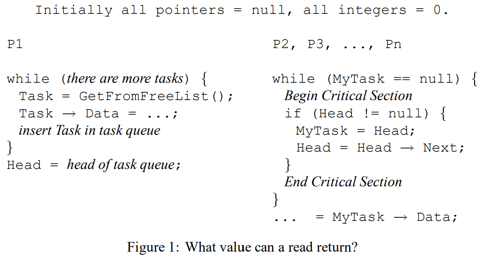
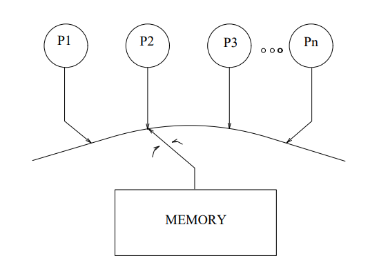
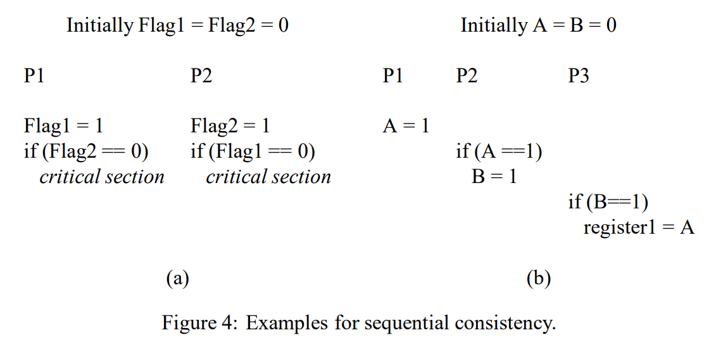
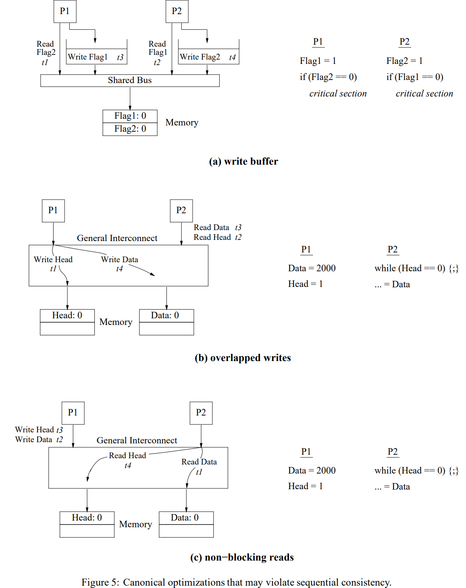
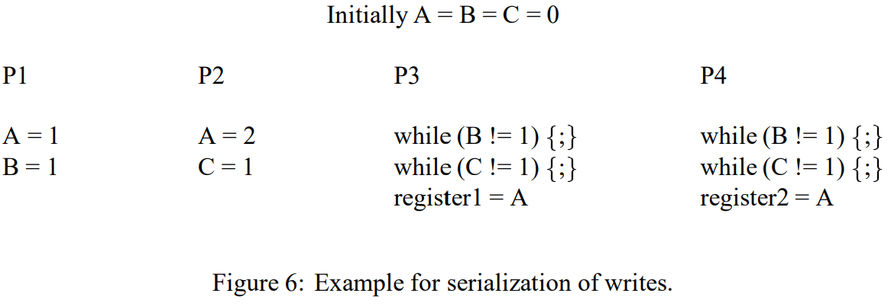
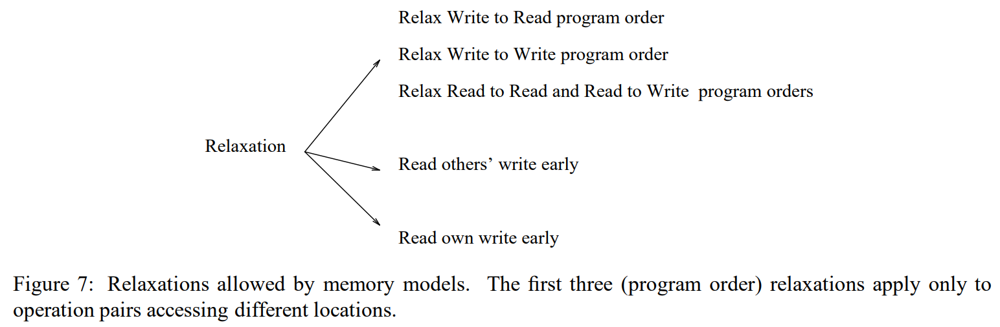
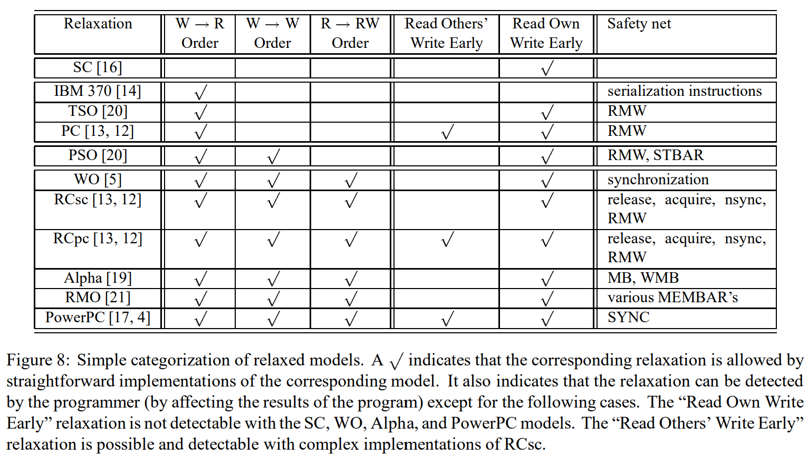
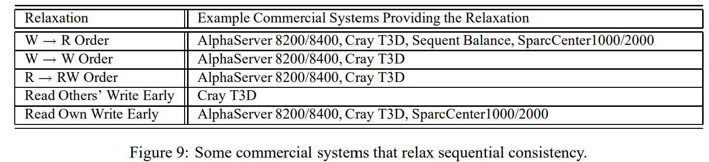
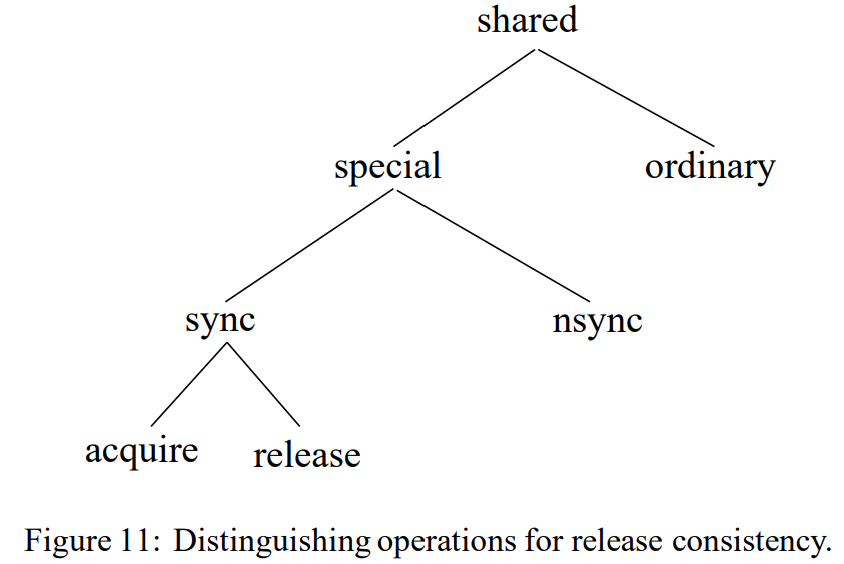
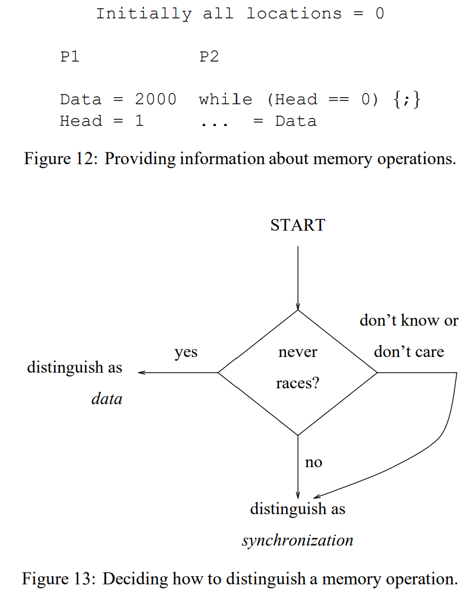

<h1 align="center">Shared Memory Consistency Models: A Tutorial</h1>

Sarita V. Adve and Kourosh Gharachorloo

## Abstract

Parallel systems that support the shared memory abstraction are becoming widely accepted in many areas of computing. Writing correct and efficient programs for such systems requires a formal specification of memory semantics, called a memory consistency model. The most intuitive model—sequential consistency—greatly restricts the use of many performance optimizations commonly used by uniprocessor hardware and compiler designers, thereby reducing the benefit of using a multiprocessor. To alleviate this problem, many current multiprocessors support more relaxed consistency models. Unfortunately, the models supported by various systems differ from each other in subtle yet important ways. Furthermore, precisely defining the semantics of each model often leads to complex specifications that are difficult to understand for typical users and builders of computer systems.

支持共享内存抽象的并行系统在计算领域的许多方面都得到了广泛应用。为这类系统编写正确且高效的程序，需要内存语义的形式化规范，称为内存一致性模型（memory consistency model）。最直观的模型——顺序一致性（sequential consistency）——极大地限制了许多单处理器硬件和编译器设计者常用的性能优化，从而降低了使用多处理器的收益。为缓解这一问题，许多当前的多处理器支持更宽松的一致性模型。不幸的是，不同系统支持的模型在微妙但重要的方面互有差异。此外，精确定义每个模型的语义往往导致复杂的规范，使普通计算机系统用户和构建者难以理解。

> *宽松内存模型允许各种重排和延迟行为，要精确描述这些行为就必须穷举所有可能的顺序约束、例外情况和交互规则，就会导致复杂的规范。*

The purpose of this tutorial paper is to describe issues related to memory consistency models in a way that would be understandable to most computer professionals. We focus on consistency models proposed for hardware-based shared-memory systems. Many of these models are originally specified with an emphasis on the system optimizations they allow. We retain the system-centric emphasis, but use uniform and simple terminology to describe the different models. We also briefly discuss an alternate programmer-centric view that describes the models in terms of program behavior rather than specific system optimizations.

本教程旨在以大多数计算机专业人员都能理解的方式，描述与内存一致性模型相关的问题。我们重点关注为基于硬件的共享内存系统提出的一致性模型。这些模型最初的规范大多强调它们所允许的系统优化。我们保留了以系统为中心的侧重点，但使用统一且简单的术语来描述不同模型。我们还简要讨论了一种替代性的以程序员为中心的视角，该视角从程序行为而非具体系统优化的角度来描述这些模型。

> *基于硬件的共享内存系统是指：多个处理单元（处理器核/CPU）通过硬件互连（总线、交叉开关、直连网络）连接到同一物理地址空间，处理器发出的 load/store 指令直接由硬件（缓存一致性协议、内存控制器、互连网络）解析为对共享数据的访问，无需软件层介入即可让任一处理器看到其他处理器对共享位置的写入效果。*

## 1. Introduction

The shared memory or single address space abstraction provides several advantages over the message passing (or private memory) abstraction by presenting a more natural transition from uniprocessors and by simplifying difficult programming tasks such as data partitioning and dynamic load distribution. For this reason, parallel systems that support shared memory are gaining wide acceptance in both technical and commercial computing.

共享内存（shared memory）或单地址空间抽象相比消息传递（message passing，或称私有内存）抽象具有若干优势：它提供了从单处理器更自然的过渡，并简化了数据划分和动态负载分布等困难的编程任务。因此，支持共享内存的并行系统在技术和商业计算领域都获得了广泛认可。

> *单地址空间抽象是指：在并行系统中，所有处理器（或线程）共享同一个物理地址空间，任何一个处理器对某个地址的写入，其他处理器都可以通过该地址直接读取到，不需要显式的数据移动或消息传递。*
>
> *消息传递抽象是指：每个处理器有自己的私有地址空间，其他处理器无法直接读写它的内存。要交换数据，各方必须显式地调用发送（send） 和 接收（receive） 操作——数据从一方的地址空间复制到另一方的地址空间。*
>
> *数据划分（Data Partitioning）*
>
> - *在消息传递中，程序员必须在代码开始就决定：每个数组、每个数据块放在哪个处理器的内存里。因为数据不能共享，所以必须提前"切好片"——比如矩阵乘法中 A 的前 N 行放 P0、中间 N 行放 P1、后 N 行放 P2。如果后来发现负载不均衡，就要手动重新划分。*
> - *在共享内存中，所有数据都在同一个地址空间里，不需要划分——整个数组就在那，每个处理器直接读写自己需要的部分即可。*
>
> *动态负载分布（Dynamic Load Distribution）*
>
> * *在消息传递中，要动态调整负载非常麻烦：比如 P0 的工作先做完了，想帮 P1 分担一半任务——它不能直接去 P1 的内存里拿一半数据，而是要 P1 先打包数据、发过来、P0 处理完再发回去，代码复杂且开销大。*
> * *在共享内存中，P0 只需要"看一下 P1 做到哪里了，然后直接接手剩下的部分"——因为数据是共享的，不需要任何显式数据移动。*

To write correct and efficient shared memory programs, programmers need a precise notion of how memory behaves with respect to read and write operations from multiple processors. For example, consider the shared memory program fragment in Figure 1, which represents a fragment of the LocusRoute program from the SPLASH application suite. The figure shows processor P1 repeatedly allocating a task record, updating a data field within the record, and inserting the record into a task queue. When no more tasks are left, processor P1 updates a pointer, Head, to point to the first record in the task queue. Meanwhile, the other processors wait for Head to have a non-null value, dequeue the task pointed to by Head within a critical section, and finally access the data field within the dequeued record. What does the programmer expect from the memory system to ensure correct execution of this program fragment? One important requirement is that the value read from the data field within a dequeued record should be the same as that written by P1 in that record. However, in many commercial shared memory systems, it is possible for processors to observe the old value of the data field (i.e., the value prior to P1's write of the field), leading to behavior different from the programmer's expectations.

要编写正确且高效的共享内存程序，程序员需要精确理解内存在多处理器读写操作下的行为。例如，考虑图 1 中的共享内存程序片段，它来自 SPLASH 应用套件中的 LocusRoute 程序。图中显示处理器 P1 重复分配任务、更新任务中的数据字段、并将任务插入任务队列。当没有更多任务时，处理器 P1 更新指针 Head，使其指向任务队列中的第一个任务。与此同时，其他处理器等待 Head 变为非空值，在临界区内出队 Head 指向的任务，最后访问出队任务中的数据字段。程序员期望内存系统如何保证该程序片段的正确执行？一个重要的要求是：从出队任务的数据字段中读取的值，应与 P1 写入该任务的值相同。然而，在许多商用共享内存系统中，处理器可能观察到数据字段的旧值（即 P1 写入该字段之前的值），从而导致与程序员预期不同的行为。

The memory consistency model of a shared-memory multiprocessor provides a formal specification of how the memory system will appear to the programmer, eliminating the gap between the behavior expected by the programmer and the actual behavior supported by a system. Effectively, the consistency model places restrictions on the values that can be returned by a read in a shared-memory program execution. Intuitively, a read should return the value of the "last" write to the same memory location. In uniprocessors, "last" is precisely defined by program order, i.e., the order in which memory operations appear in the program. This is not the case in multiprocessors. For example, in Figure 1, the write and read of the Data field within a record are not related by program order because they reside on two different processors. Nevertheless, an intuitive extension of the uniprocessor model can be applied to the multiprocessor case. This model is called sequential consistency. Informally, sequential consistency requires that all memory operations appear to execute one at a time, and the operations of a single processor appear to execute in the order described by that processor's program. Referring back to the program in Figure 1, this model ensures that the reads of the data field within a dequeued record will return the new values written by processor P1.

共享内存多处理器的内存一致性模型提供了内存系统在程序员视角下应如何表现的正式规范，消除了程序员期望的行为与系统实际支持的行为之间的差距。本质上，一致性模型限制了共享内存程序执行中读操作可以返回的值。直观地说，读操作应返回对同一内存位置的"最后一次"写入的值。在单处理器中，"最后一次"由程序顺序（program order）精确定义，即内存操作在程序中出现的顺序。但在多处理器中并非如此。例如，在图 1 中，同一任务中 Data 字段的写入和读取不在同一个处理器上，因此它们之间不存在程序顺序关系。然而，我们可以将单处理器模型直观地扩展到多处理器情形。这个模型称为顺序一致性（sequential consistency）。非正式地说，顺序一致性要求所有内存操作看起来是按某个顺序逐个执行的，并且每个处理器的操作都按照其程序指定的顺序出现在这个序列中。回到图 1 的程序，该模型确保出队任务中的数据字段的读取将返回处理器 P1 写入的新值。

Sequential consistency provides a simple and intuitive programming model. However, it disallows many hardware and compiler optimizations that are possible in uniprocessors by enforcing a strict order among shared memory operations. For this reason, a number of more relaxed memory consistency models have been proposed, including some that are supported by commercially available architectures such as Digital Alpha, SPARC V8 and V9, and IBM PowerPC. Unfortunately, there has been a vast variety of relaxed consistency models proposed in the literature that differ from one another in subtle but important ways. Furthermore, the complex and non-uniform terminology that is used to describe these models makes it difficult to understand and compare them. This variety and complexity also often leads to misconceptions about relaxed memory consistency models, some of which are described in Figure 2.

顺序一致性提供了一种简单直观的编程模型。然而，它在共享内存操作之间强制执行严格的顺序，从而禁止了许多在单处理器环境中原本可行的硬件和编译器优化。因此，研究者提出了许多更宽松的内存一致性模型，其中包括一些被商用架构（如 Digital Alpha、SPARC V8 和 V9、IBM PowerPC）所支持的模型。不幸的是，文献中提出的各种宽松一致性模型种类繁多，它们之间在微妙但重要的方面互有差异。此外，描述这些模型所用的复杂且不统一的术语使其难以理解和比较。这种多样性和复杂性也经常导致对宽松内存一致性模型的误解——其中一些误解列在图 2 中。

The goal of this tutorial article is to provide a description of sequential consistency and other more relaxed memory consistency models in a way that would be understandable to most computer professionals. Such an understanding is important if the performance enhancing features that are being incorporated by system designers are to be correctly and widely used by programmers. To achieve this goal, we describe the semantics of different models using a simple and uniform terminology. We focus on consistency models proposed for hardware-based shared-memory systems. The originalspecifications of most of these models emphasized the system optimizations allowed by these models. We retain this system-centric emphasis in our descriptions to enable capturing the original semantics of the models. We also briefly describe an alternative, programmer-centric view of relaxed consistency models. This view describes models in terms of program behavior, rather than in terms of hardware or compiler optimizations. Readers interested in further pursuing a more formal treatment of both the system-centric and programmer-centric views may refer to our previous work [1, 6, 8].

本教程文章的目标是以大多数计算机专业人员都能理解的方式描述顺序一致性及其他更宽松的内存一致性模型。如果系统设计者所采纳的性能增强特性要得到程序员正确且广泛的使用，这种理解至关重要。为实现这一目标，我们使用简单且统一的术语来描述不同模型的语义。我们重点关注为基于硬件的共享内存系统提出的一致性模型。这些模型最初的规范大多强调它们所允许的系统优化。我们在描述中保留了以系统为中心的侧重点，以便准确地体现模型的原始语义。我们还简要描述了以程序员为中心的宽松一致性模型替代视角。这一视角从程序行为而非硬件或编译器优化的角度来描述模型。有兴趣进一步了解系统中心视角和程序员中心视角的更形式化处理的读者，可参阅我们之前的工作 [1, 6, 8]。

The rest of this article is organized as follows. We begin with a short note on who should be concerned with the memory consistency model of a system. We next describe the programming model offered by sequential consistency, and the implications of sequential consistency on hardware and compiler implementations. We then describe several relaxed memory consistency models using a simple and uniform terminology. The last part of the article describes the programmer-centric view of relaxed memory consistency models.

本文的其余部分组织如下。我们首先简要说明哪些人应该关注系统的内存一致性模型。接着描述顺序一致性所提供的编程模型，以及顺序一致性对硬件和编译器实现的影响。然后使用简单统一的术语描述若干宽松内存一致性模型。文章的最后部分描述以程序员为中心的宽松内存一致性模型视角。

## 2. Memory Consistency Models - Who Should Care?

As the interface between the programmer and the system, the effect of the memory consistency model is pervasive in a shared memory system. The model affects programmability because programmers must use it to reason about the correctness of their programs. The model affects the performance of the system because it determines the types of optimizationsthat may be exploited by the hardware and the system software. Finally, due to a lack of consensus on a single model, portability can be affected when moving software across systems supporting different models.

作为程序员与系统之间的接口，内存一致性模型的影响遍及共享内存系统的方方面面。该模型影响可编程性，因为程序员必须用它来推理程序的正确性。该模型影响系统性能，因为它决定了硬件和系统软件可以利用的优化类型。最后，由于缺乏对单一模型的共识，在支持不同模型的系统之间迁移软件时，可移植性可能受到影响。

> *这里的接口可以理解成约定或规范，它划定了两边的责任边界：*
>
> - *对程序员来说：只要代码遵守这个约定（比如在需要时插入 fence、用正确的同步原语），那么读/写操作的行为就是可预期的；*
> - *对系统（硬件 + 编译器）来说：只要实现了这个约定，就可以在约定允许的范围内自由做优化。*

A memory consistency model specification is required for every level at which an interface is defined between the programmer and the system. At the machine code interface, the memory modelspecification affects the designer of the machine hardware and the programmer who writes or reasons about machine code. At the high level language interface, the specification affects the programmers who use the high level language and the designers of both the software that converts high-level language code into machine code and the hardware that executes this code. Therefore, the programmability, performance, and portability concerns may be present at several different levels.

在程序员与系统之间定义接口的每一层，都需要内存一致性模型规范。在机器码接口层，内存模型规范影响机器硬件设计者以及编写或推理机器码的程序员。在高级语言接口层，规范影响使用高级语言的程序员、将高级语言代码转换为机器码的软件设计者，以及执行该代码的硬件设计者。因此，可编程性、性能和可移植性问题可能出现在多个不同层次。

In summary, the memory model influences the writing of parallel programs from the programmer’s perspective, and virtually all aspects of designing a parallel system (including the processor, memory system, interconnection network, compiler, and programming languages) from a system designer’s perspective.

总之，从程序员的角度看，内存模型影响并行程序的编写；从系统设计者的角度看，它影响并行系统设计的几乎所有方面（包括处理器、内存系统、互连网络、编译器和编程语言）。

> *互连网络（interconnection network） 是多处理器系统中，用于连接各处理器、内存模块和 I/O 设备的通信基础设施。简单说就是处理器之间、处理器与内存之间的"数据传输通道"。*
>
> | 类型                                            | 特点                                                         | 例子                                 | 缺点                                                   |
> | ----------------------------------------------- | ------------------------------------------------------------ | ------------------------------------ | ------------------------------------------------------ |
> | 总线（bus）                                     | 所有设备共享一条传输线，同一时刻只能有一个事务在进行（一个请求-响应周期内，总线被一对通信方独占） | 传统 SMP 的前端总线                  | 串行化瓶颈，扩展性差                                   |
> | 交叉开关（crossbar）                            | 多对通信方可同时进行，每个端口之间有独立路径，不会互相阻塞   | 早期 Cray 超级计算机                 | 成本随端口数平方增长                                   |
> | 通用互连网络（general interconnection network） | 消息经路由在多跳路径上传输，不同消息可能走不同路径，不保证到达顺序 | InfiniBand、Ethernet、Torus/Fat Tree | 消息可能乱序到达，需要额外机制（如确认响应）来恢复顺序 |
>
> 

## 3. Memory Semantics in Uniprocessor Systems

Most high-level uniprocessor languages present simple sequential semantics for memory operations. These semantics allow the programmer to assume that all memory operations will occur one at a time in the sequential order specified by the program (i.e., program order). Thus, the programmer expects a read will return the value of the last write to the same location before it by the sequential program order. Fortunately, the illusion of sequentiality can be supported efficiently. For example, it is sufficient to only maintain uniprocessor data and control dependences, i.e., execute two operations in program order when they are to the same location or when one controls the execution of the other. As long as these uniprocessor data and control dependences are respected, the compiler and hardware can freely reorder operations to different locations. This enables compiler optimizations such as register allocation, code motion, and loop transformations, and hardware optimizations, such as pipelining, multiple issue, write buffer bypassing and forwarding, and lockup-free caches, all of which lead to overlapping and reordering of memory operations. Overall, the sequential semantics of uniprocessors provide the programmer with a simple and intuitive model and yet allow a wide range of efficient system designs.

大多数高级单处理器语言为内存操作提供了简单的顺序语义。这些语义允许程序员假设所有内存操作将按照程序指定的顺序（即程序顺序）逐个发生。因此，程序员期望读操作将返回由顺序程序顺序定义的、对同一位置的最后一次写入的值。幸运的是，顺序性的假象可以高效地支持。例如，只需维护单处理器的数据依赖和控制依赖即可——即在操作访问同一位置或一个操作控制另一个操作的执行时按程序顺序执行。只要这些单处理器数据依赖和控制依赖得到尊重，编译器和硬件可以自由地对不同位置的操作进行重排。这使得编译器优化（如寄存器分配、代码移动和循环变换）和硬件优化（如流水线、多发射、写缓冲绕过和转发、无锁缓存）成为可能，所有这些都导致内存操作的重叠和重排。总体而言，单处理器的顺序语义为程序员提供了一个简单直观的模型，同时又允许多种高效的系统设计。

> *内存操作的重叠是指：处理器在不等待前一个内存操作完成的情况下，就发出下一个内存操作，使多个操作在时间上部分并行执行。*

Figure 2: Some myths about memory consistency models.

| Myth                                                         | Reality                                                      |
| ------------------------------------------------------------ | ------------------------------------------------------------ |
| A memory consistency model only applies to systems that allow multiple copies of shared data; e.g., through caching. | Figure 5 illustrates several counter-examples.               |
| Most current systems are sequentially consistent.            | Figure 9 mentions several commercial systems that are not sequentially consistent. |
| The memory consistency model only affects the design of the hardware. | The article describes how the memory consistency model affects many aspects of system design, including optimizations allowed in the compiler. |
| The relationship of cache coherence protocols to memory consistency models: (i) a cache coherence protocol inherently supports sequential consistency, (ii) the memory consistency model depends on whether the system supports an invalidate or update based coherence protocol. | The article discusses how the cache coherence protocol is only a part of the memory consistency model. Other aspects include the order in which a processor issues memory operationsto the memory system, and whether a write executes atomically. The article also discusses how a given memory consistency model can allow both an invalidate or an update coherence protocol. |
| The memory model for a system may be defined solely by specifying the behavior of the processor (or the memory system). | The article describes how the memory consistency model is affected by the behavior of both the processor and the memory system. |
| Relaxed memory consistency models may not be used to hide read latency. | Many of the models described in this article allow hiding both read and write latencies. |
| Relaxed consistency models require the use of extra synchronization. | Most ofthe relaxedmodels discussed in this article do notrequire extra synchronization in the program. In particular, the programmercentric framework only requires that operations be distinguished or labeled correctly. Other models provide safety nets that allow the programmer to enforce the required constraints for achieving correctness. |
| Relaxed memory consistency models do not allow chaotic (or asynchronous) algorithms. | The models discussed in this article allow chaotic (or asynchronous) algorithms. With system-centric models, the programmer can reason about the correctness of such algorithms by considering the optimizations that are enabled by the model. The programmer-centric approach simply requires the programmer to explicitly identify the operationsthat are involved in a race. For many chaotic algorithms, the former approach may provide higher performance since such algorithms do not depend on sequential consistency for correctness. |

| 误解（Myth） | 现实（Reality） |
| --- | --- |
| 内存一致性模型仅适用于允许共享数据存在多份拷贝的系统（例如通过缓存） | 图 5 展示了若干反例 |
| 大多数当前系统都是顺序一致的 | 图 9 提到了几个非顺序一致的商用系统 |
| 内存一致性模型只影响硬件设计 | 本文描述了内存一致性模型如何影响系统设计的许多方面，包括编译器中允许的优化 |
| 缓存一致性协议与内存一致性模型的关系：(i) 缓存一致性协议本身就保证了顺序一致性；(ii) 内存一致性模型取决于系统采用的是基于失效的还是基于更新的一致性协议 | 本文讨论了缓存一致性协议只是内存一致性模型的一部分，其他因素还包括处理器向内存系统发出内存操作的顺序，以及写操作是否是原子执行的。本文还说明了同一个内存一致性模型既可以搭配失效协议，也可以搭配更新协议 |
| 系统的内存模型可以仅通过指定处理器（或内存系统）的行为来定义 | 本文描述了内存一致性模型如何受处理器和内存系统两者行为的影响 |
| 宽松内存一致性模型不能用于隐藏读延迟 | 本文描述的许多模型允许同时隐藏读和写延迟 |
| 宽松一致性模型需要使用额外的同步 | 本文讨论的大多数宽松模型并不需要在程序中增加额外的同步操作。具体来说，以程序员为中心的框架只要求操作被正确地归类或标记。而其他模型则提供了安全网，让程序员可以自行使用来确保正确性所需的顺序约束 |
| 宽松内存一致性模型不允许混沌（即异步）算法 | 本文讨论的模型允许混沌（即异步）算法。在以系统为中心的模型下，程序员可以通过分析模型所允许的各种优化来推理此类算法的正确性。而以程序员为中心的方法，则只要求程序员显式标出涉及竞争的操作。对于许多混沌算法而言，前一种方法可能带来更高的性能，因为这类算法的正确性并不依赖于顺序一致性 |

> *混沌算法（chaotic algorithms） 也常称为异步算法（asynchronous algorithms），是一种不依赖全局同步的并行算法。在这种算法中，各个处理器独立地反复更新自己的数据，不需要在每次更新前都检查其他处理器的进度，也不需要在每次迭代结束时做一次全局同步（barrier）。*

## 4. Understanding Sequential Consistency

The most commonly assumed memory consistency model for shared memory multiprocessors is sequential consistency, formally defined by Lamport as follows [16].

共享内存多处理器最常假定的内存一致性模型是顺序一致性，由 Lamport 形式化定义如下 [16]。

Definition: A multiprocessor system is sequentially consistent if the result of any execution is the same as if the operations of all the processors were executed in some sequential order, and the operations of each individual processor appear in this sequence in the order specified by its program.

定义：如果一个多处理器系统的任何执行结果都与所有处理器的操作按某种顺序执行、且每个处理器的操作按其程序指定的顺序出现在该序列中的结果相同，则该系统是顺序一致的。

There are two aspects to sequential consistency: (1) maintaining program order among operations from individual processors, and (2) maintaining a single sequential order among operations from all processors. The latter aspect makes it appear as if a memory operation executes atomically or instantaneously with respect to other memory operations.

顺序一致性有两个方面：

(1) 维护单个处理器内操作之间的程序顺序；

(2) 维护所有处理器操作之间的单一顺序 ——> 每个内存操作相对于其他操作而言，看起来是原子地（或瞬时地）执行的。

Figure 3: Programmer’s view of sequential consistency.

Sequential consistency provides a simple view of the system to programmers as illustrated in Figure 3. Conceptually, there is a single global memory and a switch that connects an arbitrary processor to memory at any time step. Each processor issues memory operations in program order and the switch provides the global serialization among all memory operations.

顺序一致性为程序员提供了如图 3 所示的简单系统视图：系统中有一个全局内存和一个开关，每个时间步开关将某个处理器连接到内存。处理器按程序顺序发出一个内存操作，开关对所有内存操作进行全局串行化。

Figure 4 provides two examples to illustrate the semantics of sequential consistency. Figure 4(a) illustrates the importance of program order among operations from a single processor. The code segment depicts an implementation of Dekker’s algorithm for critical sections, involving two processors (P1 and P2) and two flag variables (Flag1 and Flag2) that are initialized to 0. When P1 attempts to enter the critical section, it updates Flag1 to 1, and checks the value of Flag2. The value 0 for Flag2 indicates that P2 has not yet tried to enter the critical section; therefore, it is safe for P1 to enter. This algorithm relies on the assumption that a value of 0 returned by P1’s read implies that P1’s write has occurred before P2’s write and read operations. Therefore, P2’s read of the flag will return the value 1, prohibitingP2 from also entering the critical section. Sequential consistency ensures the above by requiring that program order among the memory operations of P1 and P2 be maintained, thus precluding the possibility of both processors reading the value 0 and entering the critical section.

图 4 提供了两个示例来说明顺序一致性的语义。图 4(a) 说明了单个处理器内操作之间程序顺序的重要性。该代码片段描述了 Dekker 临界区算法的一种实现，涉及两个处理器（P1 和 P2）以及两个初始化为 0 的标志变量（Flag1 和 Flag2）。当 P1 尝试进入临界区时，它将 Flag1 更新为 1，并检查 Flag2 的值。Flag2 的值为 0 表示 P2 尚未尝试进入临界区；因此 P1 可以安全进入。该算法依赖于以下假设：P1 的读操作返回 0 值意味着 P1 的写操作发生在 P2 的写和读操作之前。因此，P2 对标志的读操作将返回值 1，从而阻止 P2 也进入临界区。顺序一致性通过要求维护 P1 和 P2 内存操作之间的程序顺序来确保上述行为，从而排除了两个处理器都读取值 0 并进入临界区的可能性。

Figure 4(b) illustrates the importance of atomic execution of memory operations. The figure shows three processors sharing variables A and B, both initialized to 0. Suppose processor P2 returns the value 1 (written by P1) for its read of A, writes to variable B, and processor P3 returns the value 1 (written by P2) for B. The atomicity aspect of sequential consistency allows us to assume the effect of P1’s write is seen by the entire system at the same time. Therefore, P3 is guaranteed to see the effect of P1’s write in the above execution and must return the value 1 for its read of A (since P3 sees the effect of P2’s write after P2 sees the effect of P1’s write to A).

图 4(b) 说明了内存操作原子执行的重要性。图中显示三个处理器共享变量 A 和 B，两者均初始化为 0。假设处理器 P2 对 A 的读操作返回值 1（由 P1 写入），然后写入变量 B，处理器 P3 对 B 的读操作返回值 1（由 P2 写入）。顺序一致性的原子性允许我们假设整个系统能同时看到 P1 写操作的效果。因此，在上述执行中，P3 一定能看到 P1 写操作的效果，从而其对 A 的读操作必须返回值 1（因为写操作是原子的：P2 看到 P1 的写操作之后，P3 才看到 P2 的写操作，所以 P3 也必然看到 P1 的写操作）。

## 5. Implementing Sequential Consistency

This section describes how the intuitive abstraction of sequential consistency shown in Figure 3 can be realized in a practical system. We willsee that unlike uniprocessors, preserving the order of operations on a per-location basis is not sufficient for maintaining sequential consistency in multiprocessors.

本节描述了图 3 所示的顺序一致性直观抽象如何在实际系统中实现。我们将看到，与单处理器不同，仅仅维护每个位置上的操作顺序并不足以在多处理器中维护顺序一致性。

We begin by considering the interaction of sequential consistency with common hardware optimizations. To separate the issues of program order and atomicity, we first describe implementations of sequential consistency in architectures without caches and next consider the effects of caching shared data. The latter part of the section describes the interaction of sequential consistency with common compiler optimizations.

我们首先考虑顺序一致性与常见硬件优化的交互。为了分离程序顺序和原子性问题，我们首先描述无缓存架构中顺序一致性的实现，然后考虑缓存共享数据的影响。本节后半部分描述了顺序一致性与常见编译器优化的交互。

### 5.1 Architectures Without Caches

We have chosen three canonical hardware optimizations as illustrative examples of typical interactions that arise in implementing sequential consistency in the absence of data caching. A large number of other common hardware optimizations can lead to interactions similar to those illustrated by our canonical examples. As will become apparent, the key issue in correctly supporting sequential consistency in an environment without caches lies in maintaining the program order among operations from each processor. Figure 5 illustrates the various interactions discussed below. The terms t1, t2, t3, ... indicate the order in which the corresponding memory operations execute at memory.

我们选择了三种典型硬件优化作为说明性示例，用于说明在无数据缓存情况下实现顺序一致性时所产生的典型交互。其他大量常见硬件优化也可能导致类似的交互。可以看到，在无缓存环境中正确支持顺序一致性的关键，在于维护每个处理器内操作之间的程序顺序。图 5 展示了下面讨论的各种交互。其中 t1, t2, t3, ... 表示各内存操作在内存中执行的先后顺序。

#### 5.1.1 Write Buffers with Bypassing Capability

The first optimization we consider illustrates the importance of maintaining program order between a write and a following read operation. Figure 5(a) shows an example bus-based shared-memory system with no caches. Assume a simple processor that issues memory operations one-at-a-time in program order. The only optimization we consider (compared to the abstraction of Figure 3) is the use of a write buffer with bypassing capability. On a write, a processor simply inserts the write operation into the write buffer and proceeds without waiting for the write to complete. Subsequent reads are allowed to bypass any previous writes in the write buffer for faster completion. This bypassing is allowed as long as the read address does not match the address of any of the buffered writes. The above constitutes a common hardware optimization used in uniprocessors to effectively hide the latency of write operations.

第一个优化示例展示了维护写操作与后续读操作之间程序顺序的重要性。图 5(a) 是一个基于总线的无缓存共享内存系统。假设处理器很简单，按程序顺序依次发出内存操作。与图 3 的抽象相比，这里我们引入的唯一优化是具有绕过能力的写缓冲。发生写操作时，处理器只把写操作插入写缓冲就继续执行，无需等待写操作完成。后续的读操作可以越过写缓冲中任何尚未完成的写操作，从而更快得到处理（只要读地址不与缓冲中任一写操作的地址相同）。这是单处理器中用于隐藏写延迟的一种常见硬件优化。

To see how the use of write buffers can violate sequential consistency, consider the program in Figure 5(a). The program depicts Dekker’s algorithm also shown earlier in Figure 4(a). As explained earlier, a sequentially consistent system must prohibit an outcome where both the reads of the flags return the value 0. However, this outcome can occur in our example system. Each processor can buffer its write and allow the subsequent read to bypass the write in its write buffer. Therefore, both reads may be serviced by the memory system before either write is serviced, allowing both reads to return the value of 0.

下面通过图 5(a) 中的程序来看写缓冲如何破坏顺序一致性。该程序正是前面图 4(a) 中展示过的 Dekker 算法。如前所述，顺序一致系统绝不允许两个标志的读操作都返回 0。但在我们的示例系统中，这种结果是可能出现的：每个处理器都可以把写操作缓冲起来，并让后续读操作绕过缓冲中的写操作。于是，两个读操作可能在任一写操作被真正处理之前就得到了服务，结果双双读到 0。

The above optimization is safe in a conventional uniprocessor since bypassing (between operations to different locations) does not lead to a violation of uniprocessor data dependence. However, as our example illustrates, such a reordering can easily violate the semantics of sequential consistency in a multiprocessor environment.

上述优化在传统单处理器中是安全的，因为绕过不同位置的操作，并不会违反单处理器的数据依赖约束。然而，正如本例所示，这种重排在多处理器环境中很容易破坏顺序一致性的语义。

#### 5.1.2 Overlapping Write Operations

The second optimization illustrates the importance of maintaining program order between two write operations. Figure 5(b) shows an example system with a general (non-bus) interconnection network and multiple memory modules. A general interconnection network alleviates the serialization bottleneck of a bus-based design, and multiple memory modules provide the ability to service multiple operations simultaneously. We still assume processors issue memory operations in program order and proceed with subsequent operations without waiting for previous write operations to complete. The key difference compared to the previous example is that multiple write operations issued by the same processor may be simultaneously serviced by different memory modules.

第二个优化示例展示了维护两个写操作之间程序顺序的重要性。图 5(b) 是一个具有通用（非总线）互连网络和多个内存模块的系统。通用互连网络缓解了总线设计的串行化瓶颈，多个内存模块则可以并发处理多个操作。我们仍假设处理器按程序顺序发出内存操作，且无需等待前一个写操作完成即可继续执行后续操作。与上一例的关键区别在于：同一处理器发出的多个写操作，可能会被不同的内存模块同时处理。

> *基于总线的系统，所有写操作天然被总线事务串行化，SC 条件二自动满足。*

The example program fragment in Figure 5(b) illustrates how the above optimization can violate sequential consistency; the example is a simplified version of the code shown in Figure 1. A sequentially consistent system guarantees that the read of Data by P2 will return the value written by P1. However, allowing the writes on P1 to be overlapped in the system shown in Figure 5(b) can easily violate this guarantee. Assume the Data and Head variables reside in different memory modules as shown in the figure. Since the write to Head may be injected into the network before the write to Data has reached its memory module, the two writes could complete out of program order. Therefore, it is possible for another processor to observe the new value of Head and yet obtain the old value of Data. Other common optimizations, such as coalescing writes to the same cache line in a write buffer (as in the Digital Alpha processors), can also lead to a similar reordering of write operations.

图 5(b) 中的程序片段展示了上述优化如何破坏顺序一致性；该片段是图 1 代码的简化版。顺序一致性系统保证 P2 读 Data 会返回 P1 写入的值。然而，在图 5(b) 的系统中，如果允许 P1 的写操作相互重叠，很容易打破这一保证。假设 Data 和 Head 位于不同的内存模块（如图中所示），那么对 Head 的写操作可能先于对 Data 的写入到达其目标内存模块，导致两个写操作以乱序完成。这样一来，其他处理器就有可能观察到 Head 的新值，却仍然看到 Data 的旧值。其他常见优化（例如 Digital Alpha 处理器在写缓冲中合并对同一缓存行的写操作）也可能导致类似的写操作重排。

> *写缓冲将同一缓存行的两个连续写合并为一个总线事务，就掩盖了中间顺序——其他处理器可能看到 Head 的新值而 Data 仍是旧值，如同写操作发生了重排。*

Again, while allowing writes to different locations to be reordered is safe for uniprocessor programs, the above example shows that such reordering can easily violate the semantics of sequential consistency. One way to remedy this problem is to wait for a write operation to reach its memory module before allowing the next write operation from the same processor to be injected into the network. Enforcing the above order typically requires an acknowledgement response for writes to notify the issuing processor that the write has reached its target. The acknowledgement response is also useful for maintaining program order from a write to a subsequent read in systems with general interconnection networks.

同理，虽然对不同位置的写操作进行重排对单处理器程序是安全的，但上述例子表明，这种重排很容易违反顺序一致性的语义。解决方法是：同一处理器要等到前一个写操作到达目标内存模块后，才将下一个写操作注入网络。强制执行这一顺序通常需要写操作的确认响应，用来通知发起者写操作已到达目标。在具有通用互连网络的系统中，这种确认响应对于维护写操作到后续读操作之间的程序顺序也很有用。

#### 5.1.3 Non-Blocking Read Operations

The third optimization illustrates the importance of maintaining program order between a read and a following read or write operation. We consider supporting non-blocking reads in the system represented by Figure 5(b) and repeated in Figure 5(c). While most early RISC processors stall for the return value of a read operation (i.e., blocking read), many of the current and next generation processors have the capability to proceed past a read operation by using techniques such as non-blocking (lockup-free) caches, speculative execution, and dynamic scheduling.

第三个优化示例展示了维护读操作与后续读或写操作之间程序顺序的重要性。我们来看图 5(b)（图 5(c) 复用了同一系统）中支持非阻塞读操作的情形。虽然大多数早期 RISC 处理器因等待读操作的返回值而停顿（即阻塞读），但许多当前和下一代处理器可以利用非阻塞（无锁）缓存、推测执行和动态调度等技术，在遇到读操作时继续推进。

Figure 5(c) shows an example of how overlapping reads from the same processor can violate sequential consistency. The program is the same as the one used for the previous optimization. Assume P1 ensures that its writes arrive at their respective memory modules in program order. Nevertheless, if P2 is allowed to issue its read operations in an overlapped fashion, there is the possibility for the read of Data to arrive at its memory module before the write from P1 while the read of Head reaches its memory module after the write from P1, which leads to a non-sequentially-consistent outcome. Overlapping a read with a following write operation can also present problems analogous to the above; this latter optimization is not commonly used in current processors, however.

图 5(c) 展示了来自同一处理器的重叠读操作如何破坏顺序一致性。所用程序与前一个例子相同。假设 P1 确保写操作按程序顺序到达各自的内存模块。但若允许 P2 以重叠方式发出读操作，就可能出现如下情形：对 Data 的读操作在 P1 的写操作之前到达 Data 所在的内存模块，而对 Head 的读操作在 P1 的写操作之后到达 Head 所在的内存模块，从而导致非顺序一致的结果。将读操作与后续写操作重叠也可能引发类似问题——不过后一种优化在当前处理器中并不常见。

### 5.2 Architectures With Caches

The previous section described complications that arise due to memory operation reordering when implementing the sequential consistency model in the absence of caches. Caching (or replication) of shared data can present similar reordering behavior that would violate sequential consistency. For example, a first level write through cache can lead to reordering similar to that allowed by a write buffer with bypassing capability, because reads that follow a write in program order may be serviced by the cache before the write completes. Therefore, an implementation with caches must also take precautions to maintain the illusion of program order execution for operations from each processor. Most notably, even if a read by a processor hits in the processor’s cache, the processor typically cannot read the cached value until its previous operations by program order are complete.

上一节描述了无缓存环境下实现顺序一致性时，内存操作重排所带来的复杂性。共享数据的缓存（或复制）同样可能导致类似的重排，从而破坏顺序一致性。例如，一级写通缓存可能导致与写缓冲绕过相同的重排问题：按程序顺序跟在写操作之后的读操作，可能在写操作完成之前就从缓存中读到了结果。因此，带缓存的实现也必须采取预防措施，以维持每个处理器操作按程序顺序执行的假象。尤其值得注意的是，即使处理器在自身缓存中命中，通常也不能直接读取缓存的值，而必须等待按程序顺序排在前面的操作执行完毕。

> *写通缓存（write-through cache）：一种缓存写策略。CPU 执行写入时，同时向缓存和下一级存储发出写请求；缓存更新立即完成，CPU 不等待下级写入确认即可继续执行后续指令。*

The replication of shared data introduces three additional issues. First, the presence of multiple copies requires a mechanism, often referred to as the cache coherence protocol, to propagate a newly written value to all cached copies of the modified location. Second, detecting when a write is complete (to preserve program order between a write and its following operations) requires more transactions in the presence of replication. Third, propagating changes to multiple copies is inherently a non-atomic operation, making it more challenging to preserve the illusion of atomicity for writes with respect to other operations. We discuss each of these three issues in more detail below.

共享数据的缓存带来了三个额外的问题。

（1）首先，多副本存在要求有一种机制（通常称为缓存一致性协议）将新写入的值传播到该内存位置的所有缓存副本。

（2）其次，在数据有副本的情况下，确定写操作何时完成（以维护写操作与其后续操作之间的程序顺序）需要更多的消息交互。

（3）第三，将变更传播到多个副本本质上是一个非原子操作，这使得维持写操作的原子性假象变得更加困难。下面我们详细讨论这三个问题。

#### 5.2.1 Cache Coherence and Sequential Consistency

Several definitions for cache coherence (also referred to as cache consistency) exist in the literature. The strongest definitions treat the term virtually as a synonym for sequential consistency. Other definitions impose extremely relaxed ordering guarantees. Specifically, one set of conditions commonly associated with a cache coherence protocol are: (1) a write is eventually made visible to all processors, and (2) writes to the same location appear to be seen in the same order by all processors (also referred to as serialization of writes to the same location) [13]. The above conditions are clearly not sufficient for satisfying sequential consistency since the latter requires writes to all locations (not just the same location) to be seen in the same order by all processors, and also explicitly requires that operations of a single processor appear to execute in program order.

文献中存在多种缓存一致性（cache coherence）的定义。最强的定义几乎将该术语视为顺序一致性的同义词。其他定义则施加了极其宽松的顺序保证。通常与缓存一致性协议相关的一组条件是：

(1) 写操作最终对所有处理器可见

(2) 对同一位置的写操作对所有处理器来说看起来顺序相同（也称为对同一位置写操作的串行化）[13]。

上述条件显然不足以满足顺序一致性，因为顺序一致性要求对所有位置（不仅是同一位置）的写操作对所有处理器来说看起来顺序相同，并且明确要求单个处理器的操作看起来是按程序顺序执行的。

We do not use the term cache coherence to define any consistency model. Instead, we view a cache coherence protocol simply as the mechanism that propagates a newly written value to the cached copies of the modified location. The propagation of the value is typically achieved by either invalidating (or eliminating) the copy or updating the copy to the newly written value. With this view of a cache coherence protocol, a memory consistency model can be interpreted as the policy that places an early and late bound on when a new value can be propagated to any given processor.

我们不使用"缓存一致性"这个术语来定义任何一致性模型。相反，我们把缓存一致性协议简单地看作一种机制——它负责将新写入的值传播到被修改位置的各个缓存副本。值的传播通常是通过使副本失效，或将其更新为新值来实现的。在这种定义下，内存一致性模型就可以理解为一种策略，它规定了新值传播到某个处理器的最早和最晚时刻。

#### 5.2.2 Detecting the Completion of Write Operations

As mentioned in the previous section, maintaining the program order from a write to a following operation typically requires an acknowledgement response to signal the completion of the write. In a system without caches, the acknowledgement response may be generated as soon as the write reaches its target memory module. However, the above may not be sufficient in designs with caches. Consider the code in Figure 5(b), and a system similar to the one depicted in the same figure but enhanced with a write through cache for each processor. Assume that processor P2 initially has Data in its cache. Suppose P1 proceeds with its write to Head after its previous write to Data reaches its target memory but before its value has been propagated to P2 (via an invalidation or update message). It is now possible for P2 to read the new value of Head and still return the old value of Data from its cache, a violation of sequential consistency. This problem can be avoided if P1 waits for P2’s cache copy of Data to be updated or invalidated before proceeding with the write to Head.

如上一节所述，维护写操作到后续操作之间的程序顺序，通常需要一条确认响应来表明写操作已完成。在无缓存系统中，只要写操作到达目标内存模块，就可以立即生成确认响应。但在带缓存的设计中，这可能还不够。以图 5(b) 中的代码为例，假设系统与图中类似，只是每个处理器增加了写通缓存。再假设处理器 P2 的缓存中最初有 Data 的副本。现在，如果 P1 在 Data 的写操作到达目标内存之后、但其新值通过失效或更新消息传播到 P2 之前，就继续执行对 Head 的写操作，那么 P2 就有可能读到 Head 的新值，却从其缓存中返回 Data 的旧值，从而违反顺序一致性。要避免这个问题，P1 必须先等待 P2 的 Data 缓存副本被更新或失效，然后再继续写 Head。

Therefore, on a write to a line that is replicated in other processor caches, the system typically requires a mechanism to acknowledge the receipt of invalidation or update messages by the target caches. Furthermore, the acknowledgement messages need to be collected (either at the memory or at the processor that issues the write), and the processor that issues the write must be notified of their completion. A processor can consider a write to be complete only after the above notification. A common optimization is to acknowledge the invalidation or update message as soon as it is received by a processing node and potentially before the actual cache copy is affected; such a design can still satisfy sequential consistency as long as certain ordering constraints are observed in processing the incoming messages to the cache [6].

因此，当写入一个在其他处理器缓存中有副本的缓存行时，系统通常需要一种机制来确认目标缓存已收到失效或更新消息。此外，这些确认消息需要被汇集起来（可以在内存端，也可以在发起写操作的处理器端），并且必须通知该处理器所有确认均已收到。处理器只有收到上述通知后，才能认为写操作已完成。

一种常见的优化是提前确认：处理器一旦收到失效或更新消息就立即回复确认，而不用等到实际更新或失效缓存副本之后。这种优化之所以正确，是因为只要缓存端保证按消息到达的顺序依次处理入队消息，那么在任何后续读操作被处理之前，队列中排在它前面的失效或更新消息必然已被应用。只要满足这一顺序约束，提前确认就不会破坏顺序一致性 [6]。

#### 5.2.3 Maintaining the Illusion of Atomicity for Writes

While sequential consistency requires memory operations to appear atomic or instantaneous, propagating changes to multiple cache copies is inherently a non-atomic operation. We motivate and describe two conditions that can together ensure the appearance of atomicity in the presence of data replication. The problems due to non-atomicity are easier to illustrate with with update-based protocols; therefore, the following examples assume such a protocol.

虽然顺序一致性要求内存操作表现为原子的（即瞬时完成），但将新值传播到多个缓存副本本质上是一个非原子操作。我们下面阐述两个条件，它们共同确保了数据有副本时仍能维持原子性的假象。非原子性导致的问题用基于更新的协议更容易解释，因此以下示例均假设采用更新协议。

To motivate the first condition, consider the program in Figure 6. Assume all processors execute their memory operations in program order and one-at-a-time. It is possible to violate sequential consistency if the updates for the writes of A by processors P1 and P2 reach processors P3 and P4 in a different order. Thus, processors P3 and P4 can return different values for their reads of A (e.g., register1 and register2 may be assigned the values 1 and 2 respectively), making the writes of A appear non-atomic. The above violation of sequential consistency is possible in systems that use a general interconnection network (e.g., Figure 5(b)), where messages travel along different paths in the network and no guarantees are provided on the order of delivery. The violation can be avoided by imposing the condition that writes to the same location be serialized; i.e., all processors see writes to the same location in the same order. Such serialization can be achieved if all updates or invalidates for a given location originate from a single point (e.g., the directory) and the ordering of these messages between a given source and destination is preserved by the network. An alternative is to delay an update or invalidate from being sent out until any updates or invalidates that have been issued on behalf of a previous write to the same location are acknowledged.

为引出第一个条件，来看图 6 中的程序。假设所有处理器按程序顺序逐个执行各自的内存操作。如果 P1 和 P2 对 A 的写操作所触发的更新消息，以不同的顺序到达 P3 和 P4，则可能违反顺序一致性。这样一来，P3 和 P4 对 A 的读操作可能返回不同的值（例如 register1 和 register2 分别被赋值为 1 和 2），使 A 的写操作看起来是非原子的。这种违规也可能发生在使用通用互连网络的系统中（如图 5(b)），其中消息沿不同路径传输，且不保证传递顺序。

要避免这一问题，只需施加一个条件：对同一位置的写操作必须串行化，即所有处理器看到同一位置的写操作顺序必须一致。实现这种串行化有两种方式：一是让给定位置的所有更新或失效消息都从单一节点（如目录）发出，且网络保证源端到目标端的消息顺序不变；二是延迟发送更新或失效消息，直到前一个写操作所触发的所有更新或失效都被确认为止。

> ***单一目录节点串行化：***
>
> *所有对 A 的写操作触发的更新消息，都必须通过一个目录节点（directory node） 转发。目录内部为 A 维护一个队列，按顺序处理：*
>
> 1. *P1 写 A=1 → 目录收到请求 → 向所有持有 A 副本的处理器转发更新(A=1)*
> 2. *P2 写 A=2 → 目录收到请求 → 排在队列中，等待1完成后才转发更新(A=2)*
>
> *网络保证从目录到每个目标的消息顺序不变（源→目标保序）。因此 P3 和 P4 一定先收到 A=1 的更新、再收到 A=2 的更新，各自缓存中的 A 值从 1 变成 2，顺序一致。*
>
> ***等待确认串行化：***
>
> *没有中央节点。P1 写 A=1 后，向所有持有副本的处理器发更新消息，并等待所有目标回复确认。只有确认全部收到了，P1 才通知 P2 "你可以写 A=2 了"（或者由 P2 自行观察到该条件）。P2 写 A=2 时同理。*
>
> *这样，P3 和 P4 在收到 A=2 的更新之前，一定已经收到了 A=1 的更新——因为写 A=2 被阻塞到 A=1 的所有更新确认之后才发生。*

To motivate the second condition, consider the program fragment in Figure 4(b), again with an update protocol. Assume all variables are initially cached by all processors. Furthermore, assume all processors execute their memory operations in program order and one-at-a-time (waiting for acknowledgements as described above), and writes to the same location are serialized. It is still possible to violate sequential consistency on a system with a general network if (1) processor P2 reads the new value of A before the update of A reaches processor P3, (2) P2’s update of B reaches P3 before the update of A, and (3) P3 reads the new value of B and then proceeds to read the value of A from its own cache (before it gets P1’s update of A). Thus, P2 and P3 appear to see the write of A at different times, making the write appear non-atomic. An analogous situation can arise in an invalidation-based scheme.

为引出第二个条件，来看图 4(b) 中的程序片段，仍然采用更新协议。假设所有变量最初在所有处理器的缓存中都有副本。此外，假设所有处理器都按程序顺序逐个执行内存操作（即每次写操作都要等所有目标缓存确认后，才能继续下一操作），并且对同一位置的写操作已经串行化。，并且对同一位置的写操作已经串行化。即使如此，在通用互连网络的系统上仍可能违反顺序一致性，只要满足以下三个条件：
1. P2 在读 A 的新值时，P1 对 A 的更新尚未到达 P3；
2. P2 对 B 的更新先于 P1 对 A 的更新到达 P3；
3. P3 读到 B 的新值后，接着从自己的缓存中读 A（此时 P1 对 A 的更新仍未到达）。

这样一来，P2 和 P3 看到写 A 效果的时机不同，导致写操作看起来是非原子的。基于失效的方案中也可能出现类似情况。

The above violation of sequential consistency occurs because P2 is allowed to return the value of the write to A before P3 has seen the update generated by this write. One possible restriction that prevents such a violation is to prohibit a read from returning a newly written value until all cached copies have acknowledged the receipt of the invalidation or update messages generated by the write. This condition is straightforward to ensure with invalidation-based protocols. Update-based protocols are more challenging because unlike invalidations, updates directly supply new values to other processors. One solution is to employ a two phase update scheme. The first phase involves sending updates to the processor caches and receiving acknowledgements for these updates. In this phase, no processor is allowed to read the value of the updated location. In the second phase, a confirmation message is sent to the updated processor caches to confirm the receipt of all acknowledgements. A processor can use the updated value from its cache once it receives the confirmation message from the second phase. However, the processor that issued the write can consider its write complete at the end of the first phase.

上述违反顺序一致性的原因在于：P2 读到 P1 对 A 的写操作的新值时，P3 尚未收到该写操作触发的更新消息。要防止这种情况，可以施加一个限制：禁止读操作返回新写入的值，直到所有缓存副本都确认收到了该写操作所触发的失效或更新消息。这个条件在基于失效的协议中很容易满足。基于更新的协议则更具挑战性，因为更新会直接将新值发送给其他处理器，而不是简单地让副本失效。一种解决方案是采用两阶段更新方案：

- 第一阶段：向各处理器的缓存发送更新值，并等待它们返回确认。在此阶段中，任何处理器都不得读取该位置的新值。
- 第二阶段：当所有确认收齐后，发起者再发送一条 *“放行”消息* 给第一阶段中收到了更新值的那些缓存。处理器只有收到这条放行消息后，才可以从缓存中读取并使用新值。

不过，发出写操作的处理器在第一阶段结束后即可认为写操作完成。

### 5.3 Compilers

The interaction of the program order aspect of sequential consistency with the compiler is analogous to that with the hardware. Specifically, for all the program fragments discussed so far, compiler-generated reordering of shared memory operations will lead to violations of sequential consistency similar to hardware-generated reorderings. Therefore, in the absence of more sophisticated analysis, a key requirement for the compiler is to preserve program order among shared memory operations. Thisrequirement directly restricts any uniprocessor compiler optimization that can result in reordering memory operations. These include simple optimizations such as code motion, register allocation, and common sub-expression elimination, and more sophisticated optimizations such as loop blocking or software pipelining.

顺序一致性的程序顺序要求对编译器的交互与对硬件的交互类似。具体来说，对于迄今为止讨论的所有程序片段，如果编译器对共享内存操作进行重排，就会像硬件重排一样违反顺序一致性。因此，在没有更复杂分析的情况下，编译器的一个关键要求是保持共享内存操作之间的程序顺序不变。这一要求直接限制了任何可能导致内存操作重排的单处理器编译器优化，包括简单的优化（如代码移动、寄存器分配和公共子表达式消除）以及更复杂的优化（如循环分块或软件流水线）。

In addition to a reordering effect, optimizationssuch as register allocation also lead to the elimination of certain shared memory operations that can in turn violate sequential consistency. Consider the code in Figure 5(b). If the compiler register allocates the location Head on P2 (by doing a single read of Head into a register and then reading the value within the register), the loop on P2 may never terminate in some executions (if the single read on P2 returns the old value of Head). However, the loop is guaranteed to terminate in every sequentially consistent execution of the code. The source of the problem is that allocating Head in a register on P2 prohibits P2 from ever observing the new value written by P1.

除了导致重排外，寄存器分配等优化还会消除某些共享内存操作，这同样可能违反顺序一致性。以图 5(b) 中的代码为例：如果编译器把 Head 分配到 P2 的寄存器中（即先将 Head 读入寄存器，后续都直接从寄存器取值），那么在某些执行中 P2 上的循环可能永远不会终止——因为 P2 第一次读 Head 拿到的可能是旧值，寄存器里永远就是这个旧值了。然而，在任何一个满足顺序一致性的执行中，该循环都保证会终止。问题的根源在于，将 Head 分配到 P2 的寄存器中，使得 P2 再也看不到 P1 写入的新值。

>*寄存器分配把 Head 的一次内存读提升到循环外面，之后每次循环都直接从寄存器取值而不再访问内存，因此 P1 后来对 Head 的写入对 P2 永远不可见，循环永远无法终止。*

In summary, the compiler for a shared memory parallel program can not directly apply many common optimizations used in a uniprocessor compiler if sequential consistency is to be maintained. The above comments apply to compilers for explicitly parallel programs; compilers that parallelize sequential code naturally have enough information about the resulting parallel program they generate to determine when optimizations can be safely applied.

总之，要维护顺序一致性，共享内存并行程序的编译器不能直接套用单处理器编译器中的许多常见优化。上述结论针对的是显式并行程序的编译器。对于从顺序代码自动并行化的编译器而言，它们自然清楚自己生成的并行程序的语义，因而能够判断何时可安全应用优化。

> *编译器是自己生成的并行程序，它完全掌握这个程序的语义边界在哪里，因而知道哪些优化能安全跨过边界，哪些不能。*

### 5.4 Summary for Sequential Consistency

From the above discussion, it is clear that sequential consistency constrains many common hardware and compiler optimizations. Straightforward hardware implementations of sequential consistency typically need to satisfy the following two requirements. First, a processor must ensure that its previous memory operation is complete before proceeding with its next memory operation in program order. We call this requirement the program order requirement. Determining the completion of a write typically requires an explicit acknowledgement message from memory. Additionally, in a cache-based system, a write must generate invalidate or update messages for all cached copies, and the write can be considered complete only when the generated invalidates and updates are acknowledged by the target caches. The second requirement pertains only to cache-based systems and concerns write atomicity. It requires that writes to the same location be serialized (i.e., writes to the same location be made visible in the same order to all processors) and that the value of a write not be returned by a read until all invalidates or updates generated by the write are acknowledged (i.e., until the write becomes visible to all processors). We call this the write atomicity requirement. For compilers, an analog of the program order requirement applies to straightforward implementations. Furthermore, eliminating memory operations through optimizations such as register allocation can also violate sequential consistency.

从以上讨论可以清楚地看出，顺序一致性限制了许多常见的硬件和编译器优化。实现顺序一致性的直接硬件方案通常需要满足以下两个要求：

第一，程序顺序要求。 处理器必须确保前一个内存操作完成之后，才能按程序顺序执行下一个内存操作。判断写操作是否完成，通常需要目标端发回显式确认消息。在基于缓存的系统中，写操作还需要向所有缓存了该位置的处理器发送失效或更新消息，且只有收到所有目标缓存的确认后，才能认为写操作已完成。

第二，写原子性要求。 这一要求仅适用于基于缓存的系统。它要求：对同一位置的写操作必须串行化（即所有处理器看到的写顺序一致），且读操作不能返回一个写操作的新值，直到该写操作发出的所有失效或更新都被确认（即直到写操作对所有处理器可见）。

对于编译器的实现而言，同样适用于程序顺序要求的类似约束。此外，通过寄存器分配等优化消除共享内存操作，也可能违反顺序一致性。

A number of techniques have been proposed to enable the use of certain optimizations by the hardware and compiler without violating sequential consistency; those having the potential to substantially boost performance are discussed below.

研究者提出了多种技术，使硬件和编译器能够在不违反顺序一致性的情况下使用某些优化；下面讨论那些有潜力大幅提升性能的技术。

We first discuss two hardware techniques applicable to sequentially consistent systems with hardware support for cache coherence [10]. The first technique automatically prefetches ownership for any write operations that are delayed due to the program order requirement (e.g., by issuing prefetch-exclusive requests for any writes delayed in the write buffer), thus partially overlapping the service of the delayed writes with the operations preceding them in program order. This technique is only applicable to cache-based systems that use an invalidation-based protocol. The second technique speculatively services read operationsthat are delayed due to the program order requirement; sequential consistency is guaranteed by simply rolling back and reissuing the read and subsequent operations in the infrequent case that the read line gets invalidated or updated before the read could have been issued in a more straightforward implementation. This latter technique is suitable for dynamically scheduled processors since much of the roll back machinery is already present to deal with branch mispredictions. The above two techniques will be supported by several next generation microprocessors (e.g., MIPS R10000, Intel P6), thus enabling more efficient hardware implementations of sequential consistency.

我们首先讨论两种适用于具有硬件缓存一致性支持的顺序一致系统的硬件技术 [10]。

第一种技术为任何因程序顺序要求而延迟的写操作自动预取所有权（例如，对写缓冲中延迟的写操作发出预取独占请求），从而将延迟写操作的处理与其前面的操作部分重叠。该技术仅适用于采用失效协议的缓存系统。

第二种技术则针对因程序顺序要求而延迟的读操作进行推测性服务：当读缓存行恰好在读操作本该发出的时机之前被失效或更新时（这种情况很少见），系统只需回滚并重新发出该读操作及后续操作即可保证顺序一致性。这一技术适用于动态调度处理器，因为回滚机制大多已为处理分支预测错误而存在。

上述两种技术将得到若干下一代微处理器的支持（例如 MIPS R10000、Intel P6），从而实现更高效的顺序一致性硬件实现。

> *SC 要求"操作 A 必须等在操作 B 之后"，但在绝大多数情况下这种等待是不必要的保守。通过预取或推测执行，把等待时间用来做有用的事，同时保留在"确实是必须等待时"的回退机制来保障正确性。*

Other latency hiding techniques, such as non-binding software prefetching or hardware support for multiple contexts, have been shown to enhance the performance of sequentially consistent hardware. However, the above techniques are also beneficial when used in conjunction with relaxed memory consistency.

其他延迟隐藏技术，如非绑定软件预取或硬件多线程支持，已被证明可以提升顺序一致性硬件平台的性能。不过，这些延迟隐藏技术与宽松内存一致性配合使用时同样有益。

Finally, Shasha and Snir developed a compiler algorithm to detect when memory operations can be reordered without violating sequential consistency [18]. Such an analysis can be used to implement both hardware and compiler optimizations by reordering only those operation pairs that have been analyzed to be safe for reordering by the compiler. The algorithmby Shasha and Snir has exponential complexity [15]; more recently, a new algorithm has been proposed for SPMD programs with polynomial complexity [15]. However, both algorithmsrequire global dependence analysis to determine if two operations from different processors can conflict (similar to alias analysis); this analysis is difficult and often leads to conservative information which can decrease the effectiveness of the algorithm.

最后，Shasha 和 Snir 提出了一种编译器算法，用于判断何时可以在不违反顺序一致性的情况下重排内存操作 [18]。该算法通过只重排那些经编译器分析确认安全的操作对，来指导硬件和编译器优化。Shasha 和 Snir 的算法复杂度是指数级的 [15]；最近有人针对 SPMD 程序提出了一种多项式级复杂度的新算法 [15]。然而，这两种算法都需要进行全局依赖分析来判断来自不同处理器的两个操作是否可能冲突（类似于别名分析）。这种分析本身就很难，结果往往偏保守，从而降低了算法的实际效果。

It remains to be seen if the above hardware and compiler techniques can approach the performance of more relaxed consistency models. The remainder of this article focuses on relaxing the memory consistency model to enable many of the optimizations that are constrained by sequential consistency.

上述硬件和编译器技术能否达到与更宽松一致性模型相当的性能，还有待观察。本文接下来的部分将转而讨论如何放松内存一致性模型，以释放那些被顺序一致性所限制的优化潜力。

## 6. Relaxed Memory Models

As an alternative to sequential consistency, several relaxed memory consistency models have been proposed in both academic and commercial settings. The original descriptions for most of these models are based on widely varying specification methodologies and levels of formalism. The goal of this section is to describe these models using simple and uniform terminology. The original specifications of these models emphasized system optimizations enabled by the models; we retain the system-centric emphasis in our descriptions of this section. We focus on models proposed for hardware shared-memory systems; relaxed models proposed for software-supported sharedmemory systems are more complex to describe and beyond the scope of this paper. A more formal and unified system-centric framework to describe both hardware and software based models, along with a formal description of several models within the framework, appears in our previous work [8, 6].

作为顺序一致性的替代方案，学术界和工业界已提出了多种宽松内存一致性模型。这些模型最初的描述所采用的规范方法和形式化程度差异很大。本节的目标是使用简单统一的术语来描述它们。原始规范大多侧重于各模型所允许的系统优化，因此我们在本节的描述中也坚持以系统为中心。我们重点关注面向硬件共享内存系统提出的模型；针对软件支持的共享内存系统提出的宽松模型描述起来更为复杂，超出了本文的范围。我们之前的工作 [8, 6] 提出了一个更形式化、统一的以系统为中心的框架，可用于描述基于硬件和软件的模型，并在该框架内给出了多个模型的形式化描述。

We begin this section by describing the simple methodology we use to characterize the various models, and then describe each model using this methodology.

本节先介绍一种简单的分类方法，然后用它逐一描述每个模型。

### 6.1 Characterizing Different Memory Consistency Models

We categorize relaxed memory consistency models based on two key characteristics: (1) how they relax the program order requirement, and (2) how they relax the write atomicity requirement.

我们从两个关键特征来对宽松内存一致性模型进行分类：(1) 对程序顺序要求的放宽方式，以及 (2) 对写原子性要求的放宽方式。

With respect to program order relaxations, we distinguish models based on whether they relax the order from a write to a following read, between two writes, and finally from a read to a following read or write. In all cases, the relaxation only applies to operation pairs with different addresses. These relaxations parallel the optimizations discussed in Section 5.1.

在程序顺序的放宽方面，我们根据模型是否放宽以下三类顺序来区分：写操作到后续读操作、写操作到写操作，以及读操作到后续读或写操作。在所有情况下，放宽仅适用于访问不同地址的操作对。这些放宽类型与第 5.1 节讨论的优化一一对应。

With respect to the write atomicity requirement, we distinguish models based on whether they allow a read to return the value of another processor’s write before all cached copies of the accessed location receive the invalidation or update messages generated by the write; i.e., before the write is made visible to all other processors. This relaxation was described in Section 5.2 and only applies to cache-based systems.

关于写原子性要求，我们根据以下标准来区分不同模型：是否允许读操作在该写操作对所有处理器可见之前就返回另一个处理器写操作的值。这里的"可见"是指访问位置的所有缓存副本都收到了该写操作所触发的失效或更新消息。这种放宽在第 5.2 节中已经讨论过，仅适用于基于缓存的系统。

Finally, we consider a relaxation related to both program order and write atomicity, where a processor is allowed to read the value of its own previous write before the write is made visible to other processors. In a cache-based system, this relaxation allows the read to return the value of the write before the write is serialized with respect to other writes to the same location and before the invalidations/updates of the write reach any other processor. An example of a common optimization that is allowed by this relaxation is forwarding the value of a write in a write buffer to a following read from the same processor. For cache-based systems, another common example is where a processor writes to a write-through cache, and then reads the value from the cache before the write is complete. We consider this relaxation separately because it can be safely applied to many of the models without violating the semantics of the model, even though several of the models do not explicitly specify this optimization in their original definitions. For instance, this relaxation is allowed by sequential consistency as long as all other program order and atomicity requirements are maintained [8], which is why we did not discuss it in the previous section. Furthermore, this relaxation can be safely applied to all except one of the models discussed in this section.

最后，我们考虑一种同时涉及程序顺序和写原子性的放宽：允许处理器在写操作对其他处理器可见之前，读取自身先前写操作的值。在基于缓存的系统中，这意味着在读操作返回该写操作的值时，该写操作既未相对于同一位置的其他写操作完成串行化，其失效/更新消息也尚未到达任何其他处理器。这种放宽允许的一种常见优化是：处理器把写缓冲中的值直接转发给同一处理器的后续读操作。在基于缓存的系统中，另一个常见例子是：处理器写写通缓存，然后在写操作尚未完成之前就从缓存中读到刚写的值。

我们之所以单独讨论这种放宽，是因为它可以安全地应用于许多模型而不违反其语义，尽管有些模型在原始定义中并未明确允许此优化。例如，只要所有其他程序顺序和原子性要求得到满足，顺序一致性也允许这种放宽 [8]——这正是在上一节中没有讨论它的原因。此外，除本节讨论的模型外，这种放宽可以安全地应用于所有其他模型。

Figure 7 summarizes the relaxations discussed above. Relaxed models also typically provide programmers with mechanisms for overriding such relaxations. For example, explicit fence instructions may be provided to override program order relaxations. We generically refer to such mechanisms as the safety net for a model, and will discuss the types of safety nets provided by each model. Each model may provide more subtle ways of enforcing specific ordering constraints; for simplicity, we will only discuss the more straightforward safety nets.

图 7 总结了上述各种放宽。宽松模型通常还会为程序员提供机制来覆盖这些放宽。例如，可以用显式的栅障（fence）指令来恢复程序顺序约束。我们将这类机制统称为模型的安全网（safety net），并会在下文介绍每种模型提供了哪些安全网。每个模型可能还提供了更精细的方式来强制执行特定的顺序约束，为简单起见，我们只讨论其中比较直接的安全网。

> 覆盖放宽？指约束放款吗？

Figure 8 provides an overview of the models described in the remaining part of this section. The figure shows whether a straightforward implementation of the model can efficiently exploit the program order or write atomicity relaxations described above, and mentions the safety nets provided by each model. The figure also indicates when the above relaxations are detectable by the programmer; i.e., when they can affect the results of the program. Figure 9 gives examples of commercial systems that allow the above relaxations. For simplicity, we do not attempt to describe the semantics of the models with respect to issues such as instruction fetches or multiple granularity operations (e.g., byte and word operations) even though such semantics are defined by some of these models.

图 8 概览了本节后半部分要介绍的各模型。图中标明了各模型的直接实现能否从上述程序顺序或写原子性放宽中获得性能收益，以及每种模型提供了哪些安全网。该图还标出了上述放宽何时对程序员是可检测的——即它们何时可能影响程序的结果。图 9 则列举了允许上述放宽的商用系统。为简洁起见，本文不尝试描述模型在指令读取或多粒度操作（如字节和字操作）方面的语义，尽管其中部分模型确实定义了这些语义。

> ***指令读取（instruction fetches）***
>
> *指令读取也是一种对内存的读操作，但并非所有模型都对取指令和常规数据加载应用相同的排序规则。例如某些架构在 I-cache miss 时取指令的行为可能与数据 load 不同。*
>
> ***多粒度操作（multi-granularity operations）***
>
> *不同处理器可能以不同粒度访问同一地址,，例如：*
>
> - *P1 写 32-bit 字 0x1000 → 0x12345678*
> - *P2 读同一地址的单个字节 0x1000（可能只看到部分字节）*
>
> *这种混合粒度访问（mixed-size access） 的语义很复杂——一个字节写和一个字写之间的排序是什么？一个字节读是否能看到字写的部分效果？不同处理器架构答案不同，所以论文为保持通用性避而不谈。*

The following sections describe each model in more detail and discuss the implications of each model on hardware and compiler implementations. Throughout this discussion, we implicitly assume that the following constraints are satisfied. First, we assume all models require a write to eventually be made visible to all processors and for writes to the same location to be serialized. These requirements are triviallymet if shared data is not cached, and are usually met by a hardware cache coherence protocol in the presence of shared data caching. Second, we assume all models enforce uniprocessor data and control dependences. Finally, models that relax the program order from reads to following write operations must also maintain a subtle form of multiprocessor data and control dependences [8, 1]; this latter constraint is inherently upheld by all processor designs we are aware of and can also be easily maintained by the compiler.

以下各节更详细地描述每个模型，并讨论每个模型对硬件和编译器实现的影响。在整个讨论中，我们隐含地假设以下约束得到满足。

（1）首先，我们假设所有模型要求写操作最终对所有处理器可见，并且对同一位置的写操作被串行化。如果共享数据未被缓存，这些要求很容易满足；在存在共享数据缓存的情况下，通常由硬件缓存一致性协议满足。

（2）其次，我们假设所有模型强制单处理器的数据和控制依赖。

（3）最后，放宽从读操作到后续写操作的程序顺序的模型还必须维护一种微妙的多处理器数据和控制依赖形式 [8, 1]。这种约束在我们所知的所有处理器设计中都天然地得到维护，并且编译器也可以轻松维护。

### 6.2 Relaxing the Write to Read Program Order

The first set of models we discuss relax the program order constraints in the case of a write followed by a read to a different location. These models include the IBM 370 model, the SPARC V8 totalstore ordering model (TSO), and the processor consistency model (PC) (this differs from the processor consistency model defined by Goodman).

我们讨论的第一组模型放宽了写操作后跟对不同位置读操作时的程序顺序约束。这些模型包括 IBM 370 模型、SPARC V8 全存储排序模型（TSO）和处理器一致性模型（PC）（这与 Goodman 定义的处理器一致性模型不同）。

The key program order optimization enabled by these models is to allow a read to be reordered with respect to previous writes from the same processor. As a consequence of this reordering, programs such as the one in Figure 5(a) can fail to provide sequentially consistent results. However, the violations of sequential consistency illustrated in Figure 5(b) and Figure 5(c) cannot occur due to the enforcement of the remaining program order constraints.

这些模型启用的关键程序顺序优化是允许读操作相对于来自同一处理器的先前写操作进行重排。由于这种重排，如图 5(a) 中的程序可能无法提供顺序一致的结果。然而，由于强制执行了其余的程序顺序约束，图 5(b) 和图 5(c) 中说明的顺序一致性违规不会发生。

The three models differ in when they allow a read to return the value of a write. The IBM 370 model is the strictest because it prohibits a read from returning the value of a write before the write is made visible to all processors. Therefore, even if a processor issues a read to the same address as a previous pending write from itself, the read must be delayed until the write is made visible to all processors. The TSO model partially relaxes the above requirement by allowing a read to return the value of its own processor’s write even before the write is serialized with respect to other writes to the same location. However, as with sequential consistency, a read is not allowed to return the value of another processor’s write until it is made visible to all other processors. Finally, the PC model relaxes both constraints, such that a read can return the value of any write before the write is serialized or made visible to other processors. Figure 10 shows example programs that illustrate these differences among the above three models

这三种模型在何时允许读操作返回写操作的值方面有所不同。IBM 370 模型最严格，因为它禁止读操作在写操作对所有处理器可见之前返回写操作的值。因此，即使处理器发出与自身先前未完成的写操作相同地址的读操作，读操作也必须延迟，直到写操作对所有处理器可见。TSO 模型部分放宽了上述要求，允许读操作在该写操作相对于对同一位置的其他写操作串行化之前就返回自身处理器写操作的值。然而，与顺序一致性一样，不允许读操作返回另一个处理器写操作的值，直到该写操作对所有其他处理器可见。最后，PC 模型放宽了两种约束，允许读操作在任何写操作被串行化或对其他处理器可见之前返回该写操作的值。图 10 展示了说明上述三种模型之间差异的示例程序。

We next consider the safety net features for the above three models. To enforce the program order constraint from a write to a following read, the IBM 370 model provides special serialization instructions that may be placed between the two operations. Some serialization instructions are special memory instructions that are used for synchronization (e.g., compare&swap), while others are non-memory instructions such as a branch. Referring back to the example program in Figure 5(a), placing a serialization instruction after the write on each processor provides sequentially consistent results for the program even when it is executed on the IBM 370 model.

接下来我们考虑上述三种模型的安全网特性。为了强制执行从写操作到后续读操作的程序顺序约束，IBM 370 模型提供了可以放置在两个操作之间的特殊串行化指令。一些串行化指令是用于同步的特殊内存指令（例如 compare&swap），而另一些则是非内存指令，如分支指令。回到图 5(a) 中的示例程序，在每个处理器上的写操作之后放置一条串行化指令，即使在 IBM 370 模型上执行该程序，也能提供顺序一致的结果。

In contrast to IBM 370, the TSO and PC models do not provide explicitsafety nets. Nevertheless, programmers can use read-modify-write operations to provide the illusion that program order is maintained between a write and a following read. For TSO, program order appears to be maintained if either the write or the read is already part of a read-modify-write or is replaced by a read-modify-write. To replace a read with a read-modify-write, the write in the read-modify-write must be a “dummy” write that writes back the read value. Similarly, replacing a write with a read-modify-write requires writing back the desired value regardless of what the read returns. Therefore, the above techniques are only applicable in designs that provide such flexibility for read-modify-write instructions. For PC, program order between a write and a following read appears to be maintained if the read is replaced by or is already part of a read-modify-write. In contrast to TSO, replacing the write with a read-modify-write is not sufficient for imposing this order in PC. The difference arises because TSO places more stringent constraints on the behavior of read-modify-writes; specifically, TSO requires that no other writes to any location appear to occur between the read and the write of the read-modify-write, while PC requires this for writes to the same location only.

与 IBM 370 不同，TSO 和 PC 模型并不提供显式的安全网。不过，程序员可以利用 RMW（read-modify-write）操作来模拟写操作与后续读操作之间的程序顺序。

对于 TSO，如果写操作或读操作本身已经是 RMW 操作的一部分，或者被替换为 RMW 操作，程序顺序就似乎得到了维持。要用 RMW 替换读操作，其中的写操作必须是一个"虚拟"写——即把刚读回的值原样写回。同理，要用 RMW 替换写操作，则需要写回期望的值（无论读到的结果是什么）。因此，上述方法仅适用于提供了灵活的 RMW 指令的处理器设计。

对于 PC，只有读操作被替换为（或已经是）RMW 操作时，写与后续读之间的程序顺序才似乎得到维持。与 TSO 不同的是，在 PC 中仅将写操作替换为 RMW 并不足以恢复这一顺序。原因在于两类模型 RMW 的约束力度不同：TSO 要求在同一个 RMW 的读部分和写部分之间，不能有任何其他对任意位置的写操作插入进来；而 PC 只要求不能有对同一位置的写操作插入。

We next consider the safety net for enforcing the atomicity requirement for writes. IBM 370 does not need a safety net since it does not relax atomicity. For TSO, a safety net for write atomicity is required only for a write that is followed by a read to the same location in the same processor; the atomicity can be achieved by ensuring program order from the write to the read using read-modify-writes as described above. For PC, a write is guaranteed to appear atomic if every read that may return the value of the write is part of, or replaced with, a read-modify-write.

接下来看用于维护写原子性的安全网。IBM 370 没有放宽原子性，因此不需要安全网。对于 TSO，只有当一个写操作后面跟着同一处理器对同一位置的读时，才需要写原子性的安全网——此时可以借助 RMW 操作来强制该写操作到该读操作之间的程序顺序，从而恢复原子性（如前所述）。对于 PC，只要每个可能返回该写操作值的读操作都是 RMW 的一部分或其替代品，该写操作就表现为原子的。

The reasoning for how read-modify-write operations ensure the required program order or atomicity in the above models is beyond the scope of this paper [7]. There are some disadvantages to relying on a read-modifywrite as a safety net in models such as TSO and PC. First, a system may not implement a general read-modify-write that can be used to appropriately replace any read or write. Second, replacing a read by a read-modify-write incurs the extra cost of performing the write (e.g., invalidating other copies of the line). Of course, these safety nets do not add any overhead if the specific read or write operations are already part of read-modify-write operations. Furthermore, most programs do not frequently depend on the write to read program order or write atomicity for correctness.

关于 RMW 操作如何在上述模型中确保所需的程序顺序或原子性，其详细原理超出了本文的范围 [7]。在 TSO 和 PC 等模型中依赖 RMW 作为安全网有几个缺点。首先，系统可能没有提供足够通用的 RMW 指令来合适地替换任意读或写操作。其次，将读操作替换为 RMW 会额外引入一次写操作的开销（例如，使其他处理器上的缓存行副本失效）。当然，如果具体的读或写操作本身已经是 RMW 操作的一部分，这些安全网就不会带来额外开销。此外，大多数程序并不频繁依赖写操作到读操作的程序顺序或写原子性来保证正确性。

Relaxing the program order from a write followed by a read can improve performance substantially at the hardware level by effectively hiding the latency of write operations [9]. For compiler optimizations, however, this relaxation alone is not beneficial in practice. The reason is that reads and writes are usually finely interleaved in a program; therefore, most reordering optimizations effectively result in reordering with respect to both reads and writes. Thus, most compiler optimizations require the full flexibility of reordering any two operations in program order; the ability to only reorder a write with respect to a following read is not sufficiently flexible.

放宽写操作与后续读操作之间的程序顺序，可以通过有效隐藏写延迟来大幅提升硬件性能 [9]。然而，仅此放宽对编译器优化并无实际益处。原因是程序中的读和写通常是细粒度交错出现的，大部分重排优化在效果上都会同时牵涉读和写。因此，编译器需要的是可以重排任意两个操作的完整灵活性，仅允许读操作越过未完成的写操作是远远不够的。

### 6.3 Relaxing the Write to Read and Write to Write Program Orders

The second set of models further relax the program order requirement by eliminating ordering constraints between writes to different locations. The SPARC V8 partial store ordering model (PSO) is the only example of such a model that we describe here. The key additional hardware optimization enabled by PSO over the previous set of models is that writes to different locations from the same processor can be pipelined or overlapped and are allowed to reach memory or other cached copies out of program order. With respect to atomicity requirements, PSO is identical to TSO by allowing a processor to read the value of its own write early, and prohibiting a processor from reading the value of another processor’s write before the write is visible to all other processors. Referring back to the programs in Figures 5(a) and (b), PSO allows non-sequentially consistent results.

第二组模型通过消除对不同地址写操作之间的顺序约束，进一步放宽了程序顺序要求。SPARC V8 的部分存储排序模型（PSO）是我们这里要介绍的唯一例子。相比前一组模型，PSO 额外开启的关键硬件优化是：同一处理器对不同地址的写操作可以流水线化或重叠执行，并且允许它们以与程序顺序不同的顺序到达内存或其他缓存副本。在原子性要求方面，PSO 与 TSO 相同——允许处理器提前读到自身写操作的值，禁止处理器在写操作对所有其他处理器可见之前读取另一个处理器写操作的值。因此，对于图 5(a) 和 (b) 中的程序，PSO 允许出现非顺序一致的结果。

The safety net provided by PSO for imposing the program order from a write to a read, and for enforcing write atomicity, is the same as TSO. PSO provides an explicit STBAR instruction for imposing program order between two writes. One way to support a STBAR in an implementation with FIFO write buffers is to insert the STBAR in the write buffer, and delay the retiring of writes that are buffered after a STBAR until writes that were buffered before the STBAR have retired and completed. A counter can be used to determine when all writes before the STBAR have completed—a write sent to the memory system increments the counter, a write acknowledgement decrements the counter, and the counter value 0 indicates that all previous writes are complete. Referring back to the program in Figure 5(b), inserting a STBAR between the two writes ensures sequentially consistent results with PSO.

PSO 在恢复写操作到读操作之间的程序顺序以及维护写原子性方面，提供了与 TSO 相同的安全网。此外，PSO 还提供了一条显式的 STBAR 指令，用于强制执行两个写操作之间的程序顺序。在具有 FIFO 写缓冲的实现中，STBAR 的一种用法是将它插入写缓冲，然后延迟 STBAR 之后的写操作的提交，直到 STBAR 之前的所有写操作都已提交并完成。可以用一个计数器来跟踪进度：每次向内存发送写操作时计数器加一，收到写确认时减一；计数器归零表示前面所有写操作均已完毕。回到图 5(b) 的程序，在两个写操作之间插入 STBAR 就能在 PSO 下获得顺序一致的结果。

As with the previous set of models, the optimizations allowed by PSO are not sufficiently flexible to be useful to a compiler.

与前一组模型一样，PSO 允许的优化不够灵活，对编译器没有用处。

### 6.4 Relaxing All Program Orders

The final set of models we consider relax program order between all operations to different locations. Thus, a read or write operation may be reordered with respect to a following read or write to a different location. We discuss the weak ordering (WO) model, two flavors of the release consistency model (RCsc/RCpc), and three models proposed for commercial architectures: the Digital Alpha, SPARC V9 relaxed memory order (RMO), and IBM PowerPC models. Except for Alpha, the above models also allow the reordering of two reads to the same location. Referring back to Figure 5, the above models violate sequential consistency for all the code examples shown in the figure.

我们要讨论的最后一组模型，放宽了所有对不同地址操作之间的程序顺序。也就是说，一个读或写操作可以与后续对不同地址的读或写操作重排。我们将介绍弱排序（WO）模型、释放一致性模型的两种变体（RCsc/RCpc），以及三种面向商业架构的模型：Digital Alpha、SPARC V9 的宽松内存顺序（RMO）和 IBM PowerPC。除 Alpha 外，上述模型还允许对同一地址的两个读操作进行重排。因此，对于图 5 中的所有代码示例，这些模型都会产生非顺序一致的结果。

The key additional programorder optimization allowed relative to the previousmodelsisthatmemory operations following a read operation may be overlapped or reordered with respect to the read operation. In hardware, this flexibility providesthe possibility of hiding the latency of read operations by implementing true non-blocking reads in the context of either static (in-order) or dynamic (out-of-order) scheduling processors, supported by techniques such as non-blocking (lockup-free) caches and speculative execution [11].

与前一组模型相比，这些模型额外允许的关键优化是：可以把读操作之后的后续内存操作与该读操作重叠或重排。在硬件层面上，这种灵活性使得我们可以通过实现真正的非阻塞读操作来隐藏读延迟——无论处理器采用静态（顺序）还是动态（乱序）调度，都可以借助非阻塞（无锁）缓存和推测执行等技术支持这一能力 [11]。

All of the models in this group allow a processor to read its own write early. However, RCpc and PowerPC are the only models whose straightforward implementations allow a read to return the value of another processor’s write early. It is possible for more complex implementations of WO, RCsc, Alpha, and RMO to achieve the above. From the programmer’s perspective, however, all implementations of WO, Alpha, and RMO must preserve the illusion of write atomicity. RCsc is a unique model in this respect; programmers cannot rely on atomicity since complex implementations of RCsc can potentially violate atomicity in a way that can affect the result of a program.

这组中的所有模型都允许处理器提前读到自身的写操作。不过，只有 RCpc 和 PowerPC 的直接实现允许读操作提前返回另一个处理器写操作的值。WO、RCsc、Alpha 和 RMO 的更复杂实现也可以做到这一点。然而，从程序员的角度看，WO、Alpha 和 RMO 的所有实现都必须维持写原子性的假象。RCsc 在这方面比较特殊——程序员不能依赖写原子性，因为 RCsc 的复杂实现可能会在程序可见的层面上破坏原子性。

> *RCsc 的复杂实现允许处理器提前读到其他处理器写操作的值，因此程序员不能依赖写原子性。*

The above models may be separated into two categories based on the type of safety net provided. The WO, RCsc, and RCpc models distinguish memory operations based on their type, and provide stricter ordering constraints for some types of operations. On the other hand, the Alpha, RMO, and PowerPC models provide explicit fence instructions for imposing program orders between various memory operations. The following describes each of these models in greater detail, focusing on their safety nets. Implications for compiler implementations for the models in this group are discussed at the end of this section.

上述模型可根据其安全网的类型分为两类。WO、RCsc 和 RCpc 模型按操作类型对内存操作加以区分，并对其中某些类型的操作提供更严格的顺序约束。另一类（Alpha、RMO 和 PowerPC 模型）则通过提供显式的栅障指令来在不同内存操作之间强制执行程序顺序。下面详细逐一介绍这些模型，重点聚焦于它们的安全网。本节末尾会讨论这类模型对编译器实现的影响。

#### 6.4.1 Weak Ordering (WO)

The weak ordering model classifies memory operations into two categories: data operations and synchronization operations. To enforce program order between two operations, the programmer is required to identify at least one of the operations as a synchronization operation. This model is based on the intuition that reordering memory operationsto data regions between synchronizationoperations does not typically affect the correctness of a program.

弱排序模型将内存操作分为两类：数据操作和同步操作。要在两个操作之间强制执行程序顺序，程序员需要将其中至少一个操作标记为同步操作。该模型的直觉基础是：在相邻的同步操作之间，对指向数据区域的普通内存操作进行重排通常不会影响程序的正确性。

> *类似于互斥锁，lock -> data ops -> unlock，对 data 的操作可以进行任意重排序，因为其他处理器观察不到中间状态，释放锁后所有其他线程都会观察到相同的 data。*

Operations distinguished as synchronization effectively provide a safety net for enforcing program order. We briefly describe a simple way to support the appropriate functionality in hardware. Each processor can provide a counter to keep track of its outstanding operations. This counter is incremented when the processor issues an operation and is decremented when a previously issued operation completes. Each processor must ensure that a synchronization operation is not issued until all previous operations are complete, which is signaled by a zero value for the counter. Furthermore, no operations are issued until the previous synchronization operation completes. Note that memory operations between two synchronization operations may still be reordered and overlapped with respect to one another.

被标记为同步的操作实际上充当了强制程序顺序的安全网。下面简要介绍一种简单的硬件实现方式。每个处理器可以维护一个计数器，用来跟踪当前未完成的操作数量：处理器每发出一个操作，计数器加一；每完成一个先前发出的操作，计数器减一。处理器必须等到所有先前操作都完成后（即计数器归零），才能发出下一个同步操作。同样，在前一个同步操作完成之前，也不能发出任何后续操作。需要说明的是，两个同步操作之间的普通内存操作仍然可以相互重排和重叠。

The weak ordering model ensures that writes always appear atomic to the programmer; therefore, no safety net is required for write atomicity.

弱排序模型确保写操作对程序员始终看起来是原子的；因此，不需要写原子性的安全网。

#### 6.4.2 Release Consistency (RCsc/RCpc)

Compared to weak ordering, release consistency providesfurther distinctions among memory operations. Figure 11 pictorially depicts this classification of memory operations. Operations are first distinguished as ordinary or special. These two categories loosely correspond to the data and synchronization categories in WO. Special operations are further distinguished as sync or nsync operations. Syncs intuitively correspond to synchronization operations, whereas nsyncs correspond to asynchronous data operations or special operations that are not used for synchronization. Finally, sync operations are further distinguished as acquire or release operations. Intuitively, an acquire is a read memory operation that is performed to gain access to a set of shared locations (e.g., a lock operation or spinning for a flag to be set). A release is a write operation that is performed to grant permission for accessing a set of shared locations (e.g., an unlock operation or setting of a flag).

与弱排序模型相比，释放一致性对内存操作做了更细致的区分。图 11 用图形展示了这种分类。首先，操作分为普通（ordinary） 和特殊（special） 两大类，大致对应 WO 中的数据操作和同步操作。特殊操作又进一步分为 sync 和 nsync：sync 大致对应同步操作，nsync 对应异步数据操作或不用于同步的特殊操作。最后，sync 操作再分为获取（acquire） 和释放（release）：acquire 是为获取一组共享位置访问权而执行的读操作（如锁操作、自旋等待标志置位）；release 是为授予一组共享位置访问权而执行的写操作（如解锁操作、置位标志）。

There are two flavors of release consistency that differ based on the program orders they maintain among special operations. The first flavor maintains sequential consistency among special operations (RCsc), while the second flavor maintains processor consistency among such operations (RCpc). Below, we depict the program order constraints for these two models for operations to different locations. In our notation,   implies that if operation type  precedes operation type  in program order, then program order is enforced between the two operations. For RCsc, the constraints are as follows:

* acquire —> all, all —> release, and special —> special.

释放一致性有两种变体，区别在于它们对特殊操作之间程序顺序的维护方式不同。第一种变体在特殊操作之间维持顺序一致性（RCsc），第二种变体则维持处理器一致性（RCpc）。下面我们以不同地址操作之间的约束来说明这两种模型的程序顺序要求。在我们的表示法中，A → B 表示：如果 A 在程序顺序上先于 B，则必须强制执行 A 与 B 之间的程序顺序。对于 RCsc，约束如下：

* acquire —> all, all —> release, and special —> special.

For RCpc, the write to read program order among special operations is eliminated:

* acquire —> all, all —> release, and special —> special except for a special write followed by a special read.

对于 RCpc，特殊操作之间的写操作到读操作的程序顺序被消除： 

* acquire —> all, all —> release, and special —> special（除了特殊写操作后跟特殊读操作的情况）

Therefore, enforcing program order between a pair of operations can be achieved by distinguishing or labeling appropriate operations based on the above information. For RCpc, imposing program order from a write to a read operation requires using read-modify-write operations analogous to the PC model. Further, if the write being ordered is ordinary, then the write in the read-modify-write needs to be a release; otherwise, the write in the readmodify-write can be any special write. Similarly, to make a write appear atomic with RCpc, read-modify-write operations can be used to replace the appropriate operations analogous to the PC model. As mentioned earlier, writes may also appear non-atomic in more complex implementations of RCsc. Preserving the atomicity of a write can be achieved by labeling sufficient operations as special; however, explaining how this can be done precisely is difficult within the simple framework presented in this article. We should note that the RCsc model is also accompanied by a higher level abstraction (described in Section 7) that relieves the need for the programmer to directly reason with the lower level specification for a large class of programs [13].

因此，只要根据上述规则对操作进行区分和标记，就可以在两个操作之间强制程序顺序。对于 RCpc，要强制写操作到读操作之间的程序顺序，需要使用与 PC 模型类似的 RMW 操作。进一步地，如果要排序的写操作是普通操作，那么 RMW 中的写操作必须是 release；否则，它可以是任意特殊写操作。类似地，要在 RCpc 中让写操作表现为原子的，可以像 PC 模型那样用 RMW 操作替换相应的操作。如前所述，在 RCsc 的更复杂实现中，写操作也可能呈现非原子性。通过将足够多的操作标记为特殊操作，可以保持写操作的原子性；不过，在本文的简单框架内精确说明如何做到这一点并不容易。需要指出的是，RCsc 模型还附带了一个更高级的抽象（将在第 7 节介绍），它使程序员在面对大多数程序时无需直接基于底层规范进行推理 [13]。

#### 6.4.3 Alpha, RMO, and PowerPC

The Alpha, RMO, and PowerPC models all provide explicit fence instructions as their safety nets.

Alpha、RMO 和 PowerPC 模型都提供显式的栅障指令作为其安全网。

The Alpha model provides two different fence instructions, the memory barrier (MB) and the write memory barrier (WMB). The MB instruction can be used to maintain program order from any memory operations before the MB to any memory operations after the MB. The WMB instruction provides this guarantee only among write operations. The Alpha model does not require a safety net for write atomicity.

Alpha 模型提供了两种不同的栅障指令：内存屏障（MB）和写内存屏障（WMB）。MB 指令可用于维护 MB 之前的任何内存操作到 MB 之后的任何内存操作之间的程序顺序。WMB 指令仅在写操作之间提供此保证。Alpha 模型不需要写原子性的安全网。

The SPARC V9 RMO model provides more flavors of fence instructions. Effectively, a MEMBAR instruction can be customized to order a combination of previous read and write operations with respect to future read and write operations; a four bit encoding is used to specify any combination of read to read, read to write, write to read, and write to write orderings. The fact that a MEMBAR can be used to order a write with respect to a following read alleviates the need for using read-modify-writes to achieve this order, as is required in the SPARC V8 TSO or PSO models. Similar to TSO and PSO, the RMO model does not require a safety net for write atomicity.

SPARC V9 RMO 模型提供了更多种类的栅障指令。实际上，MEMBAR 指令可以被定制，以对先前的读和写操作相对于未来的读和写操作进行排序；使用四位编码来指定 读-读、读-写、写-读和写-写 排序的任意组合。MEMBAR 可以用于对写操作相对于后续读操作进行排序，这一事实缓解了使用 RMW 操作来实现这种排序的需要（如在 SPARC V8 TSO 或 PSO 模型中所要求的）。与 TSO 和 PSO 类似，RMO 模型不需要写原子性的安全网。

The PowerPC model provides a single fence instruction, called the SYNC instruction. For imposing program order, the SYNC instruction behaves similar to the MB instruction of the Alpha model with one exception. The exception is that even if a SYNC is placed between two reads to the same location, it is possible for the second read to return the value of an older write than the first read; i.e., the reads appear to occur out of program order. This can create subtle correctness problems in programs, and may require the use of read-modify-write operations (analogous to their use for PC and RCpc) to enforce program order between two reads to the same location. PowerPC also differs from Alpha and RMO in terms of atomicity in that it allows a write to be seen early by another processor’s read; therefore, analogous to PC and RCpc, read-modify-write operations may need to be used to make a write appear atomic.

PowerPC 模型提供了一个单一的栅障指令，称为 SYNC 指令。在强制执行程序顺序方面，SYNC 指令的行为类似于 Alpha 模型的 MB 指令，但有一个例外。该例外是，即使在两次对同一位置的读操作之间放置了 SYNC，第二次读操作仍可能返回比第一次读操作更旧的写操作的值；即读操作看起来以非程序顺序发生。这可能在程序中产生微妙的正确性问题，并且可能需要使用 RMW 操作（类似于它们在 PC 和 RCpc 中的使用）来强制执行对同一位置的两次读操作之间的程序顺序。PowerPC 在原子性方面也与 Alpha 和 RMO 不同，因为它允许写操作被另一个处理器的读操作提前看到；因此，类似于 PC 和 RCpc，可能需要使用 RMW 操作来使写操作看起来原子的。

#### 6.4.4 Compiler Optimizations

Unlike the models in the previous sections, the models that relax all program orders provide sufficient flexibility to allow common compiler optimizations on shared memory operations. In models such as WO, RCsc and RCpc, the compiler has the flexibility to reorder memory operations between two consecutive synchronization or special operations. Similarly, in the Alpha, RMO, and PowerPC models, the compiler has full flexibility to reorder operations between consecutive fence instructions. Since most programs use these operations or instructions infrequently, the compiler gets large regions of code where virtually all optimizationsthat are used for uniprocessor programs can be safely applied.

与前面几节的模型不同，放宽所有程序顺序的模型提供了足够的灵活性，允许对共享内存操作进行常见的编译器优化。在 WO、RCsc 和 RCpc 等模型中，编译器可以灵活地在两个连续的同步操作或特殊操作之间重排内存操作。类似地，在 Alpha、RMO 和 PowerPC 模型中，编译器在连续的栅障指令之间具有完全的重排灵活性。由于大多数程序不频繁使用这些操作或指令，编译器获得了大段代码区域，在这些区域中，几乎所有用于单处理器程序的优化都可以安全地应用。

## 7. An Alternate Abstraction for Relaxed Memory Models

The flexibility provided by the relaxed memory models described in the previous section enables a wide range of performance optimizations that have been shown to improve performance substantially [9, 11, 6]. However, the higher performance is accompanied by a higher level of complexity for programmers. Furthermore, the wide range of models supported by different systems requires programmers to deal with various semantics that differ in subtle ways and complicates the task of porting programs across these systems. The programming complexity arises due to the system-centric specifications that are typically provided by relaxed memory models. Such specifications directly expose the programmer to the reordering and atomicity optimizations that are allowed by a model, and require the programmer to consider the behavior of the program in the presence of such optimizations in order to reason about its correctness. This provides an incentive to devise a higher level abstraction for programmers that provides a simpler view of the system, and yet allows system designers to exploit the same types of optimizations.

上一节所描述的各种宽松内存模型提供了很大的灵活性，支持一系列已被证明能大幅提升性能的优化 [9, 11, 6]。然而，更高的性能也意味着程序员要面对更高的复杂性。此外，不同系统支持的一致性模型种类繁多，且它们的语义在细微处各不相同，这使得跨系统移植程序变得更加复杂。编程复杂性的根源在于宽松内存模型通常采用以系统为中心的规范——这类规范直接将模型所允许的重排和原子性优化暴露给程序员，要求程序员在考虑这些优化的前提下分析程序行为才能判定正确性。这促使我们去为程序员设计一种更高级的抽象：它既能提供更简单的系统视图，又不妨碍系统设计者利用同样的优化手段。

> *比如 C++ 内存模型。*

For the relaxed models we have described, the programmer can ensure correctness for a program by using sufficient safety nets (e.g., fence instructions, more conservative operation types, or read-modify-write operations) to impose the appropriate ordering and atomicity requirements on memory operations. The difficult problem is identifying the ordering constraints that are necessary for correctness. For example, consider the program in Figure 1 executing on a model such as weak ordering (WO). In this example, it is sufficient to maintain only the following orders for correctness: (1) on P1, maintain program order between the write to Head and operations before the write to Head, and (2) on other processors, maintain the program order from the read of Head to the following operations. The write and read of Head actually behave as synchronization operations, and by identifying them as such, the appropriate program orders will be automatically maintained by a model like WO. Recognizing this issue, many models such as WO are accompanied by informal conditions for what programmers must do to ensure “correct” behavior. For example, weak ordering requires that programmers should identify all synchronization operations. However, the informal nature of these conditions makes them ambiguous when they are applied over a wide range of programs (e.g., which operations should really be identified as synchronization). Therefore, in a lot of cases, the programmer must still resort to reasoning with low level reordering optimizations to determine whether sufficient orders are enforced.

对于我们已经讨论过的这些宽松模型，程序员可以通过使用足够的安全网（例如栅障指令、更保守的操作类型或 RMW 操作）来施加正确的顺序和原子性约束，从而确保程序的正确性。真正的难点在于识别出保证正确性所必需的那些顺序约束。以图 1 的程序在弱排序（WO）上运行为例：要保证正确性，只需维护以下顺序即可——

1. 在 P1 上，保持对 Head 的写操作与其前面的操作之间的程序顺序；
2. 在其他处理器上，保持对 Head 的读操作与其后续操作之间的程序顺序。

这里对 Head 的写和读实际上起到了同步操作的作用，只要将它们识别为同步操作，WO 这样的模型就会自动维护相应的程序顺序。意识到这一问题后，许多模型（如 WO）都附带了一些非正式的指引，说明程序员应该怎么做才能确保"正确"的行为。例如，弱排序要求程序员把所有的同步操作标记出来。然而，这些条件本身是非形式化的，在应用于范围广泛的程序时往往含义模糊——例如，到底哪些操作才应被识别为同步？因此，在许多情况下，程序员仍然不得不回到底层的重排序优化视角去分析是否施加了足够的顺序约束。

Instead of exposing performance-enhancing optimizations directly to the programmer as is done by a systemcentric specification, a programmer-centric specification requires the programmer to provide certain information about the program. This information is then used by the system to determine whether a certain optimization can be applied without violating the correctness of the program. To provide a formal programmer-centric specification, we need to first define the notion of “correctness” for programs. An obvious choice for this is sequential consistency since it is a natural extension of the uniprocessor notion of correctness and the most commonly assumed notion of correctness for multiprocessors. Second, the information required from the programmer must be defined precisely.

以系统为中心的规范将性能优化直接暴露给程序员，而以程序员为中心的规范则不同——它要求程序员提供关于程序的某些信息，然后由系统利用这些信息来判断某项优化是否可以应用而不违反程序的正确性。要建立形式化的以程序员为中心的规范，首先需要定义程序的"正确性"概念。一个自然的选择就是顺序一致性，因为它既是对单处理器正确性概念的自然推广，也是多处理器中最常被假设的正确性标准。其次，需要精确定义程序员应当提供哪些信息。

In summary, with the programmer-centric approach, a memory consistency model is described in terms of program-level information that must be provided by the programmer. Systems based on the model exploit the information to perform optimizations without violating sequential consistency. Our previous work has explored various programmer-centric approaches. For example, the data-race-free-0 (DRF0) approach explores the information that is required to allow optimizationssimilar to those enabled by weak ordering [2]. The properly-labeled (PL) approach was provided along with the definitionof release consistency (RCsc) as a simpler way to reason about the type of optimizations exploited by RCsc [13]. Programmer-centric approaches for exploiting more aggressive optimizations are described in our other work [7, 3, 1, 6]; a unified framework for designing programmer-centric models has also been developed and used to explore the design space of such models [1].

总之，在以程序员为中心的方法中，内存一致性模型是根据程序员提供的程序级信息来描述的。基于该模型的系统利用这些信息来实施优化，同时不违反顺序一致性。我们之前的工作探索了多种以程序员为中心的方法。例如，无数据竞争（DRF0）方法研究了要启用类似弱排序所允许的优化需要哪些信息 [2]。正确标记（PL）方法则与释放一致性（RCsc）的定义一同提出，作为推理 RCsc 所利用的优化类型的一种更简单的途径 [13]。针对更激进优化的以程序员为中心的方法在我们的其他工作中也有描述 [7, 3, 1, 6]；我们还建立了一个用于设计以程序员为中心模型的统一框架，并利用该框架探索了此类模型的设计空间 [1]。

To illustrate the programmer-centric approach more concretely, the next section describes the type of programlevel information that may be provided by the programmer to enable optimizations similar to those exploited by the weak ordering model. We then describe how such information can actually be conveyed by the programmer to the system.

为了更具体地说明以程序员为中心的方法，下一节描述了程序员可能提供的程序级信息类型，以启用类似于弱排序模型所利用的优化。然后我们描述程序员如何实际地将此类信息传递给系统。

### 7.1 An Example Programmer-Centric Framework

Recall that weak ordering is based on the intuition that memory operations can be classified as data and synchronization, and data operations can be executed more aggressively than synchronization operations. A key goal of the programmer-centric approach is to formally define the operations that should be distinguished as synchronization.

回顾一下，弱排序基于以下直觉：内存操作可以分为数据操作和同步操作，数据操作可以比同步操作更积极地执行。以程序员为中心的方法的一个关键目标是形式化定义应被区分为同步的操作。

An operation must be defined as a synchronization operation if it forms a race with another operation in any sequentially consistent execution; other operations can be defined as data. Given a sequentially consistent execution, an operation forms a race with another operation if the two operations access the same location, at least one of the operations is a write, and there are no other intervening operations between the two operations under consideration. Consider the example in Figure 12 (same as the example in Figure 5(b)). In every sequentially consistent execution of this program, the write and read of Data will always be separated by the intervening operations of the write and read of Head. Therefore, the operations on Data are data operations. However, the operations on Head are not always separated by other operations; therefore, they are synchronization operations. Note that the programmer only reasons about sequentially consistent executions of the program and does not deal with any reordering optimizations in order to provide the above information.

如果一个操作在任何一个顺序一致执行中与另一个操作形成竞争（race），则该操作必须被定义为同步操作；其余操作可定义为数据操作。在给定的顺序一致执行中，两个操作形成竞争的条件是：它们访问同一位置，至少有一个是写操作，且这两个操作之间没有其他操作插入。以图 12（与图 5(b) 相同）为例：在该程序的每一个顺序一致执行中，对 Data 的写和读之间总是隔着对 Head 的写和读——因此 Data 上的操作是数据操作。而对 Head 的操作之间并不总是有其他操作隔着，所以它们是同步操作。需要强调的是，程序员只需在顺序一致执行的层面上推理程序，完全不需要涉及任何重排优化，即可提供上述信息。

From the system design viewpoint, operations distinguished as synchronization need to be executed conservatively, while operations distinguished as data can be executed aggressively. In particular, the optimizations enabled by the weak ordering model can be safely applied. Furthermore, the information also enables more aggressive optimizations than exploited by weak ordering [2, 13, 1].

从系统设计的角度来看，被区分为同步的操作需要保守地执行，而被区分为数据的操作可以积极地执行。特别是，弱排序模型所启用的优化可以安全地应用。此外，这些信息还允许比弱排序所利用的更积极的优化 [2, 13, 1]。

As shown in Figure 13, the programmer-centric framework requires the programmer to identify all operations that may be involved in a race as synchronization operations. Other operations may be distinguished as either data or synchronization. Therefore, an operation may be conservatively distinguished as a synchronization operation if the programmer is not sure whether the particular operation is involved in a race or not. This “don’t-know” option is important for the following reasons. A programmer can trivially ensure correctness by conservatively distinguishing all operations as synchronization; of course, this forgoes any performance gains but potentially allows a faster path to an initial working program. Another potential benefit of the don’t-know option is that it allows the programmer to incrementally tune performance by providing accurate information for a subset of the memory operations (in performance-critical areas of the program), and simply providing conservative information for the remaining operations. Of course, correctness is not guaranteed if the programmer incorrectly distinguishes a race operation as data.

如图 13 所示，在以程序员为中心的框架中，程序员需要将所有可能涉及竞争的操作标记为同步操作，其余操作则可以选择标记为数据或同步。因此，如果程序员不确定某个操作是否涉及竞争，可以保守地将其标记为同步。这个"不知道"（don't-know）选项之所以重要，有两个原因。首先，程序员可以直接把所有操作都保守地标记为同步来确保正确性——这样做虽然放弃了性能收益，但可以快速得到一个能正确运行的初始版本。其次，它允许程序员逐步调优：对性能关键的代码区域提供准确信息，对剩余区域只提供保守信息，从而渐进地提升性能。当然，如果程序员错误地将本应标记为同步的竞争操作标记为数据，正确性就无法保证了。

Providing the appropriate information to the system requires a mechanism at the programming language level to distinguishmemory operations, and also a mechanism for passing this information in some form to the hardware level. We describe such mechanisms in the next section.

要为系统提供正确的信息，一方面需要在编程语言层面提供区分内存操作的机制，另一方面需要将此类信息以某种形式传递到硬件层面的机制。我们将在下一节描述这些机制。

### 7.2 Mechanisms for Distinguishing Memory Operations

This section describes several possible mechanisms for conveying the information required by the programmercentric framework described in the previous section.

本节介绍几种机制，它们可用于传递上一节所述以程序员为中心的框架所需的信息。

#### 7.2.1 Conveying Information at the Programming Language Level

We consider programming languages with explicit parallel constructs. The parallel programming support provided by the language may range from high level parallelism constructs such as doall loops to low level use of memory operations for achieving synchronization. Therefore, the mechanism for conveying information about memory operations depends on the support for parallelism provided by the language.

我们考虑的是具有显式并行构造的编程语言。语言对并行编程的支持程度不一，从 doall 循环这样的高级并行构造，到直接使用内存操作来实现同步的低级方式。因此，传递内存操作信息的机制取决于语言提供了何种级别的并行支持。

> *doall 循环是并行编程中的一个术语，源自 FORTRAN 的 DO 循环体系，全称 "do all"（全部执行）。指一个循环的所有迭代可以被安全地并行执行，且迭代之间不存在数据依赖。*

Many languages specify high level paradigms for parallel tasks and synchronization, and restrict programmers to using these paradigms. For example, consider a language that only allows parallelism to be expressed through doall loops. Correct use of doall loops implies that no two parallel iterations of the loop should access the same location if at least one of the accesses is a write. Thus, the information about memory operations is implicitly conveyed since none of the operations in the high level program are involved in a race.

许多语言为并行任务和同步指定了高级范式，并要求程序员遵循这些范式。例如，假设一种语言只允许通过 doall 循环来表达并行。正确使用 doall 循环意味着：如果循环的任何两个并行迭代访问同一位置且至少有一个是写操作，则这样的访问是不允许的。因此，关于内存操作的信息是隐式传递的——高级程序中的所有操作都不涉及竞争。

At a slightly lower level, the language may provide a library of common synchronization routines, and the programmer is restricted to achieve synchronization by calls to such routines. In this case, the programmer must use sufficient such synchronization calls to eliminate any races between other operationsin the program. Therefore, similar to the case with doall loops, the information about all memory operations visible to the programmer (i.e., excluding operations used within the synchronization routines) is implicitly conveyed. Of course, the compiler or writers of library routines must still ensure that the operation types (i.e., synchronization or data) for additional operations introduced to implement constructs such as doall loops or other synchronization routines are conveyed to the lower levels such as the hardware.

在稍低一级的层次上，语言可能会提供一个常见的同步例程库，程序员只能通过调用这些例程来实现同步。在这种情况下，程序员必须使用足够多的同步调用，以消除程序中其他操作之间的竞争。因此，与 doall 循环的情况类似，程序员可见的所有内存操作（即不包括同步例程内部的操作）的信息是隐式传递的。当然，编译器或库例程的编写者仍需确保：那些为实现 doall 循环或其他同步例程等构造而引入的额外操作的操作类型（同步或数据）能被正确地传递到硬件等更低层次。

Finally, the programmer may be allowed to directly use memory operations visible at the program level for synchronization purposes (e.g., using a memory location as a flag variable). In this case, the programmer must explicitly convey information about operation types. One way to do this is to associate this information with the static instructions at the program level. For example, the language may provide constructs that identify specific static regions of code to be synchronization (or data); then all dynamic operations generated from that region of code are implicitly identified as synchronization (or data). Another option is to associate the data or synchronization attribute with a shared variable or address. For example, the language may provide additional type declarations that allow the programmer to identify variables that are used for synchronization purposes.

最后，语言可能允许程序员直接使用程序级可见的内存操作来实现同步（例如，将某个内存位置用作标志变量）。在这种情况下，程序员必须显式地传递关于操作类型的信息。一种做法是将此类信息与程序级的静态指令关联起来：例如，语言可以提供某种构造，将特定的静态代码区域标记为同步（或数据），那么从该区域生成的所有动态操作就隐式地具有相应的类型。另一种做法是将数据或同步属性关联到共享变量或地址上：例如，语言可以提供额外的类型声明，让程序员指明哪些变量是用于同步的。

The type and generality of the mechanisms provided by the programming language affects the ease of use for conveying the required information. For example, in the method where type declarations are used to indicate the operation type, a default where all operations are considered data (unless indicated otherwise) can be beneficial since data operations are more frequent. On the other hand, making the synchronization type the default makes it simpler to bring up an initial working program, and can potentially decrease errors by requiring programmers to explicitly declare the more aggressive data operations.

编程语言所提供的机制的种类和通用程度，会影响传递所需信息的便利性。例如，在使用类型声明来标记操作类型的方法中，如果将默认值设为"所有操作都是数据操作（除非另有声明）"通常是有利的——因为数据操作更为常见。反之，如果将默认值设为同步操作，则更容易先让程序快速跑起来，而且要求程序员显式声明更激进的数据操作也有助于减少错误。

#### 7.2.2 Conveying Information to the Hardware

The information conveyed at the programming language level must ultimately be provided to the underlying hardware. Therefore, the compiler is often responsible for appropriately translating the higher level information to a form that is supported by the hardware.

在编程语言级别传递的信息最终必须提供给底层硬件。因此，编译器通常负责将更高级别的信息适当地转换为硬件支持的形式。

Similar to the mechanisms used at the programming language level, information about memory operations may be associated with either specific address ranges or with the memory instruction corresponding to the operation. One way to associate the information with specific address ranges is to treat operations to specific pages as data or synchronization operations. Associating the information with a specific memory instruction can be done in one of two ways. The first option is to provide multiple flavors of memory instructions (e.g., by providing extra opcodes) to distinguish memory operations. The second option is to use any unused high order bits of the virtual memory address to achieve this (i.e., address shadowing). Finally, some memory instructions, such as compare-and-swap or load-locked/store-conditional, may be treated as synchronization by default.

与编程语言层面的机制类似，关于内存操作的信息既可以关联到特定的地址范围，也可以关联到该操作对应的内存指令本身。将信息关联到地址范围的一种做法是：将对特定页面的操作统一视为数据操作或同步操作。将信息关联到具体指令则有两种方式：一是提供多种类型的内存指令（例如通过增加操作码来区分不同类型的操作）；二是利用虚拟地址中未使用的高位比特来编码此信息（即地址阴影）。此外，某些内存指令（如 compare-and-swap 或 load-locked/store-conditional）默认就可以视为同步操作。

Most commercial systems do not provide the above functionalityfor directly communicating information about memory operations to the hardware. Instead, this information must be transformed to explicit fence instructions supported at the hardware level to impose sufficient ordering constraints. For example, to provide the semantics of synchronization operations of weak ordering on hardware that supports Alpha-like memory barriers, the compiler can precede and follow every synchronization operation with a memory barrier.

大多数商用系统并不提供上述将内存操作信息直接传递给硬件的功能。因此，这些信息必须被转换为硬件层面支持的显式栅障指令，以施加足够的顺序约束。例如，要在支持类似 Alpha 内存屏障的硬件上实现弱排序（WO）的同步操作语义，编译器可以在每个同步操作之前和之后各插入一条内存屏障。

## 8. Discussion

There is strong evidence that relaxed memory consistency models provide better performance than is possible with sequential consistency by enabling a number of hardware optimizations [9, 11, 6]. The increase in processor speeds relative to memory and communication speeds will only increase the potential benefit from these models. In addition to providing performance gains at the hardware level, relaxed memory consistency models also play a key role in enabling important compiler optimizations. The above reasons have led many commercial architectures, such as Digital Alpha, Sun SPARC, and IBM PowerPC, to support relaxed memory models. Furthermore, nearly all other architectures also support some form of explicit fence instructionsthat indicates a commitment to support relaxed memory models in the future. Unfortunately, the existing literature on memory consistency models is vast and complex, with most of it targeted towards researchers in this area rather than typical users or builders of computer systems. This article used a uniform and intuitive terminology to cover several issues related to memory consistency models representative of those used in industry today, with the goal of reaching the wider community of computer professionals.

有强有力的证据表明，宽松内存一致性模型通过启用多种硬件优化，能提供顺序一致性无法达到的性能 [9, 11, 6]。处理器速度相对于内存和通信速度的持续增长，只会进一步提升这些模型的潜在收益。除了在硬件层面带来性能提升，宽松内存一致性模型在支持重要的编译器优化方面也起着关键作用。上述原因使得许多商业架构——如 Digital Alpha、Sun SPARC 和 IBM PowerPC——都支持宽松内存模型。此外，几乎所有其他架构也提供了某种形式的显式栅障指令，这体现了它们在未来支持宽松内存模型的承诺。遗憾的是，现有的内存一致性模型文献庞大而复杂，大部分面向的是该领域的研究人员，而非普通的计算机系统用户或构建者。本文采用统一直观的术语，涵盖了当前工业界所使用的几种内存一致性模型的相关问题，旨在面向更广泛的计算机专业人员群体。

> *通信速度指互连网络（interconnection network）的带宽和延迟，即处理器之间传递消息（缓存一致性消息、数据块传输、确认信号等）的速度。*

One disadvantage of relaxed memory consistency models is the increase in programming complexity. Much of this complexity arises because many of the specifications presented in the literature expose the programmer to low level performance optimizations that are enabled by the model. Our previous work has addressed this issue by defining models using a higher level abstraction; this abstraction provides the illusion of sequential consistency as long as the programmer provides correct program-level information about memory operations. Meanwhile, language standardization efforts such as High Performance Fortran have led to high-level memory models that are different from sequential consistency. For example, the forall statement of High Performance Fortran, which specifies a computation for a set of array indices, has a copy-in/copy-out semantics, where the computation for one index is not affected by values produced by the computation of other indices. Overall, the choice of the best memory consistency model is far from resolved and would benefit from more active collaboration between language and hardware designers.

宽松内存一致性模型的一个缺点是编程复杂性的增加。这种复杂性在很大程度上源于：文献中的许多规范将模型所启用的底层性能优化直接暴露给了程序员。我们之前的工作通过使用更高级别的抽象来定义模型，从而解决这一问题——只要程序员提供了关于内存操作的程序级信息，这种抽象就能维持顺序一致性的假象。与此同时，语言标准化工作（如 High Performance Fortran）催生了不同于顺序一致性的高级内存模型。例如，High Performance Fortran 的 forall 语句（用于在一组数组索引上指定计算）具有 copy-in/copy-out 语义：一个索引上的计算结果不会影响到其他索引上的计算。总的来说，最佳内存一致性模型的选型还远未尘埃落定，它需要语言设计者与硬件设计者之间更积极的协作。

## 9. Acknowledgements

Much of this work was done as part of our dissertation research. We are indebted to our respective advisors, Mark Hill, and Anoop Gupta and John Hennessy, fortheir directionthroughoutour dissertation work. We especially thank Mark Hill for suggesting the need for this paper and for encouraging us to write it. We thank Sandhya Dwarkadas, Anoop Gupta, John Hennessy, Mark Hill, Yuan Yu, and Willy Zwaenepoel for their valuable comments on earlier versions of this paper. We also thank Andreas Nowatzyk, Steve Scott, and Wolf-Dietrich Weber for information on products developed by Sun Microsystems, Cray Research, and HaL Computer Systems, respectively.

本文的大部分内容是我们博士论文研究的一部分。我们感谢各自的导师 Mark Hill、Anoop Gupta 和 John Hennessy 在整个博士论文工作中的指导。我们特别感谢 Mark Hill 提出撰写本文的必要性并鼓励我们动笔。我们感谢 Sandhya Dwarkadas、Anoop Gupta、John Hennessy、Mark Hill、Yuan Yu 和 Willy Zwaenepoel 对本文早期版本的宝贵意见。我们还感谢 Andreas Nowatzyk、Steve Scott 和 Wolf-Dietrich Weber 分别提供 Sun Microsystems、Cray Research 和 HaL Computer Systems 产品信息。

## References

[1] Sarita V. Adve. Designing Memory Consistency Models for Shared-Memory Multiprocessors. PhD thesis, Computer Sciences Department, University of Wisconsin-Madison, December 1993. Available as Technical Report #1198.

[2] Sarita V. Adve and Mark D. Hill. Weak ordering - A new definition. In Proceedings of the 17th Annual International Symposium on Computer Architecture, pages 2–14, May 1990.

[3] Sarita V. Adve and Mark D. Hill. A unified formalization of four shared-memory models. IEEE Transactions on Parallel and Distributed Systems, 4(6):613–624, June 1993.

[4] Francisco Corella, Janice M. Stone, and Charles M. Barton. A formal specification of the PowerPC shared memory architecture. Technical Report Computer Science Technical Report RC 18638(81566), IBM Research Division, T.J. Watson Research Center, January 1993.

[5] Michel Dubois, Christoph Scheurich, and Faye´ Briggs. Memory access buffering in multiprocessors. In Proceedings of the 13th Annual International Symposium on Computer Architecture, pages 434–442, June 1986.

[6] Kourosh Gharachorloo. Memory Consistency Models for Shared-Memory Multiprocessors. PhD thesis, Stanford University, 1995.

[7] Kourosh Gharachorloo, Sarita V. Adve, Anoop Gupta, John L. Hennessy, and Mark D. Hill. Programming for different memory consistency models. Journal of Parallel and Distributed Computing, 15(4):399–407, August 1992.

[8] Kourosh Gharachorloo,Sarita V. Adve, Anoop Gupta, John L. Hennessy,and Mark D. Hill. Specifying system requirements for memory consistency models. Technical Report CSL-TR-93-594, Stanford University, December 1993. Also available as Computer Sciences Technical Report #1199, University of Wisconsin - Madison.

[9] Kourosh Gharachorloo, Anoop Gupta, and John Hennessy. Performance evaluation of memory consistency models for shared-memory multiprocessors. In Fourth International Conference on Architectural Support for Programming Languages and Operating Systems, pages 245–257, April 1991.

[10] Kourosh Gharachorloo, Anoop Gupta, and John Hennessy. Two techniques to enhance the performance of memory consistency models. In Proceedings of the 1991 International Conference on Parallel Processing, pages I:355–364, August 1991. 

[11] Kourosh Gharachorloo, Anoop Gupta, and John Hennessy. Hiding memory latency using dynamic scheduling in sharedmemory multiprocessors. In Proceeding of the 19th Annual International Symposium on Computer Architecture, pages 22–33, May 1992. 

[12] Kourosh Gharachorloo, Anoop Gupta, and John Hennessy. Revision to “Memory consistency and event ordering in scalable shared-memory multiprocessors”. Technical Report CSL-TR-93-568, Stanford University, April 1993. 

[13] Kourosh Gharachorloo, Dan Lenoski, James Laudon, Phillip Gibbons, Anoop Gupta, and John Hennessy. Memory consistency and event ordering in scalable shared-memory multiprocessors. In Proceedings of the 17th Annual International Symposium on Computer Architecture, pages 15–26, May 1990. 

[14] IBM System/370 Principles of Operation. IBM, May 1983. Publication Number GA22-7000-9, File Number S370-01. 

[15] Arvind Krishnamurthy and Katherine Yelick. Optimizing parallel SPMD programs. In Languages and Compilers for Parallel Computing, 1994. 

[16] Leslie Lamport. How to make a multiprocessor computer that correctly executesmultiprocess programs.IEEE Transactions on Computers, C-28(9):690–691, September 1979. 

[17] Cathy May, Ed Silha, Rick Simpson, and Hank Warren, editors. The PowerPC Architecture: A Specification for a New Family of RISC Processors. Morgan Kaufmann Publishers, Inc., 1994. 

[18] Dennis Shasha and Marc Snir. Efficient and correct execution of parallel programs that share memory. ACM Transactions on Programming Languages and Systems, 10(2):282–312, April 1988. 

[19] Richard L. Sites, editor. Alpha Architecture Reference Manual. Digital Press, 1992. 

[20] The SPARC Architecture Manual. Sun Microsystems Inc., January 1991. No. 800-199-12, Version 8. 

[21] David L. Weaver and Tom Germond, editors. The SPARCArchitectureManual. Prentice Hall, 1994. SPARC International, Version 9.