# Relaxed Memory Concurrency

## 1. Memory Model

内存一致性模型是系统和程序员之间的规范，规定了在多线程共享内存程序中，内存访问应表现出怎样的行为。

SC（Sequential Consistency）Model：任何一次执行等价于所有线程的访存操作按某个全局全序依次执行，且每个线程内的操作在该全序中保持程序顺序，所有线程观察到相同的全序。

可以简单理解为，任何一次执行结果表现得像不同线程以交错的方式访问内存，线程内保持代码顺序，所有线程看到相同的交错顺序。这意味着系统不允许任何形式的指令重排序，且所有线程对所有内存地址的读写顺序达成全局一致。

弱于 SC 的模型被称为**宽松内存模型（Relaxed Memory Model）**。

> *可线性化（Linearizability） Herlihy & Wing 1990：一个并发执行是可线性化的，当且仅当存在一个全序满足顺序一致性的全部要求，并额外满足实时顺序约束：若操作 A 的返回时间在操作 B 的调用时间之前，则 A 必须在全序中排在 B 之前。*

## 2. Nondeterminism Due To Shared Memory Accesses

共享内存并发程序的不确定性主要来自两个来源：线程交错（thread interleaving）和指令重排序（instruction reordering）。

### 2.1 Thread Interleaving

线程交错指多线程的 Load/Store 指令交替执行，导致结果不确定。例如：

```rust
X = 0;

// 线程1             线程2
X = 1;               X = 2;
```

最终 X 的值可能是 1（线程1 先执行）或 2（线程2 先执行）。这种不确定性容易推断。

### 2.2 Reordering

指令重排序指内存操作实际执行的顺序与程序代码不一致，导致反直觉的结果。编译器会直接重排指令；硬件则通过 store buffer、乱序执行等机制让其他线程观察到**如同**指令被重排了一样的效果。重排序可以发生在任意两个内存操作之间。

经典例子：

```
DATA = 42;            ||   if FLAG.load() == 1 {
FLAG.store(1);        ||       assert_eq!(DATA, 42);
                      ||   }
```

如果只有线程交错，上述程序**不可能失败**：

- 线程2 先执行 `if` → `FLAG == 0`，不进入分支
- 线程1 先执行 `DATA = 42; FLAG.store(1)`，然后线程2 执行 `if` → `FLAG == 1`，进入分支时 `DATA` 已经是 42

但存在重排序时，断言可能失败：

- **Store hoisting**：`FLAG.store(1)` 先于 `DATA = 42` 执行，线程2 看到 `FLAG == 1` 但还没看到 `DATA = 42`
- **Load hoisting**：`assert_eq!(DATA, 42)` 先于 `FLAG.load()` 执行，读到 `DATA` 的旧值

这种重排序导致的意外行为称为 **relaxed behaviors**，无法在线程交错语义中观察到。

### 2.3 No Reordering

使用 **Release/Acquire** 可以防止重排序：

```
DATA = 42;                        ||   if FLAG.load(acquire) == 1 {
FLAG.store(1, release);           ||       assert(DATA == 42);
                                  ||   }
```

- **Release Store**：禁止**之前的**所有内存操作乱序到该 store **之后**；但之后的指令可以乱序到 store 之前
- **Acquire Load**：禁止**之后的**所有内存操作乱序到该 load **之前**；但之前的指令可以乱序到 load 之后

使用 **SC fence** 也能达到同样效果。SC fence 是双向屏障：之前的指令不能乱序到 fence 之后，之后的指令不能乱序到 fence 之前。

```
DATA = 42;                ||   if FLAG.load(relaxed) == 1 {
fence(SC);                ||       fence(SC);
FLAG.store(1, relaxed);   ||       assert(DATA == 42);
                          ||   }
```

要准确推断并发程序的正确性，我们需要一个精确的语义模型。

## 3. Promising Semantics

[Promising Semantics](https://sf.snu.ac.kr/promise-concurrency/) 是一种对 relaxed behaviors and orderings 进行建模的可操作语义，包含四个核心机制：

- **Multi-valued memory**：modeling load hoisting（Allowing a thread to read an old value from a location）
- **Message adjacency**：modeling read-modify-write（Forbidding multiple read-modify-writes of a single value）
- **Views**：modeling coherence 和 synchronization（Constraining a thread’s behavior）
- **Promises**：modeling store hoisting（Allowing a thread to speculatively write a value）

### 3.1 Multi-valued Memory

在 Promising Semantics 中，内存是 location 到 message list 的映射，每个 message 由 value 和 timestamp 戳组成。线程可以从一个 location 读到 old value。

考虑如下例子，`r1=r2=0` 可能会出现。

```
X = 1;   r1 = Y;      ||      Y = 1;   r2 = X;
```

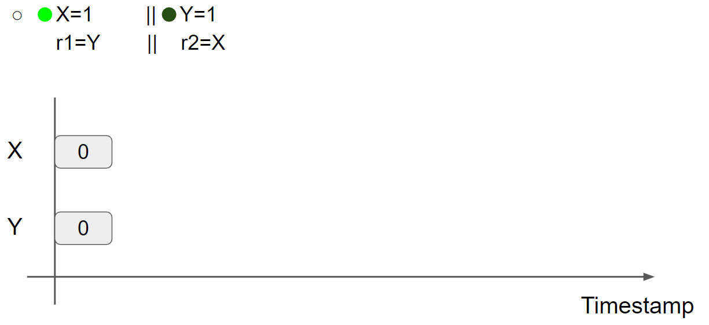
线程1执行 `X = 1`，插入 `X = 1` message：

[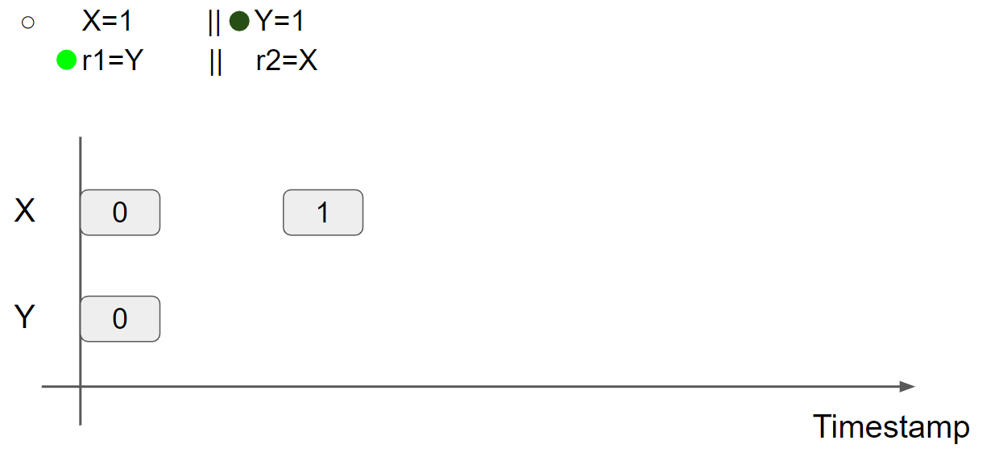](https://night-cruise.github.io/2022/11/27/relaxed-memory-concurrency/multi-value-memory-2.png)

线程2执行 `Y = 1`，插入 `Y = 1` message：

[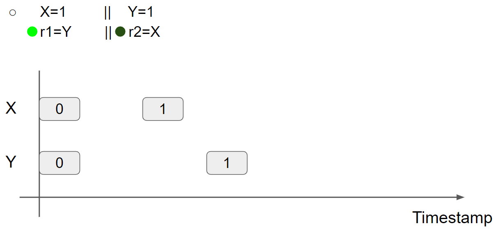](https://night-cruise.github.io/2022/11/27/relaxed-memory-concurrency/multi-value-memory-3.png)

线程1执行 `r1 = Y`，读到 `Y = 0` message，`r1 = 0`：

[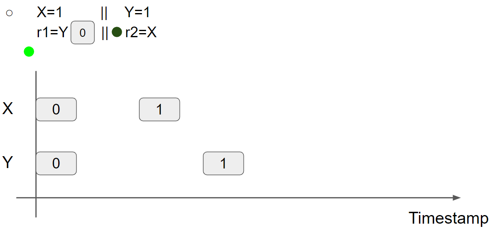](https://night-cruise.github.io/2022/11/27/relaxed-memory-concurrency/multi-value-memory-4.png)

线程2执行 `r2 = X`，读到 `X = 0` message，`r2 = 0`：

[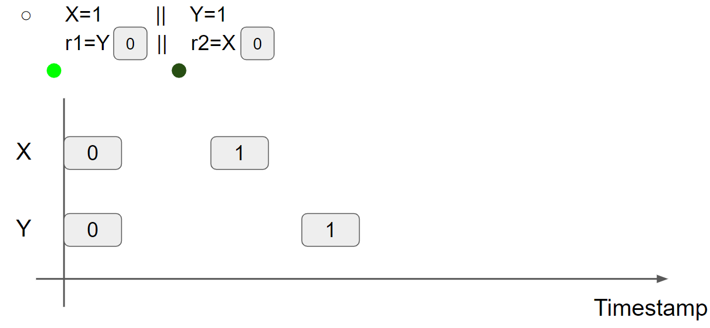](https://night-cruise.github.io/2022/11/27/relaxed-memory-concurrency/multi-value-memory-5.png)


从重排序角度看，相当于两个线程都做了 Store-Load 重排序。

### 3.2 Message Adjacency

对于 fetch-add 这类 RMW(ReadModifyWrite) 指令，新 message 必须邻接到被读取的 message 右侧。这防止了 RMW 读取到 old value。

考虑如下例子，`r1=r2=0` 不可能出现。

```rust
r1=X.fetch_add(1)       ||        r2=X.fetch_add(1)
```

[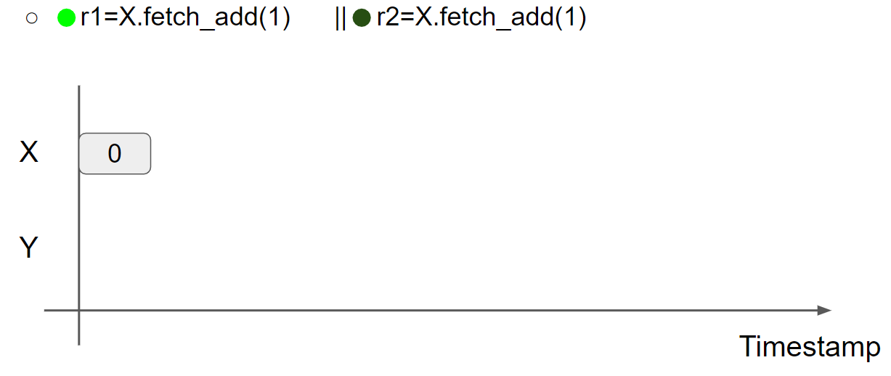](https://night-cruise.github.io/2022/11/27/relaxed-memory-concurrency/message-adjacency-1.png)

线程1执行 `r1 = X.fetch_add(1)`，`X = 1` message 被邻接到 `X = 0` 的 右边，`r1 = 0`：

[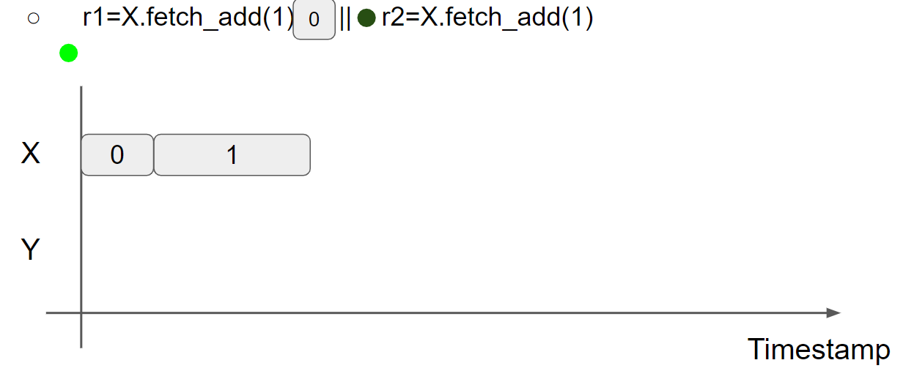](https://night-cruise.github.io/2022/11/27/relaxed-memory-concurrency/message-adjacency-2.png)

线程2执行 `r2 = X.fetch_add(1)`，`X = 0` 已经被邻接了，`X = 2` 只能邻接到 `X = 1` 的右边，只能读到 `X = 1`，结果 `r2 = 1`：

[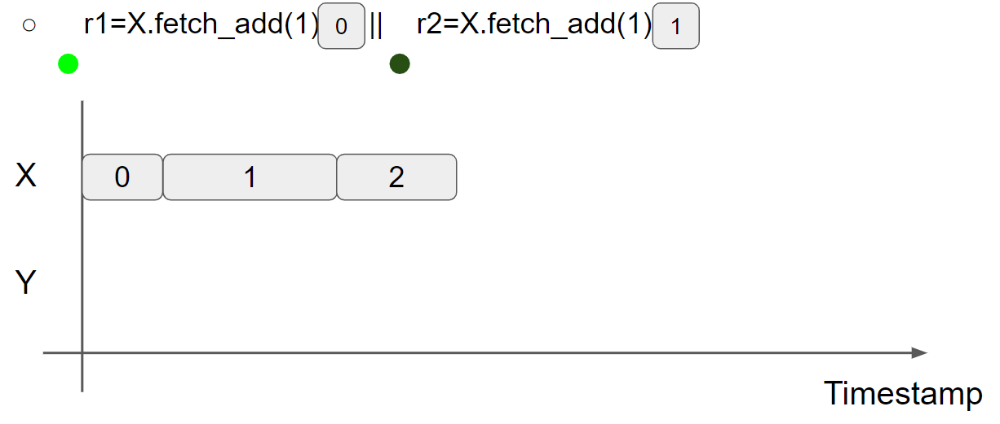](https://night-cruise.github.io/2022/11/27/relaxed-memory-concurrency/message-adjacency-3.png)

### 3.3 Views

Multi-valued memory 允许太多行为，当涉及 coherence 和 synchronization 时需要限制。**View** 是 location 到 timestamp 的映射，表示线程对 message 的确认状态。有三种 view：

- **Per-thread view** for coherence；
- **Per-message view** for release/acquire synchronization；
- **A global view** for SC synchronization。

#### 3.3.1 Per-thread View

Per-thread View 表示一个线程对 message 的确认，要求 reading/writing 发生在当前线程的 view 之后，并且 reading/writing 会更新当前线程的 view。

Per-thread View 保证 per-location coherence（同一地址的读写一致性）：

- **RR coherence**：不会读到已过期的值
  - `X=1 || r1=X; r2=X [r1=1,r2=0 impossible]`

- **RW coherence**：读后写，读到的值在写之前
  - `r=X; X=1 [r=0]`

- **WR coherence**：写后读，读到的值一定是刚写的
  - `X=1; r=X [r=1]`

- **WW coherence**：写后写，最终结果一定是最后一个写
  - `X=1; X=2 [X=2 at the end]`


以 WR coherence 为例：

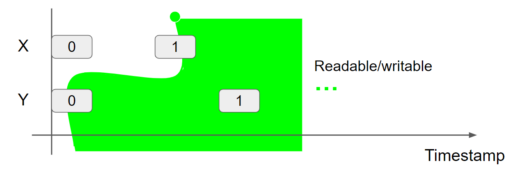

`X = 1` 插入新 message，线程 view 变为 X = 1 & Y = 0，执行 `r = X` 就只能读到 `X = 1` message。

#### 3.3.2 Per-message View

Release 写操作会生成一个 message view，记录 release 时刻线程的完整视图。Acquire 读操作读到该 message 时，会将 message view 合并到自己的 thread view 中，实现 Release/Acquire 同步。

典型例子——消息传递：

```rust
X = 1;                         ||   if Y.load(acquire) == 1:
Y.store(1, release);           ||       assert(X == 1);  // 一定成功
```

[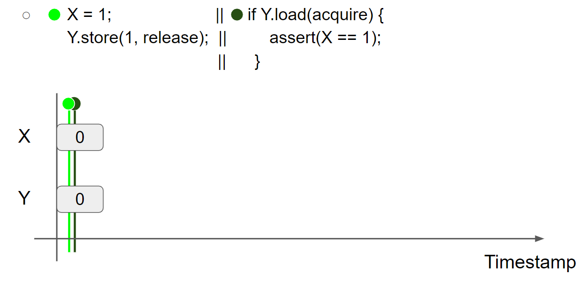](https://night-cruise.github.io/2022/11/27/relaxed-memory-concurrency/per-message-view-1.png)

线程1执行 `X = 1`，插入 `X=1` message，线程1的视图变为 X = 1 & Y = 0：

[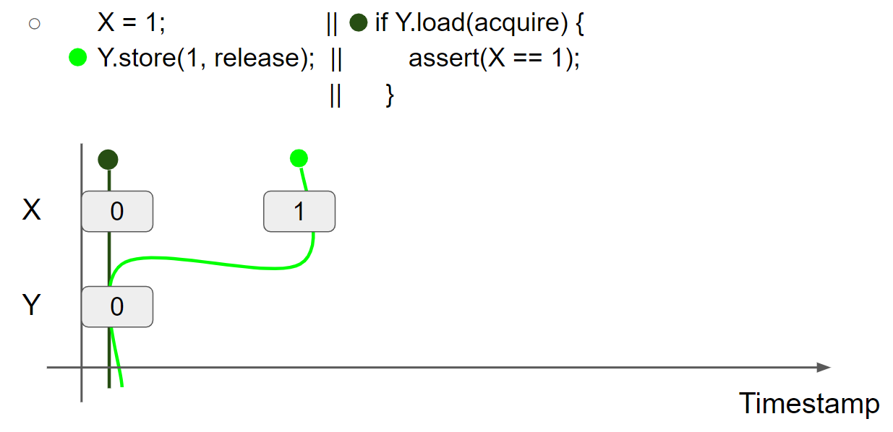](https://night-cruise.github.io/2022/11/27/relaxed-memory-concurrency/per-message-view-2.png)

线程1执行 `Y.store(1, release)`，插入 `Y=1` message，线程1的视图变为 X = 1 & Y = 1，release 会生成 message view：X = 1 & Y = 1：

[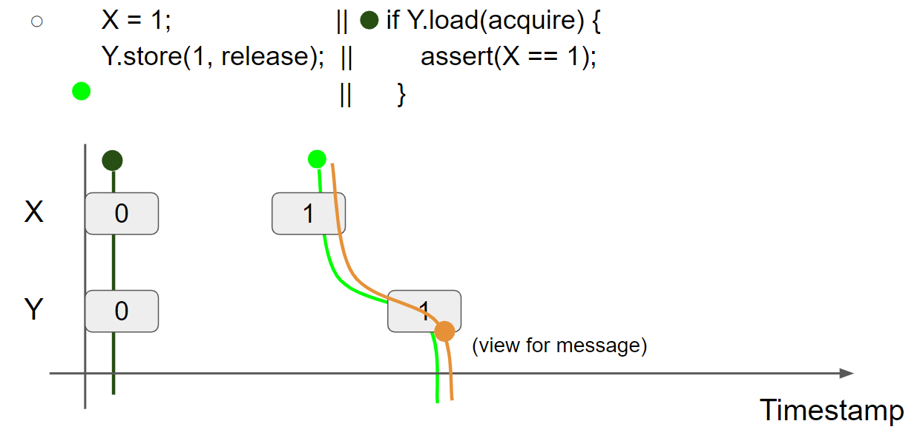](https://night-cruise.github.io/2022/11/27/relaxed-memory-concurrency/per-message-view-3.png)

线程2执行 `Y.load(acquire)`，线程2读到 `Y=1` message，线程2的视图变为 X = 0 & Y = 1，acquire 会把 message view 合并到线程2的 view 中，线程2的视图变为 X = 1 & Y = 1：

[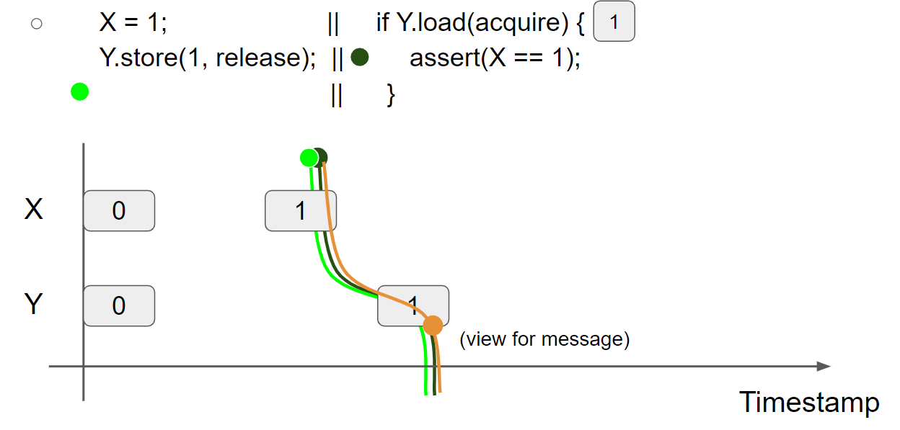](https://night-cruise.github.io/2022/11/27/relaxed-memory-concurrency/per-message-view-4.png)

线程2执行 `assert(X == 1)`，线程2的 view 为 X = 1 & Y = 1，会读到 X=1 message，断言执行成功：

[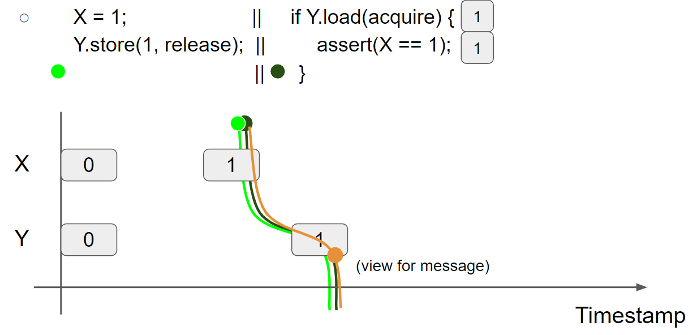](https://night-cruise.github.io/2022/11/27/relaxed-memory-concurrency/per-message-view-5.png)

通过 Release/Acquire 的使用，可以实现 message 在不同线程之间的传递。

#### 3.3.3 Global View

Global view 是所有线程共享的 SC fence 同步 view。执行 fence(SC) 时，thread view 和 global view 更新为两者的最新 view，使两个 view 收敛。这样，即使使用 relaxed 操作，两个线程各自配上 SC fence 也能进行消息传递。

经典例子：

```rust
X = 1                          ||            if Y.load(relaxed):
fence(SC)					   ||			     fence(SC)
Y.store(1, relaxed)			   ||                assert(X == 1)
```

[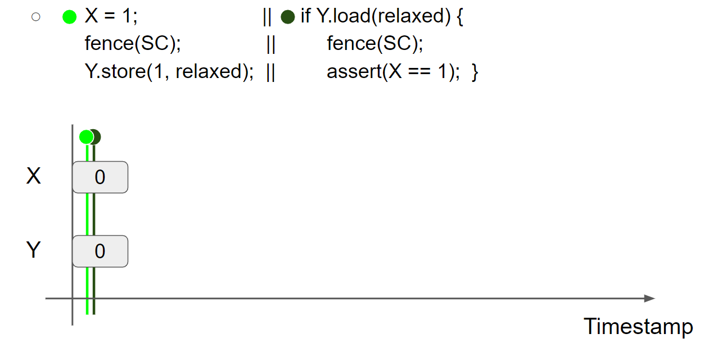](https://night-cruise.github.io/2022/11/27/relaxed-memory-concurrency/global-view-1.png)

线程1执行 `X = 1`，插入 X = 1 message，线程1的 view 变为 X = 1 & Y = 0：

[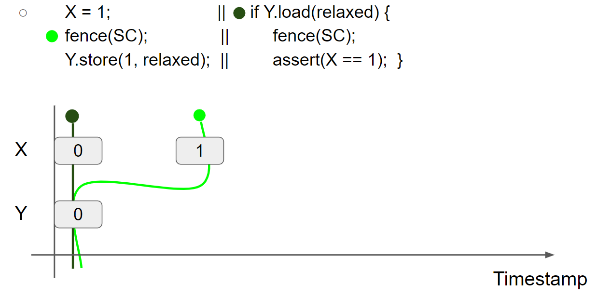](https://night-cruise.github.io/2022/11/27/relaxed-memory-concurrency/global-view-2.png)

线程1执行 `fence(SC)`，SC view 和 thread1 view 成为它们之间的最大者，thread1 view 保持不变，SC view 变为 X = 1 & Y = 0：

[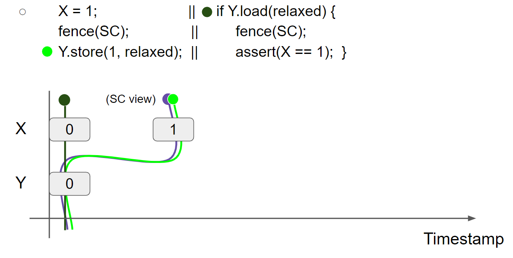](https://night-cruise.github.io/2022/11/27/relaxed-memory-concurrency/global-view-3.png)

线程1执行 `Y.store(1, relaxed)`，插入 Y = 1 message，线程1的 view 变为 X = 1 & Y = 1：

[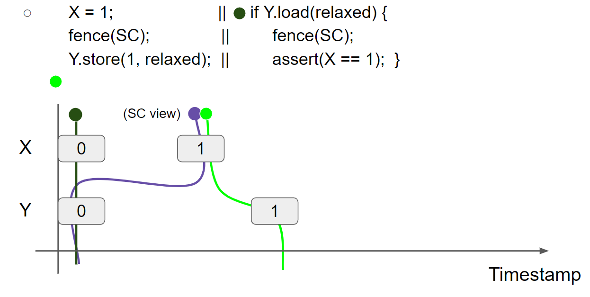](https://night-cruise.github.io/2022/11/27/relaxed-memory-concurrency/global-view-4.png)

线程2执行 `Y.load(relaxed)`，线程2读到 Y = 1 message，线程2的 view 变为 X = 0 & Y = 1：

[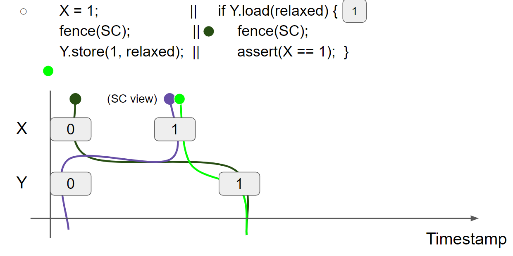](https://night-cruise.github.io/2022/11/27/relaxed-memory-concurrency/global-view-5.png)

线程2执行 `fence(SC)`，SC view 和 thread2 view 成为它们之间的最大者，thread2 view 变为 X = 1 & Y = 1，SC view 变为 X = 1 & Y = 1：

[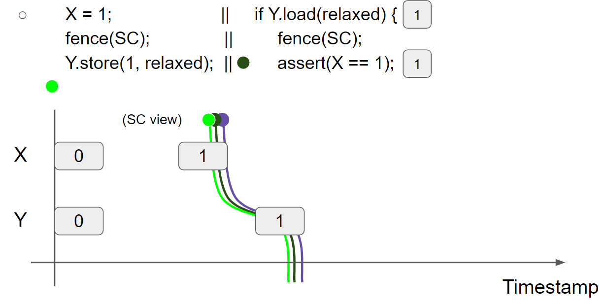](https://night-cruise.github.io/2022/11/27/relaxed-memory-concurrency/global-view-6.png)

线程2执行 `assert(X == 1)`，线程2的 view 为 X = 1 & Y = 1，因此线程2会读到 X = 1 message，断言执行成功。

### 3.4 Promises

Store hoisting 更为复杂，涉及三种情况：

**（1）Store hoisting w/o dependency（r1=r2=1 allowed by reordering）**

```
r1 = X    ||    r2 = Y
Y = r1    ||    X = 1
```

线程2写 X 的值不依赖其他指令，Load-Store 重排序后 `r1 = r2 = 1` 是允许的。

**（2）Store hoisting w/ dependency（r1=r2=1 disallowed, OOTA）**

```
r1 = X    ||    r2 = Y
Y = r1    ||    X = r2   // X 写入依赖 r2
```

如果允许 `r1 = r2 = 1`，则出现 "out of thin air"（OOTA）行为，导致无法推断程序正确性。

**（3）Store hoisting w/ syntactic dependency（r1=r2=1 allowed by compiler opt）**

```
r1 = X    ||    r2 = Y
Y = r1    ||    if r2 == 1 { X = r2 } else { X = 1 }
```

无论走哪个分支，`X = 1` 都成立，编译器可优化为 `X = 1`，变成情况（1）。

Promises 的思路是只允许 semantically independent writes hoisting，即允许 (1) (3)，禁止 (2)。因为 semantically independent writes 在未来一定是可写入的，因此 Promises 提出了两个机制：

* 线程可以**承诺**未来会写入某个值（A thread may speculatively write a value）
* 承诺必须能被兑现——在线程实际执行到写操作时，必须能够写入承诺的值，如果无法兑现，则该执行路径无效（A thread should always be able to write its promises in the future）

**（1）Store hoisting w/o dependency（r1=r2=1 allowed by reordering）**

[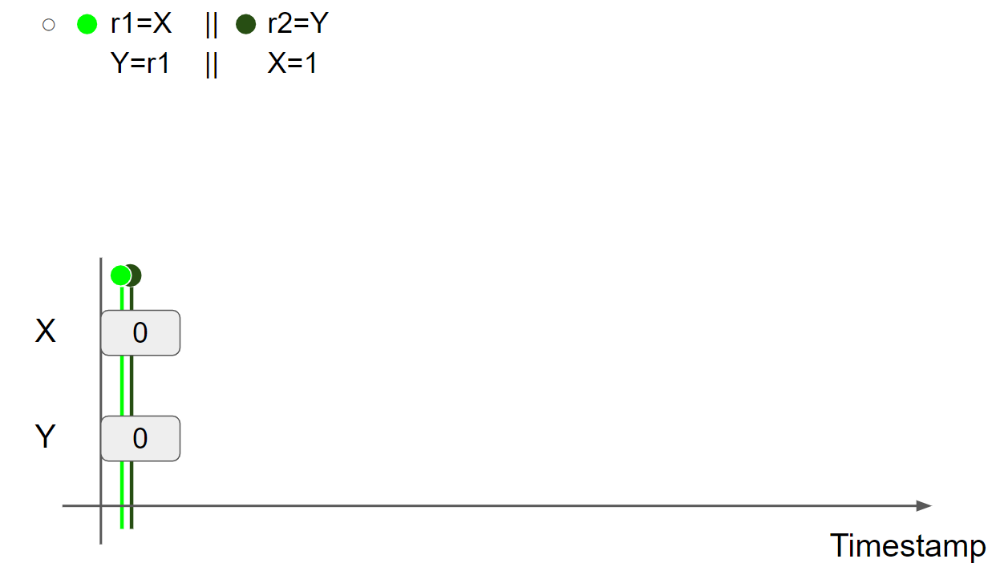](https://night-cruise.github.io/2022/11/27/relaxed-memory-concurrency/promises-1-1.png)

线程2 promise to write X = 1，插入 X = 1 message：

[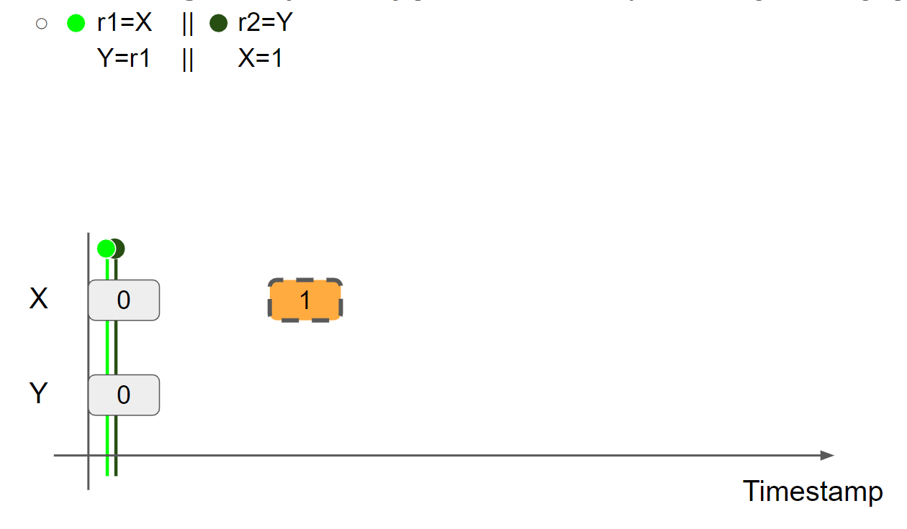](https://night-cruise.github.io/2022/11/27/relaxed-memory-concurrency/promises-1-2.png)

为验证线程2可以完成 promise write，屏蔽掉线程1：

[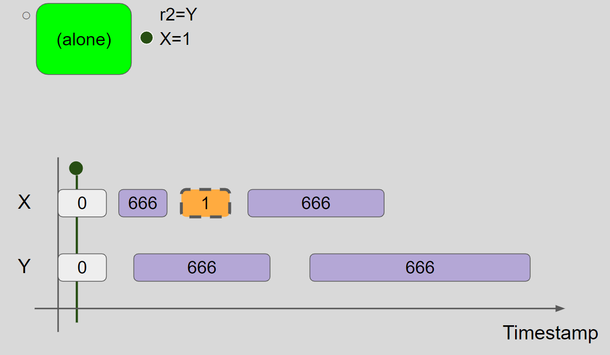](https://night-cruise.github.io/2022/11/27/relaxed-memory-concurrency/promises-1-5.png)

线程2执行 `r2=Y`，读取 `Y = 0` message。线程2执行 `X = 1`，插入 X = 1 message，兑现 promise write，线程2的视图更新为 X = 1 & Y = 0：

[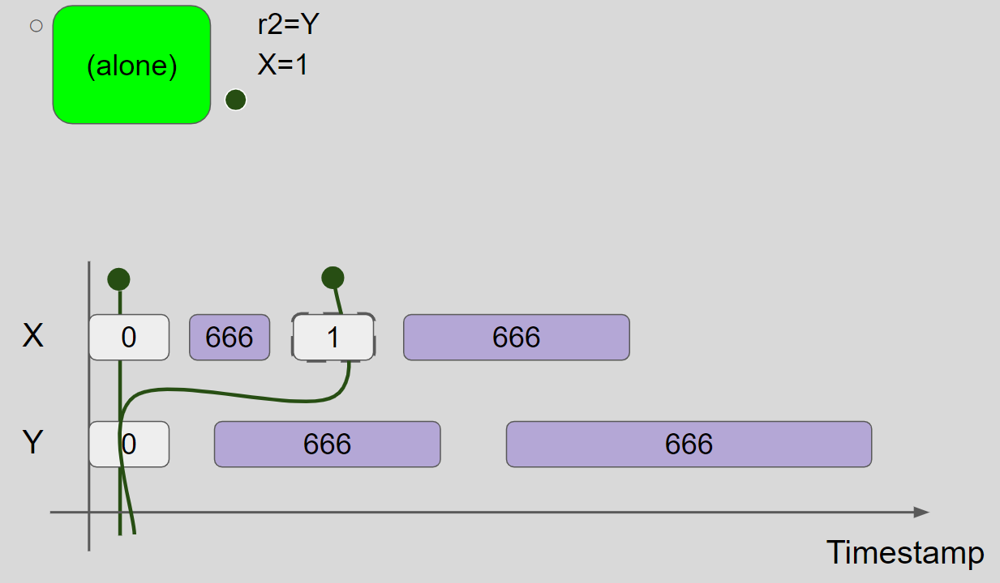](https://night-cruise.github.io/2022/11/27/relaxed-memory-concurrency/promises-1-6.png)

promise write 得到验证，将线程2的视图还原，将 X = 1 message 标记为 Certified：

[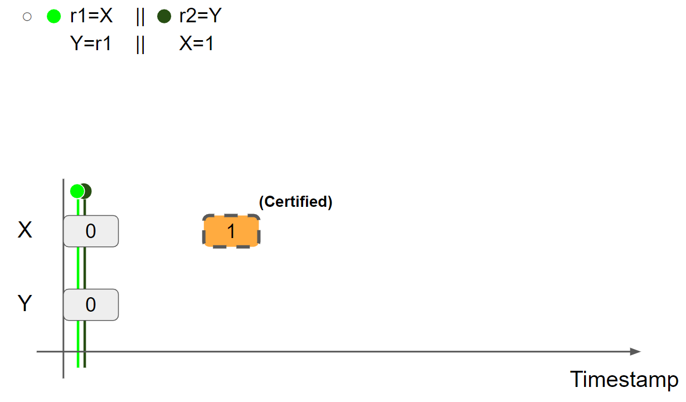](https://night-cruise.github.io/2022/11/27/relaxed-memory-concurrency/promises-1-7.png)

线程1执行 `r1 = X`，读 X = 1 message，线程1的视图更新为 X = 1 & Y = 0：

[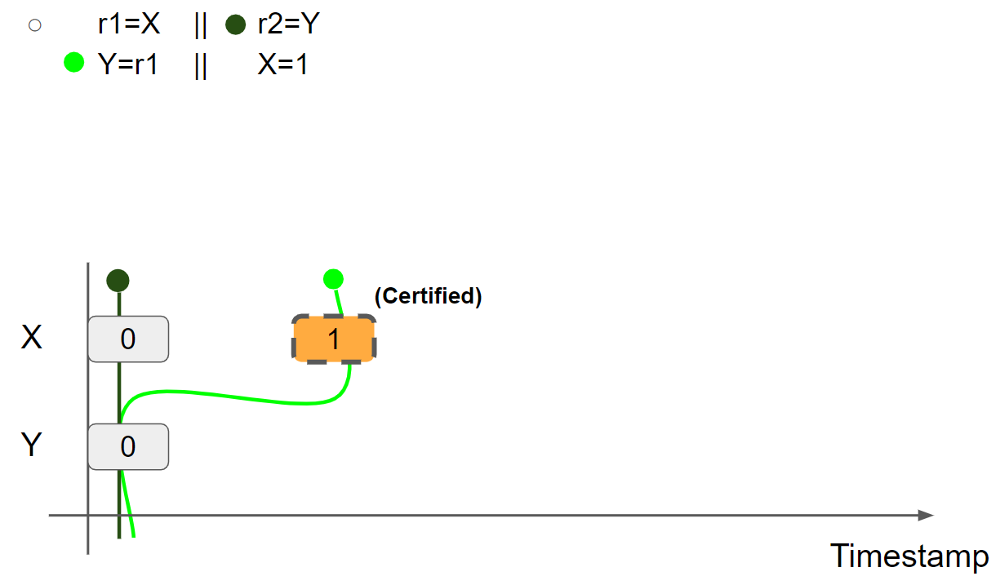](https://night-cruise.github.io/2022/11/27/relaxed-memory-concurrency/promises-1-8.png)

线程1执行 `Y = r1`，插入 Y = 1 message，线程1的视图更新为 X = 1 & Y = 1：

[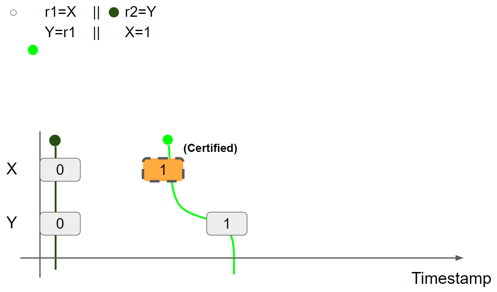](https://night-cruise.github.io/2022/11/27/relaxed-memory-concurrency/promises-1-9.png)

线程2执行 `r2 = Y`，读 Y = 1 message，线程2的视图更新为 X = 0 & Y = 1：

[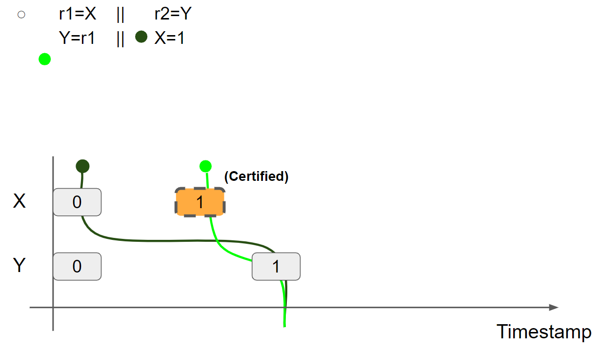](https://night-cruise.github.io/2022/11/27/relaxed-memory-concurrency/promises-1-10.png)

线程2执行 `X = 1` 兑现 promise write，promise 得到二次验证，将 X = 1 message 标记为 Re-Certified：

[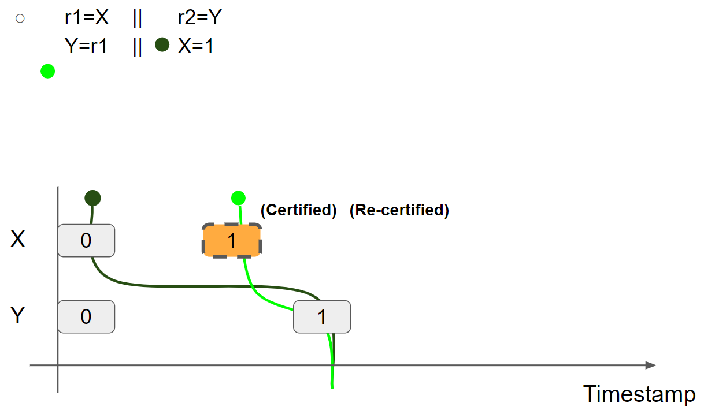](https://night-cruise.github.io/2022/11/27/relaxed-memory-concurrency/promises-1-11.png)

线程2执行 `X = 1`，兑现 promise write，线程2的视图更新为 X = 1 & Y = 1：

[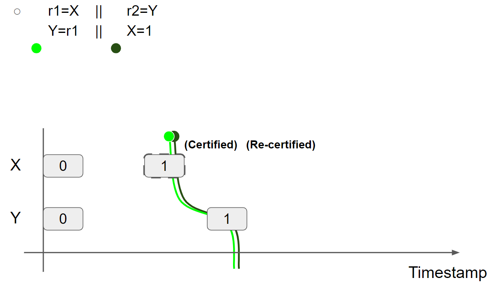](https://night-cruise.github.io/2022/11/27/relaxed-memory-concurrency/promises-1-12.png)

**（2）Store hoisting w/ dependency（r1=r2=1 disallowed, OOTA）**

[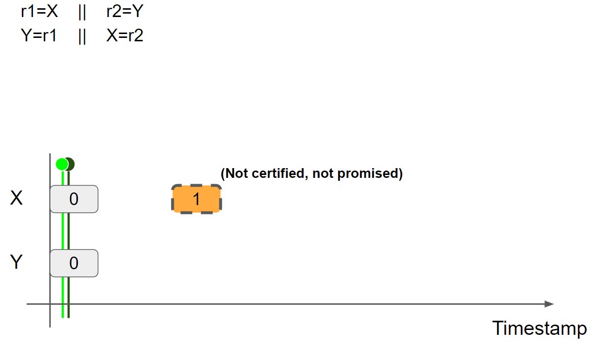](https://night-cruise.github.io/2022/11/27/relaxed-memory-concurrency/promises-2-1.png)

线程2 promise to write X = 1，插入 X = 1 message。屏蔽线程1，线程2执行 `r2 = Y` 读取 Y = 0 message，r2 = 0。线程2执行 `X = r2`，因为 r2 = 0，线程2无法兑现 promise write，执行失败。

**（3）Store hoisting w/ syntactic dependency（r1=r2=1 allowed by compiler opt）**

[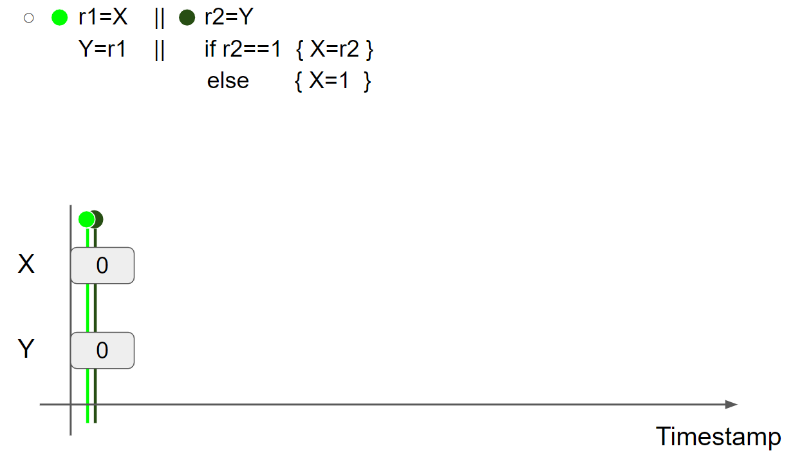](https://night-cruise.github.io/2022/11/27/relaxed-memory-concurrency/promises-3-1.png)

线程2 promise to write X = 1，插入 X = 1 message：

[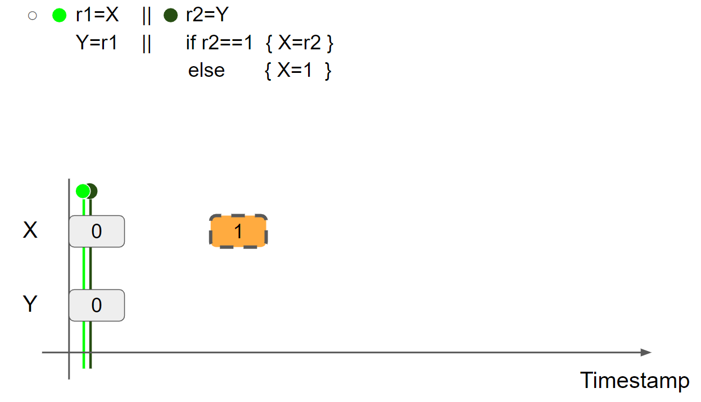](https://night-cruise.github.io/2022/11/27/relaxed-memory-concurrency/promises-3-2.png)

为验证线程2可以兑现 promise write，需屏蔽掉线程1：

[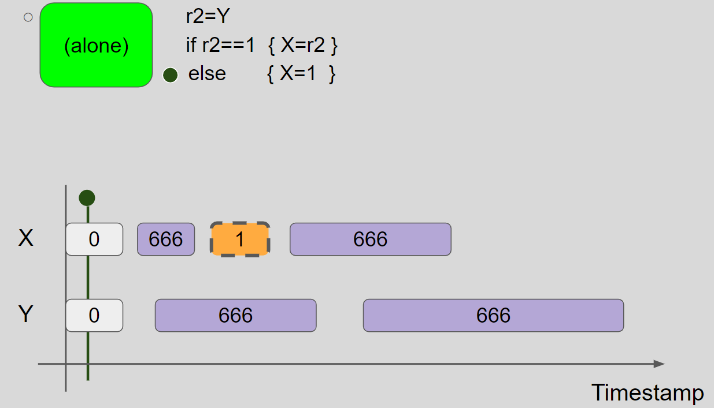](https://night-cruise.github.io/2022/11/27/relaxed-memory-concurrency/promises-3-5.png)

线程2执行 `r2=Y`，读 `Y = 0` message。接着，线程2进入 else 分支，执行 `X = 1`，插入 X = 1 message，兑现 promise write，线程2的视图更新为 X = 1 & Y = 0：

[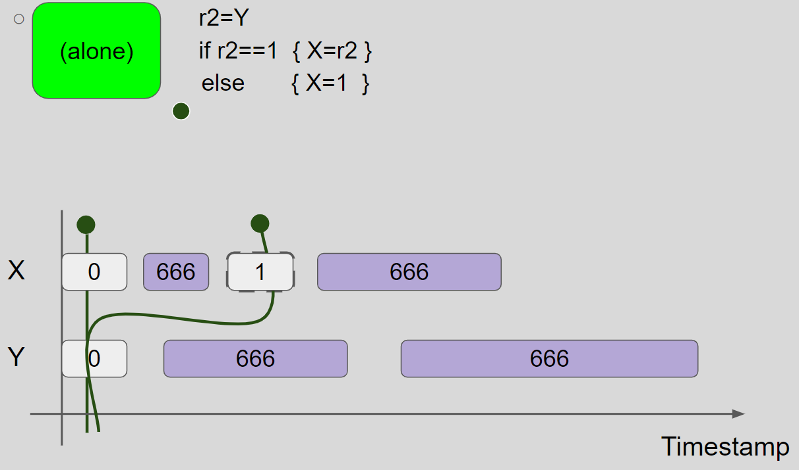](https://night-cruise.github.io/2022/11/27/relaxed-memory-concurrency/promises-3-6.png)

promise write 得到验证，将线程2的视图还原，将 X = 1 message 标记为 Certified：

[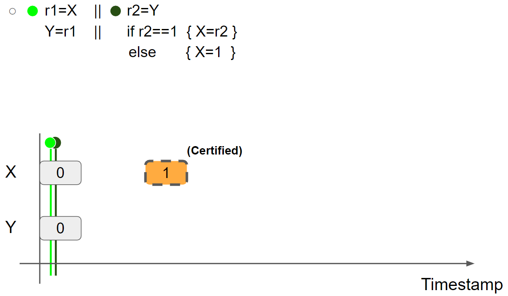](https://night-cruise.github.io/2022/11/27/relaxed-memory-concurrency/promises-3-7.png)

线程1执行 `r1 = X`，读 X = 1 message，线程1的视图更新为 X = 1 & Y = 0：

[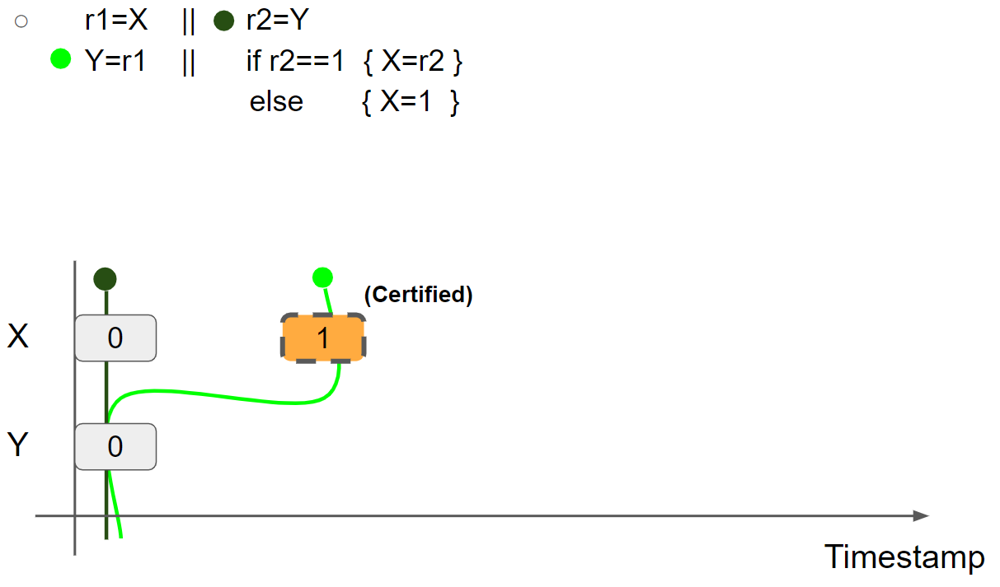](https://night-cruise.github.io/2022/11/27/relaxed-memory-concurrency/promises-3-8.png)

线程1执行 `Y = r1`，插入 Y = 1 message，线程1的视图更新为 X = 1 & Y = 1：

[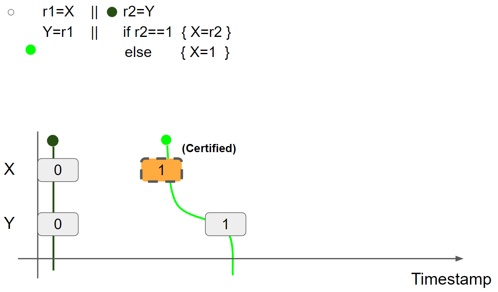](https://night-cruise.github.io/2022/11/27/relaxed-memory-concurrency/promises-3-9.png)

线程2执行 `r2 = Y`，读取 Y = 1 message，线程2的视图更新为 X = 0 & Y = 1：

[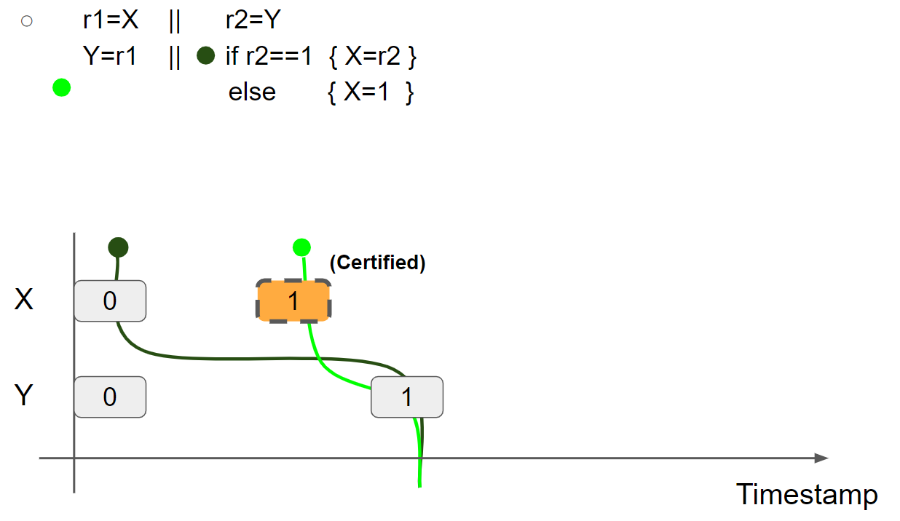](https://night-cruise.github.io/2022/11/27/relaxed-memory-concurrency/promises-3-10.png)

线程2执行 `if r2 == 1` 进入 if 分支内部，接着执行 `X = r2` 兑现 promise write，promise 得到二次验证，将 X = 1 message 标记为 Re-Certified：

[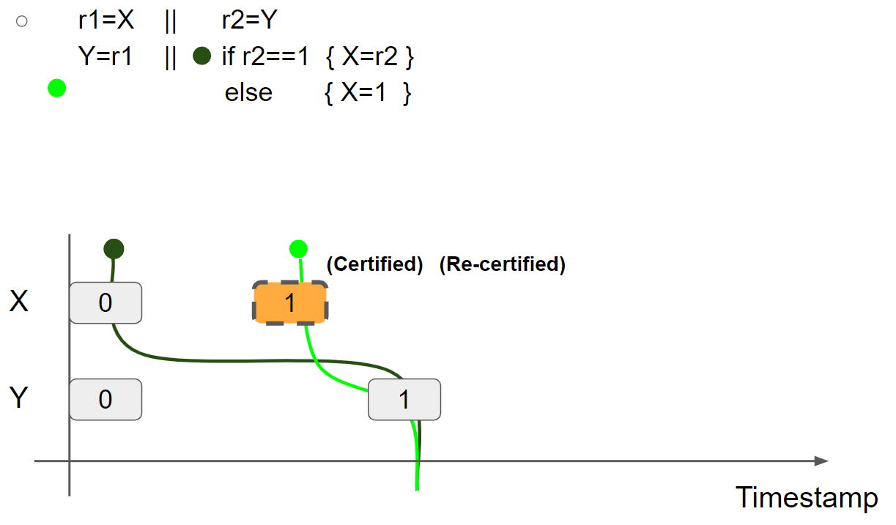](https://night-cruise.github.io/2022/11/27/relaxed-memory-concurrency/promises-3-11.png)

线程2执行 `X = r2`，兑现 promise write，线程2的视图更新为 X = 1 & Y = 1：

[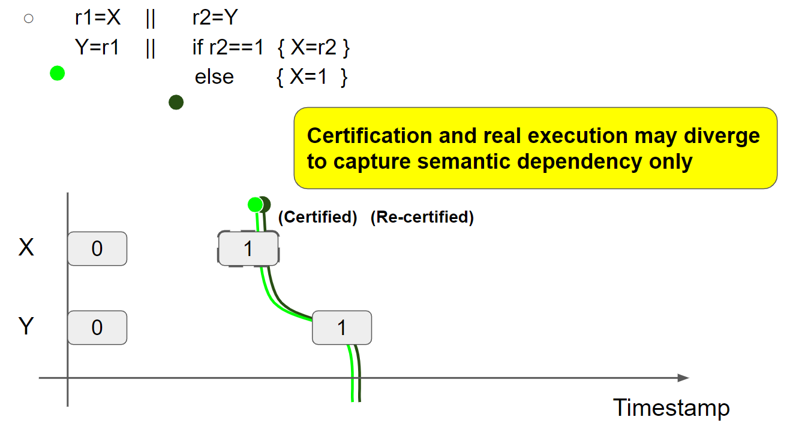](https://night-cruise.github.io/2022/11/27/relaxed-memory-concurrency/promises-3-12.png)

**（4）store hoisting w/ syntactic dependency（r1=r2=r3=1 disallowed due to RW coherence）**

线程2 promise to write X = 1，并验证 promise（验证过程与前面一致，这里跳过）：

[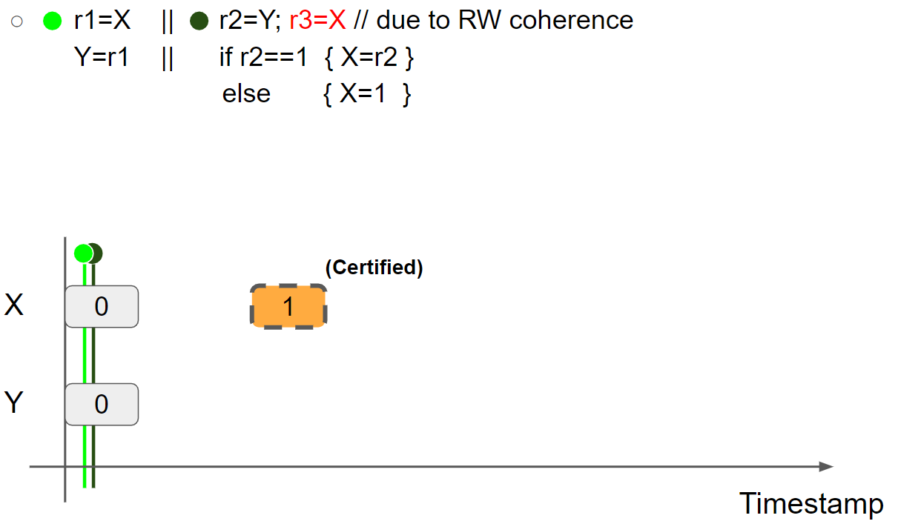](https://night-cruise.github.io/2022/11/27/relaxed-memory-concurrency/promises-4-1.png)

线程1执行 `r1 = X`，读 X = 1 message，线程1的视图变为 X = 1 & Y = 0：

[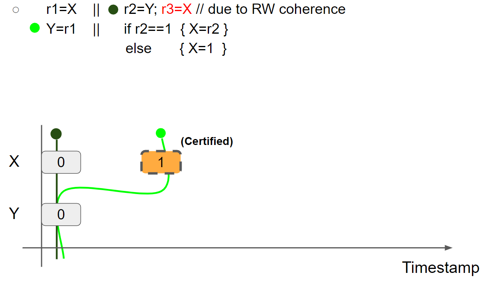](https://night-cruise.github.io/2022/11/27/relaxed-memory-concurrency/promises-4-2.png)

线程1执行 `Y = r1`，插入 Y = 1 message，线程1的视图变为 X = 1 & Y = 1：

[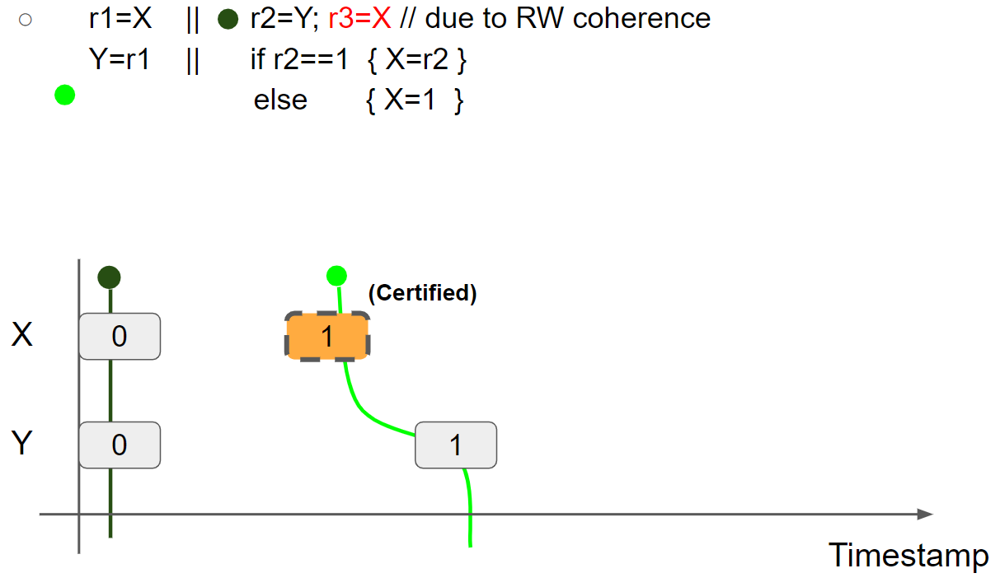](https://night-cruise.github.io/2022/11/27/relaxed-memory-concurrency/promises-4-3.png)

线程2执行 `r2=Y`，读取 `Y = 1` message，线程2的视图变为 X = 0 & Y = 1。线程2执行 `r3 = X`，读到 X = 1 message，线程2的视图变为 X = 1 & Y = 1：

[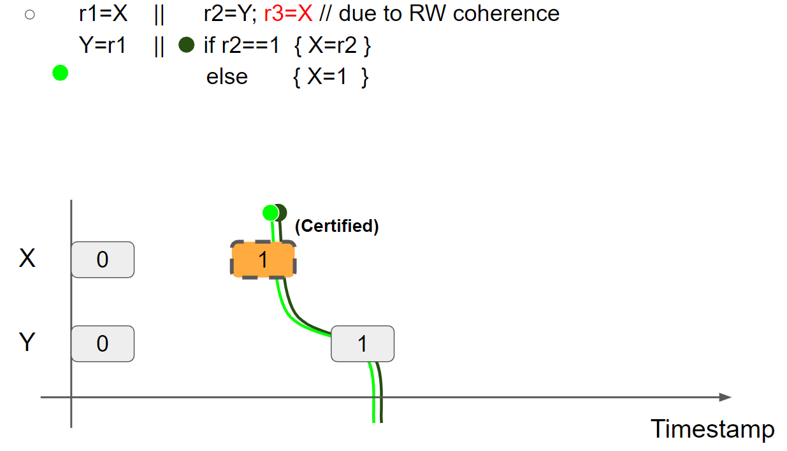](https://night-cruise.github.io/2022/11/27/relaxed-memory-concurrency/promises-4-4.png)

`r2 = 1`，进入 if 分支内部执行 `X = r2`，线程2的视图已经变为 X = 1 & Y = 1，只能在当前视图的右边插入新的 X = 1 message，无法兑现 promise write，执行失败：

[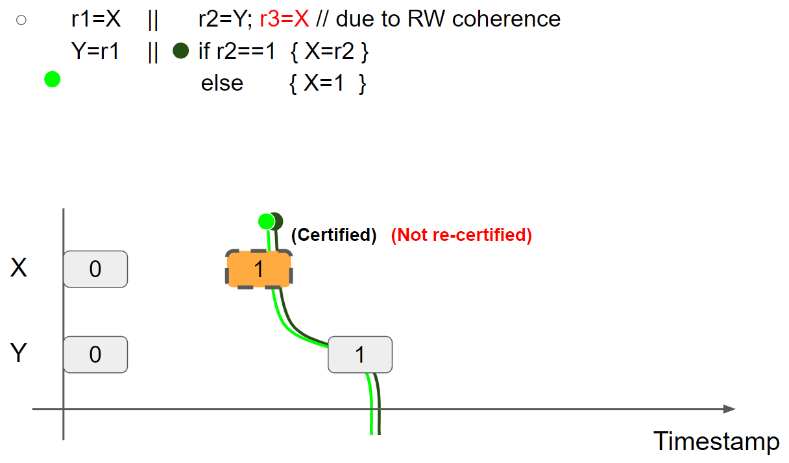](https://night-cruise.github.io/2022/11/27/relaxed-memory-concurrency/promises-4-5.png)

通过 promises 机制：

- 无依赖的 store hoisting 可以兑现承诺（写操作不依赖其他线程的值），因此允许
- 有数据依赖的 store hoisting 无法兑现承诺（写操作依赖另一个线程尚未写入的值），因此禁止

## 4. Mutex Lock

以下用 promising semantics 的视角分析三种锁的实现。

### 4.1 Spin Lock

```rust
fn lock(&self)   { while self.inner.cas(false, true, acquire).is_err() {} }
fn unlock(&self) { self.inner.store(false, release); }
```

[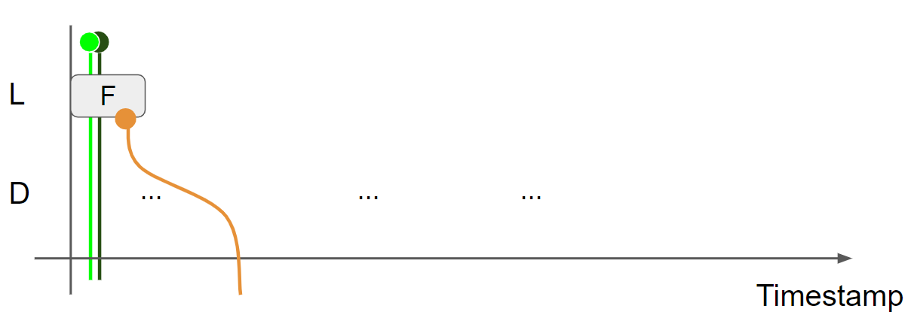](https://night-cruise.github.io/2022/11/27/relaxed-memory-concurrency/spin-lock-1.png)

线程1读取 L = F message，邻接 L = T message，message view 合并到线程1的 view 中，线程1的 view 变为 L = T & D = S1：

[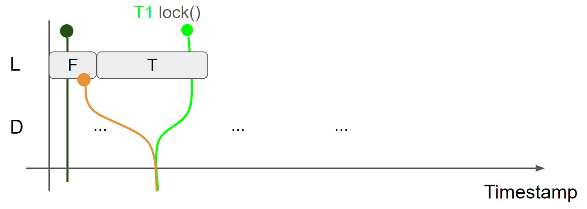](https://night-cruise.github.io/2022/11/27/relaxed-memory-concurrency/spin-lock-2.png)

线程1修改 D，插入 D = S2 message，线程1的view 变为 L = T & D = Something2：

[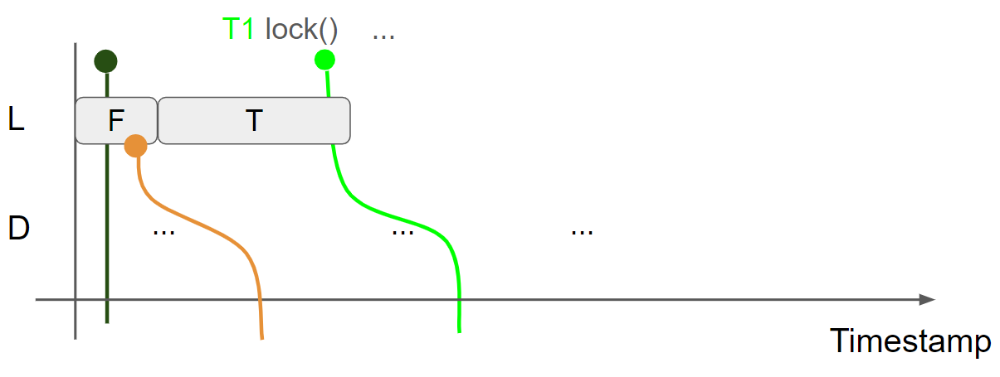](https://night-cruise.github.io/2022/11/27/relaxed-memory-concurrency/spin-lock-3.png)

线程2读 L = T message，进入自旋，message view 合并到线程2的 view 中，线程2的 view 变为 L = T & D = S1：

[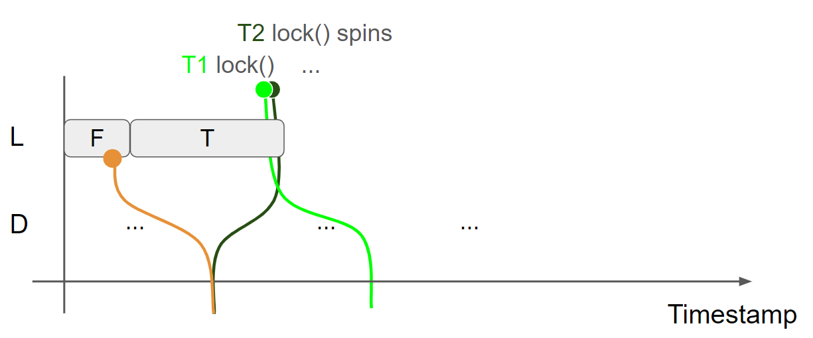](https://night-cruise.github.io/2022/11/27/relaxed-memory-concurrency/spin-lock-4.png)

线程1插入 L = F message，线程1的视图变为 L = F & D = S2，生成 message view：L = F & D = S2：

[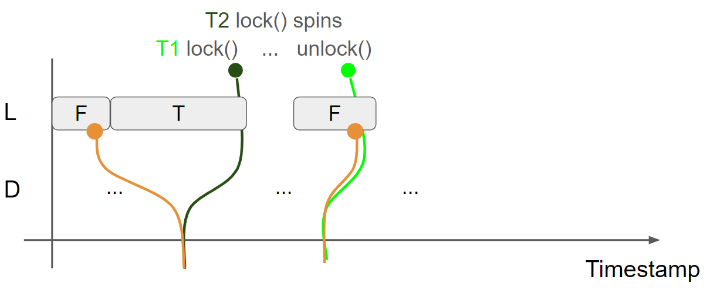](https://night-cruise.github.io/2022/11/27/relaxed-memory-concurrency/spin-lock-5.png)

线程2读 L = F message，邻接 L = T message，message view 合并到线程2的 view 中，线程2的 view 变为 L = T & D = S2：

[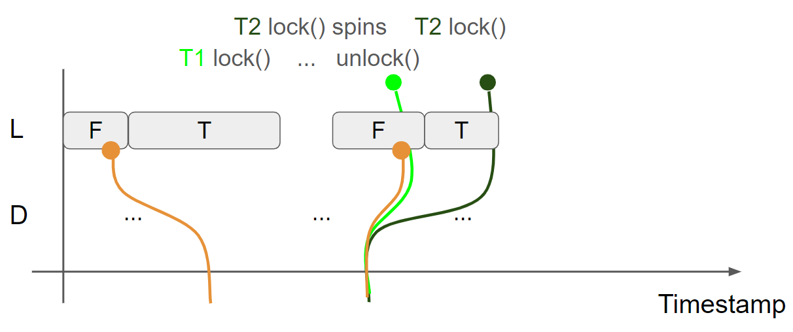](https://night-cruise.github.io/2022/11/27/relaxed-memory-concurrency/spin-lock-6.png)

线程2插入 D = S3 message，线程2的view 变为 L = T & D = S3：

[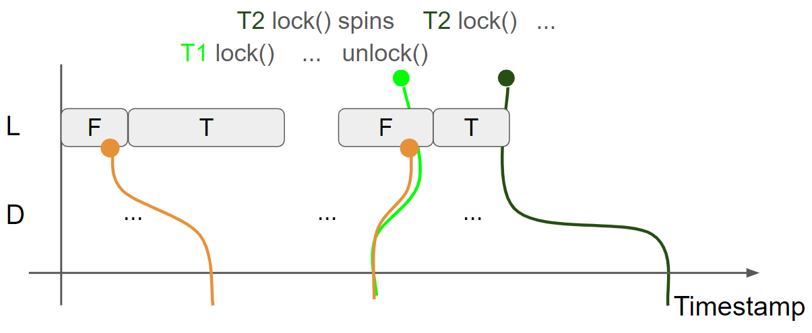](https://night-cruise.github.io/2022/11/27/relaxed-memory-concurrency/spin-lock-7.png)

线程2插入 L = F message，线程2的视图变为 L = F & D = S3，生成 message view：L = F & D = S3：

[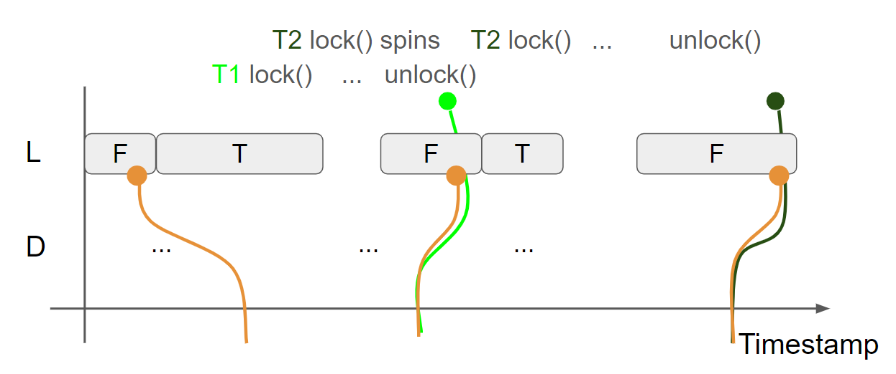](https://night-cruise.github.io/2022/11/27/relaxed-memory-concurrency/spin-lock-8.png)

全部执行流程如下：

[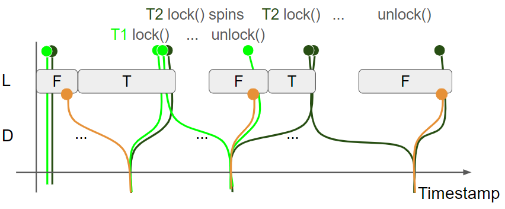](https://night-cruise.github.io/2022/11/27/relaxed-memory-concurrency/spin-lock-9.png)

通过 CAS + Acquire 获取锁，Store + Release 释放锁。Release 生成的 message view（含有被保护数据的最新值）会在下一个线程 Acquire 时合并到其视图中，从而保证持有锁时访问到最新数据。两个线程持有锁的时间戳区间不相交。

### 4.2 Ticket Lock

```rust
fn lock(&self) -> usize {
    let ticket = self.next.fetch_add(1, Relaxed);
    while self.curr.load(Acquire) != ticket {}
    ticket
}
fn unlock(&self, ticket: usize) {
    self.curr.store(ticket.wrapping_add(1), Release);
}
```

每个线程取号排队，`curr` 表示当前允许进入的号码。取号使用 `Relaxed`（不需要同步），等待使用 `Acquire`，释放使用 `Release`。同样通过 Release/Acquire 传递最新数据。

### 4.3 CLH Lock

```rust
fn lock(&self) -> Token {
    let node = Box::into_raw(Box::new(Node::new(true)));
    let prev = self.tail.swap(node, AcqRel);
    while unsafe { (*prev).locked.load(Acquire) } {}
    drop(unsafe { Box::from_raw(prev) });
    Token(node)
}
fn unlock(&self, token: Token) {
    (*token.0).locked.store(false, Release);
}
```

基于链表实现的无锁公平锁。每个线程创建一个新节点，通过 `swap(AcqRel)` 获取前驱节点，然后轮询前驱节点是否释放。同样通过 Release/Acquire 传递最新数据。

**三种锁的共同点**：持有锁的时间戳区间不相交，通过 Release/Acquire 实现消息传递，保证持有锁时能访问到最新数据。

## References

- [A Promising Semantics for Relaxed-Memory Concurrency](https://sf.snu.ac.kr/promise-concurrency/)
- [KAIST CS431: Concurrent Programming](https://github.com/kaist-cp/cs431)

* [How to Make a Multiprocessor Computer That Correctly Executes Multiprocess Programs](https://lamport.azurewebsites.net/pubs/multi.pdf)
- [Shared Memory Consistency Models: A Tutorial](https://pages.cs.wisc.edu/~markhill/upc/restricted/consistency_tutorial_tr.pdf)
- [Linearizability: A Correctness Condition for Concurrent Objects](https://cs.brown.edu/people/mph/HerlihyW90/p463-herlihy.pdf)

